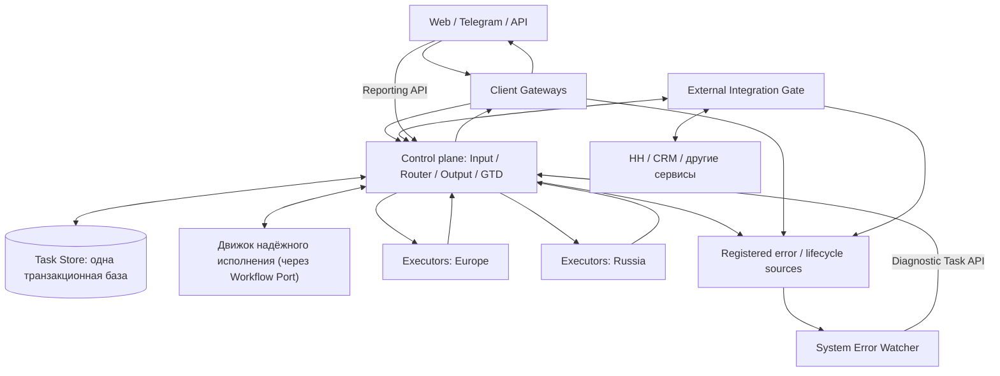
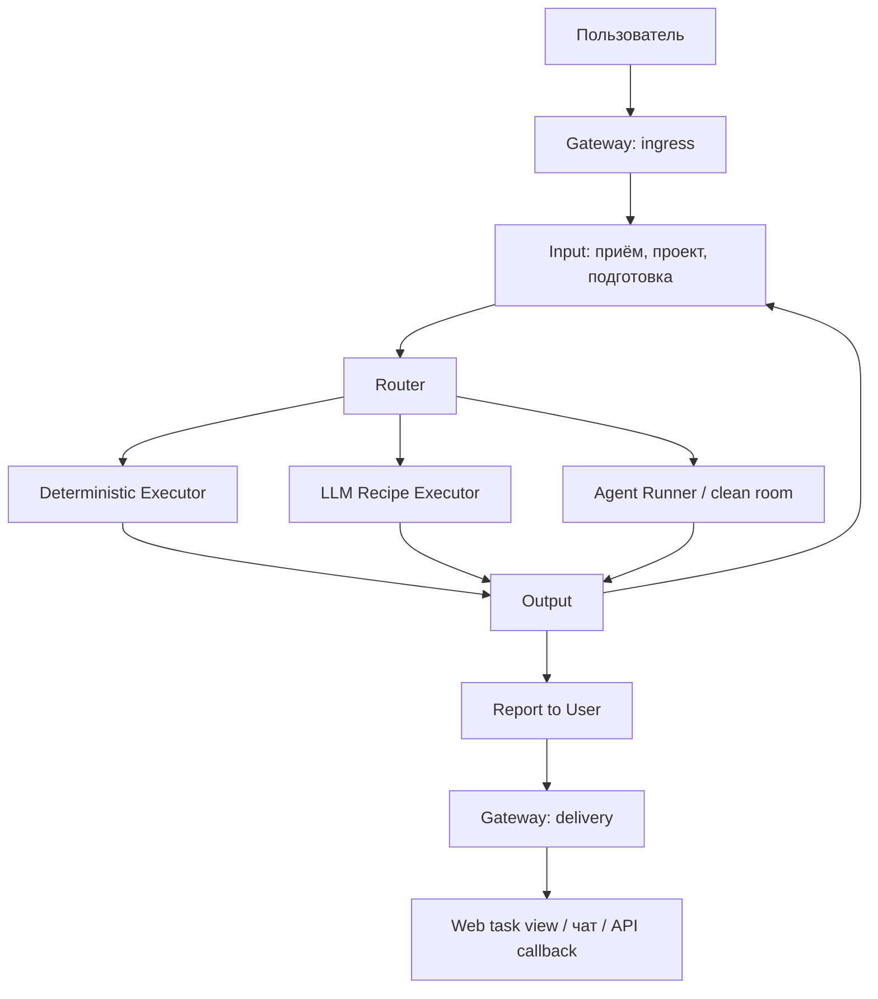
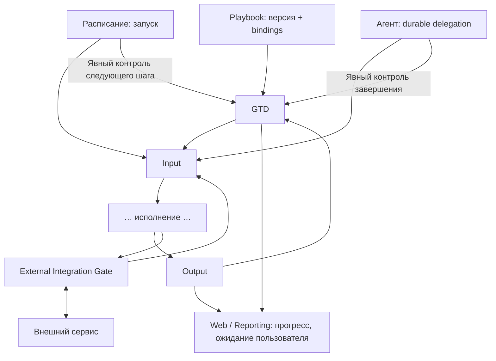

# Архитектура Trained Assist

Версия 0.7 · 30.09.2026. Предыдущая версия 0.6 переписана по [ревью Claude](ARCHITECTURE_claude_2026-09-30_1926.md), с которым согласился владелец, и с учётом [ревью MiMo](ARCHITECTURE_mimo_review_2026-09-30.md). История решений — [DECISIONS.md](DECISIONS.md). Факты о текущем коде — [Code baseline](audits/CODE-BASELINE.md) и раздел 6.

Обозначения статуса у разделов: **Принято** — решение владельца; **Предложено** — направление, ждёт подтверждения пилотом или владельцем; **Открыто** — решения нет. Метка **В проде ✅** означает, что механизм уже работает у живых пользователей; ссылки на доказательства в разделе 6.

## 0. Коротко

Что строим. Одну систему, которая принимает задачи из Web, Telegram, API, расписания и от других агентов, надёжно доводит каждую до результата и показывает её состояние по одному сквозному номеру задачи (userTaskId).

Ключевые решения:
1. **Одна транзакционная база состояния задач** (Task Store). Очереди, статусы, ожидания и журнал — таблицы в ней, а не пять хранилищ (раздел 4).
2. **Готовый движок надёжного исполнения за своим интерфейсом.** Первый кандидат — Cloudflare Workflows. Движок можно заменить, не переписывая модули (раздел 4).
3. **Разговорная сессия — главный сценарий**, он проектируется первым: диалог с уточнениями, проект, выбор движка, бот-аудитория (раздел 5).
4. **Что работает в проде, переиспользуем.** При равных вариантах выигрывает уже проверенное решение: его логика доказана, миграция проще (раздел 6).
5. **Новое строим параллельно живому сервису**, но с условиями перехода, а новые крупные фичи старого прода сразу делаются на новых контрактах (раздел 10).

Что открыто: подтверждение Cloudflare как места управляющего слоя проверкой на настоящем аккаунте (пилот P-DB рекомендует Cloudflare, запасной — VM), регион хранения данных RU/EU, режим бюджета при недоступном учёте (раздел 13).

## 1. Цель и границы

Статус: **Принято**.

Одна пользовательская задача имеет стабильный **userTaskId** до окончательного результата. Web предоставляет приватный просмотр задачи и справку о её состоянии; чат получает уведомления и результаты по настройке. Чат не владелец фоновой задачи.

Три вида Job: **deterministic-job** (программный шаг), **llm-recipe-job** (один вызов модели на подготовленном входе, без инструментов и доступа к профилю), **ai-agent-job** (агент с инструментами). Job — определение работы; Run — одно конкретное выполнение. Agent Runner запускает агента в изолированной среде (**Agent clean room**); она нужна агенту, а не каждому Job. Соответствие OpenLineage — в [терминологии](TERMINOLOGY.md).

**gtdId** означает, что задача под контролем результата (Getting Things Done). **GTD выключен по умолчанию.** Он включается при явной просьбе довести работу до принятого результата либо при конкретном следующем шаге после исполнения: проверка CI после PR, шаг миграции, внешнее условие. Расписание, длинный Run, эскалация ошибки и делегирование сами по себе GTD не включают. GTD контролирует результат, технический контроль — живучесть попыток, playbook задаёт методику; ни одно не подменяется бесконечным повтором.

## 2. Общая схема

Это логические блоки; блок не обязательно отдельный процесс или репозиторий. Input, Router, Output, GTD и Journal — модули одного управляющего слоя (control plane) над одной базой (раздел 4, раздел 9). Пользователь видит состояние задачи через авторизованный Reporting API, а не прямым доступом к базе.

География исполнения выбирается политикой движка, провайдера и данных: Claude Code/Codex — вне российской зоны; OpenCode — в допустимой зоне с учётом провайдера модели. География хранения — открытый вопрос (раздел 13).

Gateways адаптируют каналы и не выбирают исполнителя. Router решает тип работы и допустимую эскалацию; долговременной истории он не хранит, а получает нужную проекцию во входе.

## 3. Одна задача: вход, исполнение, результат

Статус: **Принято** (логика); хранение — по разделу 4.

**Input** принимает задание один раз по requestId и выдаёт квитанцию после записи в Task Store. Он определяет проект (раздел 5.2), загружает и готовит вложения, ждёт готовности. Передача исполнителю — одна транзакция: запись попытки с владельцем и поколением (generation), смена статуса, событие. Отправить и забыть нельзя.

Крупные файлы идут в Artifact Storage; в задаче только ссылки и метаданные. Загрузка, проверка, транскрипция и сжатие имеют состояния, лимиты и сроки; тяжёлый файл не держится в запросе на всё время расчёта.

**Output** принимает результат, проверяет контракт, сохраняет его, затем передаёт на доставку или следующий шаг. У **одного перехода ровно один владелец**: для задачи под GTD следующий шаг решает GTD; для прочих — Output. Router только выбирает исполнителя для уже решённого шага. В одной базе это одна транзакция одного модуля.

Разговорный запрос по умолчанию получает один bounded recipe «ответь или определи исполнителя». Если нужны инструменты — Output создаёт продолжение той же задачи к агенту (тот же userTaskId). Команды stop/status, известные доменные задания и callbacks идут без обязательной LLM-классификации. Реплики внутри активного диалога не классифицируются повторно (раздел 5.1). Подробнее — [Task Router и MCP](TASK-ROUTER-AND-MCP.md).

Автоматическая эскалация deterministic → LLM → **OpenCode agent** с ограничением попыток, срока и ёмкости. Автоматической ступени OpenCode → Claude Code/Codex нет; Claude Code запускается по явному выбору (таблица в разделе 5.3). Отсутствие бюджета, доступа или неизвестный исход внешнего действия дают состояние blocked или сверку (reconciliation). «Задача принята» и «агент запущен» — разные события.

**Reporting** показывает по userTaskId: очередь, подготовку, запуск, ошибку, следующего исполнителя, эскалацию, ожидание пользователя и итог. Текущий статус — колонка в Task Store, история — журнал событий (раздел 4.1). Доставка имеет свой статус, отдельный от исполнения.

## 4. База данных задач и движок надёжного исполнения

Статус: **Принято** (направление, 30.09.2026). Конкретная пара «база + движок» подтверждается пилотом P-DB (4.5).

### 4.1 Одна транзакционная база состояния задач (Task Store)

Всё управляющее состояние живёт в **одной транзакционной базе**: задачи, попытки, шаги планов, ожидания ответа, исходящие события (outbox), квитанции приёма, расписания и их запуски, доставки. Input, Output, GTD, Journal и Reporting — модули и таблицы в ней. Удаление из очереди, смена статуса и запись события — одна транзакция, поэтому двухфазный протокол передачи между модулями не нужен.

Правила:
- **Текущий статус — колонка, история — журнал событий.** Статус не вычисляется из событий. Журнал нужен для истории, отчётов, разбора и повторного воспроизведения.
- **База — источник истины.** Движок исполнения (4.2) хранит только ход оркестрации. Если движок заменить или его история истечёт, задачи, результаты и статусы не теряются.
- **Доступ только через слой хранилища** (repository-интерфейс). Модули не пишут SQL в обход него. Смена SQLite → D1 → Postgres меняет адаптер, а не модули.
- **Владелец попытки записан в базе**: owner, срок аренды (lease), generation. Результат с устаревшим generation отвергается (INV-02).
- Большие файлы — в Artifact Storage (R2); в базе только ссылки, владелец, размер и контрольная сумма.
- Разговорные сессии, проекты и привязки чатов тоже переезжают в Task Store (раздел 6: сейчас это JSON-файлы без транзакций).

**Стартовая схема — прод.** В проде уже работает SQLite-база планов `durable-tasks/state.db` **В проде ✅**: таблицы `durable_tasks`, `task_items` (с ожиданием `wait_json` и веером `fanout_json`), `executions`, `task_validation_results`, `hook_executions`, `cron_jobs`. На 30.09.2026 в ней 52 плана, 706 шагов, 625 запусков у 6 профилей. Её таблицы и поля — основа схемы Task Store; новые сущности (userTaskId, delivery, awaiting input, conversation) добавляются к ней, а не проектируются заново.

Физическая база:

| Этап | База | Когда |
|---|---|---|
| Сейчас и пилот | SQLite (текущая `state.db`), правило «одна VM — один владелец» | Пока управляющий слой один |
| Цель, если управляющий слой на Cloudflare | **Cloudflare D1** рядом с движком | Выбор P-DB |
| Цель, если управляющий слой на VM | Postgres | Выбор P-DB |

D1 использует тот же диалект SQLite, что и прод, поэтому текущая схема переносится почти без переписывания. D1 уже применяется в llm-ladder (журнал вызовов моделей).

### 4.2 Движок надёжного исполнения: готовый, за своим интерфейсом

**Не пишем движок с нуля.** Долговечные шаги, таймеры, ожидание события без расхода ресурсов, повтор с дедупликацией, один владелец перехода — это задача готового durable workflow engine.

Первый кандидат — **Cloudflare Workflows**. Причины: шлюз, web и ladder уже на Cloudflare; есть долговечные шаги с повторами (`step.do`), сон (`step.sleep`) и ожидание события (`step.waitForEvent`) до 365 дней; ожидающие экземпляры не занимают слоты исполнения; событие, отправленное раньше ожидания, буферизуется.

Главное требование — **гибкость**. Движок подключается через собственный интерфейс **Workflow Port**:

| Операция | Смысл |
|---|---|
| start(userTaskId, definition, input) | Запустить экземпляр для задачи; повтор с тем же ключом возвращает тот же экземпляр |
| step(name, fn, retryPolicy) | Долговечный шаг; готовый результат при повторе не пересчитывается |
| sleep(until) | Ждать без расхода ресурсов |
| waitFor(eventType, timeout) | Ждать ответа пользователя, callback, CI |
| signal(instance, eventType, payload) | Доставить событие ожидающему экземпляру |
| cancel(instance) | Остановка пользователем (INV-08) |
| status(instance) | Для Reporting и диагностики |

Правила гибкости:
- Методика, playbook и решения GTD зависят только от Port, а не от API конкретного движка.
- Всё, что должно пережить движок, записывается в Task Store внутри шагов. История экземпляров Cloudflare Workflows хранится 30 дней — это журнал оркестрации, не архив задач.
- **Второй адаптер Port — текущий механизм планов из прода** **В проде ✅** (раздел 6, строка «Планы»). Он уже делает шаги, ожидание, пробуждение и восстановление после рестарта. Пока пилот не доказал преимущество внешнего движка, это рабочий вариант, а после — запасной.
- Если управляющий слой останется на VM: Restate, DBOS (поверх Postgres) или Temporal. Замена — новый адаптер Port.

Ограничения Cloudflare Workflows, которые учитываем: результат шага до 1 МиБ (больше — в R2), состояние экземпляра до 1 ГБ, до 10 000 шагов (настраивается до 25 000), CPU шага до 5 минут. Сам агентский Run идёт на VM; шаг движка лишь запускает его и ждёт событие завершения через `waitFor`.

### 4.3 Что это упрощает

- Input, Output, GTD inbox и Awaiting user input — это start/signal/waitFor плюс таблицы Task Store, а не отдельные сервисы со своими протоколами.
- Таймеры и возобновление orchestration поручаем движку; VM не принимает решений о повторном запуске. Owner/generation и состояние попытки сохраняем в Task Store. Граница процесса, потери связи и сохранения данных — раздел 4.6.
- Расписание — экземпляр со `sleep` до следующего запуска. Это первый пилот новой архитектуры (раздел 10).

### 4.4 Что переносим из текущего механизма планов как есть

- **Политика восстановления** **В проде ✅**: провал качества — два повтора на том же уровне модели, затем один на уровень выше; платные движки автоматически не выбираются.
- **Семантика ожидания** **В проде ✅**: срок по умолчанию 24 часа, максимум 30 дней; ложится на `waitFor` без изменений.
- **Захват шага в транзакции и возврат прерванных шагов в очередь при старте** **В проде ✅**; в движке это встроенное поведение.
- **Бюджет попыток на шаг и классы провалов** **В проде ✅**.

Что заменяем (по прод-данным, раздел 6): текстовый маркер результата шага `DURABLE:` на структурированный результат; строгий порядок шагов на граф зависимостей.

### 4.5 Пилот P-DB (до I01)

Одна страница сравнения. Кандидаты: Cloudflare Workflows + D1; текущий механизм планов + SQLite; Restate или DBOS + Postgres. Критерии: ожидание без расхода ресурсов, дедупликация шагов, fencing, наблюдаемость, цена сопровождения одним человеком, перенос текущей схемы. Равенство по критериям решается в пользу работающего в проде (раздел 6).

Приёмка: план из пяти шагов с ожиданием ответа пользователя и рестартом исполнителя посередине проходит через Workflow Port; статус и история читаются из Task Store.

**Результат пилота (30.09.2026)** — [pilots/p-db/COMPARISON.md](pilots/p-db/COMPARISON.md). Восемь проверок: сбой после шага, ожидание без исполнителя, ранний сигнал, дубль сигнала, fencing, отмена, наблюдаемость.
- Cloudflare Workflows + D1 — 8/8 в локальном эмуляторе; DBOS + Postgres — 8/8; Restate — 8/8; текущие планы — 6/8 (теряют ранний сигнал, нет fencing).
- **Рекомендация: Cloudflare Workflows + D1** при условии проверки на настоящем аккаунте (продолжение после сбоя и по таймеру, деплой во время ожидания — локальный эмулятор этого не умеет). Запасной — DBOS + Postgres на VM. Restate исключён: постоянный сервер с состоянием и BSL без выигрыша над DBOS.
- При любом движке: fencing по `generation` — в Task Store; сигнал несёт ключ идемпотентности (id входящего сообщения); внешние вызовы идемпотентны по (userTaskId, шаг); имена шагов — контракт версии плана.
- Текущие планы остаются адаптером на время миграции; их четыре доработки (generation, таблица сигналов, структурированный результат, `awaiting_input` + журнал) — это и есть схема Task Store.

### 4.6 Связка Workflow — Runner — рабочие данные

Статус: **Принято**, уточнение владельца 30.09.2026.

VM — заменяемый исполнитель. Управляющее состояние задачи и решение о продолжении находятся вне VM; Runner исполняет попытку, сохраняет результат и завершает работу. Потеря связи, завершение процесса и потеря диска — три разных события.

- **Потеря связи не означает смерть процесса.** Отсутствие heartbeat даёт `connection_lost` (исход исполнения неизвестен), уведомление в Reporting и ожидание восстановления связи либо явного сигнала на перезапуск. Ни timeout, ни истечение lease сами по себе не запускают агента повторно. Workflow ждёт без удержания вычислительного процесса.
- **Перезапуск — отдельное решение.** Сигнал содержит источник/полномочия и дополнительные инструкции; например «разбей на шаги и сохраняй результат каждого шага». Перед запуском проверяем предыдущий процесс, сохранённые данные и неизвестные внешние действия. Если прежний процесс может работать, нужен подтверждённый stop или действенный отзыв его прав на запись/внешние действия; смена generation лишь для результатов этого не обеспечивает.
- **Рабочие данные переживают процесс.** Task-scoped workspace/volume имеет отдельный lifecycle, привязку к tenant/userTaskId, поколениям Run и manifest/checkpoints. Это не одноразовый диск процесса. Завершение агента или Runner не удаляет данные. Следующая разрешённая попытка получает доступ к сохранившимся результатам в новой clean room; старые процессы и секреты не наследуются.
- **Исполнение и финализация разделены.** После выхода агента Runner может оставаться в `finalizing`: сохранять тяжёлые локальные файлы, логи и manifest во внешнее хранилище. Финализация идемпотентна и возобновляется отдельно, без повторного запуска агента. Engine outcome, persistence/export status и доставка пользователю — разные состояния.
- Первый вариант — один Runner с разделёнными фазами execution/finalization. Отдельный асинхронный архиватор возможен позже в той же репе: durable receipt передачи владения файлами обязателен, диск доступен архиватору независимо от исходного процесса.
- Успешное завершение задачи требует сохранения обязательных результатов. Ошибка export не стирает успешный outcome агента и не удаляет локальную копию. Очистка рабочих данных — отдельный подтверждённый переход после сохранения и окончания согласованного retention; не побочный эффект exit/cancel/lease expiry. TTL/квоты и предупреждение об их исчерпании задаются явно.
- Persistent volume или промежуточная выгрузка защищают данные от исчезновения VM. Если исчез и диск с единственной копией, восстановление этих байтов не обещаем: фиксируем явную потерю данных. Выбор хранения должен проверяться отдельно от восстановления процесса.

Минимальная корреляция: userTaskId, runId, ownerGeneration, workspaceRef/volumeRef, manifestVersion, checkpoint refs и export operationId; в Task Store хранятся ссылки и статусы, а не тяжёлые bytes. Новый Run сохраняет userTaskId, получает новый runId и явные refs предшествующего результата.

Приёмка: сетевой разрыв при живом агенте не создаёт новый Run; после выхода процесса диск остаётся доступным; повтор finalization не повторяет исполнение; разрешённый следующий Run видит прежние файлы и дополнительные инструкции; очистка до подтверждённого сохранения блокируется. Конкретные проверки — P03/P06/P07/P09/P30 в [плане реализации](IMPLEMENTATION-AND-INTEGRATION-PLAN.md).

## 5. Разговорная сессия

Статус: **Принято** (ревью Claude C3/C4/C6/C7). Детали контрактов — предложены.

Сегодня основной сценарий — долгий диалог: человек пишет, агент отвечает, человек уточняет «а теперь сделай так же, но…», агент продолжает с полным контекстом. Новая система не заменит старую, пока не повторит этот сценарий не хуже.

### 5.1 Реплика, задача и контекст

- **userTaskId создаётся на каждую содержательную просьбу; conversationId связывает их в диалог.** Reporting показывает обе проекции.
- **Реплика в активном диалоге закрепляется за текущим исполнителем и сессией** без повторной классификации, пока пользователь явно не сменит тему или проект. Это модель прода: одна интерактивная работа на полосу Telegram (бот + чат + тред) и один писатель на сессию **В проде ✅**.
- **Состояние сессии движка — отдельный класс данных** (runtime state) со своим владельцем, сроком хранения и регионом. Clean room получает его при старте и отдаёт при завершении, как рабочие файлы. В проде контекст обычного хода собирается из хранилища сессий, а родное продолжение движка (`--resume`) используется после рестарта **В проде ✅**; этот порядок сохраняем.

Приёмка: пять последовательных уточнений в одном диалоге с рестартом исполнителя между 3-м и 4-м проходят без потери контекста; задержка и стоимость хода записаны рядом с текущим продом.

### 5.2 Проект определяется на входе

Проект входящей задачи определяет Input до Router. Правило выбора берём из прода как есть **В проде ✅**: закреплённый проект, затем активный, затем проект по умолчанию; один проект — выбираем его; нет проектов — создаём; несколько и неясно — спрашиваем. Ответ «нужно спросить» — законный исход: задача переходит в Awaiting user input. Router получает уже определённый projectId. Модель «профиль → проект → сессия» и типы проектов со своей структурой папок сохраняются; меняется только хранение (указатели в Task Store вместо файлов).

### 5.3 Движок по точке входа

| Точка входа | Движок по умолчанию | Кто может переопределить |
|---|---|---|
| Быстрый вопрос в чате | llm-recipe «ответь или определи исполнителя» | Router по контракту эскалации |
| Кнопка «▶️ Запустить проработку» | Claude Code (EU) **В проде ✅** | Пользователь |
| Шаг плана | Уровень модели из шага, OpenCode по умолчанию **В проде ✅** | Методика (playbook), политика восстановления |
| Автоматическая эскалация без явного выбора | OpenCode | Никто автоматически |
| Движок по умолчанию в профиле или проекте | Выбранный движок | Пользователь |

Выбор в профиле, проекте, кнопка проработки и запуск playbook с указанным движком считаются явным выбором пользователя. Каждый выбор и каждый запасной вариант проходят политику размещения (INV-05).

### 5.4 Бот-аудитория

Один шлюз уже обслуживает несколько ботов с разными аудиториями (рекрутерский, @freelance_spec_bot) **В проде ✅**. Вводим **audienceId** рядом с tenant/profile. Он определяет каталог возможностей и адрес доставки по умолчанию. Задача запоминает audienceId и destinationId при приёме; доставка всегда идёт по ним, а не по «текущему» боту (INV-19).

## 6. Что берём из текущего прода

Статус: **Принято** как правило, таблица — инвентарь на коммите прода `9d0bde8`.

Новая архитектура сначала была нарисована с нуля, чтобы не повторять старых ошибок. Теперь каждое решение прода сверяется с ней. **Правило:** если работающее в проде решение совместимо с целевой моделью, оно выигрывает у нового при прочих равных: логика уже проверена живыми пользователями, миграция проще. Решение прода заменяется только по записанной причине (цифры, инцидент, несовместимость с инвариантом).

Вердикты: **Как есть** — переносим без изменений логики; **С правками** — логику сохраняем, меняем хранение или слабое место; **Заменяем** — причина указана.

| Решение прода | Вердикт | Почему | Что меняем |
|---|---|---|---|
| Схема планов в SQLite (`durable-tasks/state.db`): планы, шаги, запуски, проверки, хуки | С правками | 52 плана, 706 шагов, 625 запусков у 6 профилей за 25–30.09 | Становится ядром Task Store (4.1); добавляются userTaskId, delivery, conversation |
| Политика восстановления шагов и ожидание 24 ч / 30 дней | Как есть | Работает в проде; 619 из 622 запусков на бесплатной ступени | Ложится на Workflow Port (4.4) |
| Текстовый маркер результата шага `DURABLE:` | Заменяем | 174 из 186 провалов OpenCode (94%) — «нет маркера»; около 25 часов агентного времени впустую | Структурированный результат шага |
| Строгий порядок шагов плана | Заменяем | 285 шагов стоят, планы висят 21–46 часов за одним ждущим или упавшим шагом | Граф зависимостей |
| Восстановление после рестарта (журнал `pending-tasks`, продолжение сессии движка, окно 2 часа, 3 попытки) | С правками | Переживает десятки рестартов в день; тихий рестарт без drain работает | Журнал переезжает в Task Store; убираем сканирование файлов при старте |
| Замок единственного владельца данных (`execution-owner.sqlite`) | С правками | Надёжно исключает второй сервер на одной VM | Для нескольких хостов — owner/generation в Task Store |
| Полосы и писатели: одна работа на полосу Telegram, один писатель на сессию, общий лимит параллельных запусков | Как есть (модель) | Прод-контракт, INV-03 | Состояние допуска — в Task Store, сейчас в памяти процесса |
| Хранилище сессий и привязок чатов (JSON-файлы, TTL 4 ч) | С правками | Модель верная | Сейчас «последний писатель выигрывает», файл переписывается на каждое сообщение; переезд в Task Store |
| /stop по слоту: остановка всего дерева процессов, маркер против повторного запуска | Как есть | Проверено на GCP 28.09 (#1800) | Добавить сигнал `cancel` в Workflow Port |
| Проекты: профиль → проект → сессия, типы с папками, правило выбора | Как есть (модель) | Работает, планы наследуют проект сессии (#1843) | Указатели проекта — в Task Store |
| Изоляция: слоты `ta-agent-N`, ACL на профиль только на время запуска, белый список переменных, мост к MCP с токеном запуска | Как есть | Основной путь запусков; в CI есть e2e с реальными Unix-пользователями | Закрыть исключения: Codex и worktree вне профиля идут без слота (#1708), MCP-серверы работают под сервисным пользователем, общий `.mcp.json` (#1868) |
| Выпуск: неизменяемые релизы, переключение ссылки, автооткат за 60 с, обязательный staging, автосквош-мерж, автопочинка PR | Как есть | 24 выкладки за 29–30.09 без ручного участия | Доменные скилы версионировать вместе с релизом (сейчас откат ядра их не откатывает) |
| Шлюз Telegram: буфер приёма, outbox запросов с повтором до квитанции по requestId, очередь повторов, медиа-задачи (Durable Objects) | Как есть | Основа приёма всех Telegram-запросов (1512 квитанций) | Сопоставить с контрактом C01 без переписывания |
| Доставка результата прямым вызовом Bot API из агента | Заменяем | Нет outbox доставки: сбой Telegram не отличим от сбоя работы | Доставка через Output и outbox доставки (C02) |
| Классификатор входа `input-router` | Заменяем | Работает только в теневом режиме, решений не принимает; реальная маршрутизация — около 55 регулярных выражений | Bounded recipe «ответь или определи исполнителя» (раздел 3) |
| Быстрые ответы без запуска агента с идемпотентной квитанцией | Как есть | Работают в проде | Становятся deterministic-job |
| Режим проработки по кнопке | Как есть | Явный выбор пользователя | Таблица 5.3 |
| Доменные скилы как отдельные MCP-репозитории (8 штук), поиск playbook профиль → скил → ядро | Как есть | Вся доменная работа идёт так | Версионирование с релизом |
| Хранилище контекста скилов (context_get/set на профиль) | С правками | Используется всеми скилами | Последний писатель выигрывает; версии при переезде |
| llm-ladder: лестница моделей free → подписка → платные, здоровье ключей, журнал вызовов в D1 | Как есть | Обслуживает сервисные вызовы моделей | Обязательные ID задачи и попытки в каждом вызове (INV-10) |
| Учёт расходов (`usage.json`, `calls.jsonl` по профилям) | Заменяем | Разрознен, стоимость пишется только если её сообщил движок | Единый Ledger по C08 |
| Публикация сайтов `site_deploy` (токен только у сервера, владение проектом) | Как есть | Работает | — |
| Публикация страниц `publish_page` (файлы на диске VM) | С правками | Работает | Хранение в R2, чтобы не зависеть от одной VM |
| Инженерные рабочие копии (ветка на задачу, замки, идемпотентные операции) | Как есть | Все инженерные планы идут так (#1647) | — |
| Расписание: SQLite-движок с арендой и уникальным запуском | С правками | Внутренние действия работают; пользовательские расписания выключены (#1489) | Первый пилот на Workflow Port (раздел 10) |

Доказательства: [аудит фонового исполнения планов на данных прода](https://github.com/trained-assist/trained-assist-agent/blob/9d0bde8d7cfa5a95843b834bf50d3d225973fb7a/docs/audits/playbook-background-execution-audit-2026-09-30.md), [durable-task-store](https://github.com/trained-assist/trained-assist-agent/blob/9d0bde8d7cfa5a95843b834bf50d3d225973fb7a/src/durable-task-store.js), [recovery-policy](https://github.com/trained-assist/trained-assist-agent/blob/9d0bde8d7cfa5a95843b834bf50d3d225973fb7a/src/recovery-policy.js), [projects](https://github.com/trained-assist/trained-assist-agent/blob/9d0bde8d7cfa5a95843b834bf50d3d225973fb7a/src/projects.js), [agent-isolation](https://github.com/trained-assist/trained-assist-agent/blob/9d0bde8d7cfa5a95843b834bf50d3d225973fb7a/src/agent-isolation.js), [admission](https://github.com/trained-assist/trained-assist-agent/blob/9d0bde8d7cfa5a95843b834bf50d3d225973fb7a/src/core/admission.js), [TG outbox](https://github.com/trained-assist/trained-assist-tg-bot/blob/main/src/run-outbox.js). Счётчики базы сняты с прода 30.09.2026 около 20:00 МСК.

Важное следствие для эскалации: 43% провалов OpenCode в прод-данных почти целиком вызваны протоколом маркера, а не качеством движка. Решение «OpenCode — конечная автоматическая ступень» оценивается после замены маркера, иначе цифры вводят в заблуждение.

## 7. GTD, playbook и внешние сервисы

Статус: **Принято**.

Playbook — переносимый артефакт методики. Execution Plan — его конкретизация с bindings; Checklist — представление исполнения. Доменные репозитории хранят методику; GTD хранит контроль конкретной задачи и переходы. Детали — [границы](PLAYBOOKS-VS-GETTING-THINGS-DONE-BOUNDARIES.md), [проверка реальными playbooks](REVIEW-WITH-REAL-PLAYBOOKS.md). Библиотека инженерных playbooks и доменные playbooks в скилах **В проде ✅** остаются там, где лежат.

Каждый запуск расписания получает occurrenceId и свой userTaskId; повторный запуск того же occurrence дедуплицируется. gtdId создаётся только при отдельном контракте контроля. Продолжение той же задачи сохраняет gtdId; самостоятельная дочерняя задача получает свой userTaskId и ссылку на родителя.

**Awaiting user input** — состояние в Task Store с awaitingInputId, ожидаемым ответом и правами отвечающего; в движке это `waitFor`. Оно видно в Web, с уведомлением в чат по настройке. Run завершается после сохранения checkpoint; ответ возобновляет работу новым Run. Ожидание не тратит токены на опрос.

Агент может заказать независимую задачу через платформенный API: ограниченный principal, бюджет, идемпотентный запрос и связь с родителем. Принятая задача живёт после смерти родительского процесса. GTD для простого делегирования не нужен; надёжная постановка и восстановление обязательны.

### External Integration Gate

Статус: **Принято** — отдельный репозиторий, имя предложено: trained-assist-integration-gate. Спецификация — [External Integration Gate](EXTERNAL-INTEGRATION-GATE.md).

Gate выполняет исходящие обращения и принимает события **в контексте разрешённой интеграции пользователя**: integrationBindingId разрешается в provider/account/scopes, userId от модели не принимается на веру. Доменные adapters знают API HeadHunter/CRM; общая оболочка отвечает за границу авторизации, входящий inbox, дедупликацию и квитанции. Webhook — отдельное действие с разрешениями и жизненным циклом подписки; без поддержки у провайдера — опрос по расписанию. HH-сценарии сегодня работают через доменный скил **В проде ✅** и Gate для них не блокирует переход (ревью Claude, раздел 4).

Побочные эффекты «на всякий случай» не повторяются: operationId сохраняется до вызова; таймаут после отправки означает «исход неизвестен», затем сверка. Результаты не утекают между профилями.

## 8. ID и область видимости

| ID / reference | Назначение и жизненный цикл | Видимость |
|---|---|---|
| userTaskId | Сквозная задача; неизменен при повторах, маршрутизации и эскалации | Пользователь и авторизованные сервисы |
| conversationId | Диалог; связывает задачи одной беседы (раздел 5.1) | Канал, Reporting |
| sessionId | Сессия движка (runtime state), не владелец задачи | Engine, scoped |
| gtdId | Контроль одной задачи | Пользовательская проекция + GTD |
| workflowInstanceId | Экземпляр движка через Workflow Port; ссылка из задачи | Внутренний, диагностика |
| jobId / runId | Определение Job / одно выполнение | Внутренний, диагностика |
| planId / stepId | Конкретный план и шаг | Scoped Web/GTD |
| playbookRef + revision | Неизменяемая версия методики | В рамках доступа к артефакту |
| scheduleId / occurrenceId | Правило расписания / один запуск | Scoped Web/GTD |
| awaitingInputId | Одно ожидание ответа, одноразовый идемпотентный ответ | Уполномоченный пользователь |
| operationId | Один логический побочный эффект, стабилен при повторах | Исполнители и integration adapter |
| eventId / resultId | Дедупликация событий и результатов | Внутренний |
| artifactId / workspaceRef | Данные и версионированный snapshot | Scoped по владельцу |
| tenantId / profileId / projectId | Владение и доступ; проверяются на каждой границе | Все границы |
| audienceId | Бот-аудитория: каталог возможностей и адрес доставки по умолчанию | Gateway, Input, Output |
| destinationId / nativeMessageId | Адрес доставки / ID сообщения провайдера | Gateway и delivery |
| integrationBindingId | Интеграция пользователя с аккаунтом и scopes | Gate, пользовательская проекция |
| webhookSubscriptionId / providerEventId | Подписка и дедупликация внешнего события | Gate |
| externalOperationRef | ID операции у провайдера для сверки | Gate/domain |
| parentUserTaskId / parentRunId | Причина дочерней задачи | Scoped lineage |
| traceId / spanId | Технический трейсинг | Observability |
| errorEventId / incidentId / suppressionId | Ошибка, группа дефекта, подавление | Observability/Watcher |
| providerCallId | Одна попытка вызова модели, связана с runId и расходом | Ledger/Model Gateway |

userTaskId, gtdId, tenant/profile/audience и причинная связь передаются через Input → Router → исполнитель → Output → GTD/Reporting/доставку. ID не секрет и не дают права читать задачу. Повторы API используют отдельный ключ идемпотентности. Детали — [User Task и Reporting](USER-TASK-IDS-AND-REPORTING.md).

## 9. Репозитории и ownership

Статус: **Принято**, кроме строк с пометкой «предложено».

Репозиторий выделяется по независимому контракту и жизненному циклу, а не по каждому прямоугольнику схемы.

| Репозиторий | Ответственность |
|---|---|
| trained-agent-architecture | Эта архитектура, контракты, сценарии, аудит |
| **Control plane — один новый репозиторий** [trained-assist-control-plane](https://github.com/trained-assist/trained-assist-control-plane) (создан 30.09.2026) | Input, Router, Output, GTD, Journal, Reporting API — модули над одним Task Store; Workflow Port и его адаптеры. Router выделяется отдельно, только если у него появится свой жизненный цикл |
| trained-assist-tg-bot | Telegram: приём, доставка, ID сообщений, UX канала; буфер и outbox приёма **В проде ✅**; выбор исполнителя отсюда уходит |
| trained-assist-web | Web UI и просмотр задач через общий API |
| ai-agent-runner | Clean room, адаптеры движков, размещение по регионам, жизненный цикл Run; изоляция слотами переносится из ядра |
| trained-assist-agent | Текущее ядро; источник переносимых модулей (раздел 6) |
| trained-assist-llm-ladder | Выбор модели и провайдера **В проде ✅**; не выбор типа Job |
| [trained-assist-integration-gate](https://github.com/trained-assist/trained-assist-integration-gate) (создан 30.09.2026) | Provider API/webhook adapters, bindings, inbox, квитанции |
| [trained-assist-error-watcher](https://github.com/trained-assist/trained-assist-error-watcher) (создан 30.09.2026) | Ошибки → инциденты → диагностика → обход/issue/отчёт |
| Credential Broker / Storage (размещение открыто) | Scoped credentials, snapshots, artifacts |
| Общие contracts/schema | Версионированные envelopes, без бизнес-логики |

Доменные репозитории **В проде ✅**: software-engineering-playbooks, trained-assist-hh-skill, trained-assist-sales-skill, trained-assist-documents-skill, trained-assist-marketing-skill, trained-assist-freelance-skill, trained-assist-speech-skill, trained-assist-search-skill. Их playbooks и contracts требуют inventory; общая архитектура не переносит их playbooks в core. Подробнее — [review](REVIEW-WITH-REAL-PLAYBOOKS.md) и [scenarios](scenarios/README.md).

### MCP, данные и credentials

MCP — интерфейс, а не монолитное ядро: локальный stdio-процесс на запуск, удалённый MCP-сервис, фиксированный вызов handler из Job и каталог возможностей. Схема «доменный скил — свой MCP-сервер в конфигурации запуска» **В проде ✅**. Готовность MCP измеряется, а не предполагается. Детали — [Router/MCP](TASK-ROUTER-AND-MCP.md).

Runner загружает разрешённый snapshot пользовательских текстов и ссылок на artifacts; после Run экспортирует разрешённые изменения. Параллельные экспорты требуют версий и политики конфликтов. Логи Run хранятся отдельно от рабочего пространства пользователя.

Credentials имеют scopes shared/platform, private/user и replaceable-default; выбор через binding policy. Секреты не попадают в события и Ledger; Runner получает минимальный доступ. Правило прода «токен Cloudflare только у сервера, агент его не видит» **В проде ✅** — образец для остальных.

Стоимость, бюджет, лестница моделей и Ledger — [Model Gateway and Costs](MODEL-GATEWAY-AND-COSTS.md). Режим бюджета при недоступном учёте (предложено): по умолчанию продолжаем работу с локальным потолком на попытку из RunSpec, расходы пишутся в outbox и сверяются позже; жёсткий отказ — только для платных внешних ресурсов пользователя.

### Ошибки, события и диагностика

Каждый модуль публикует structured error events: зарегистрированный источник, профиль для пользовательской ошибки, канал/адрес при наличии, связь с задачей и Run, срок хранения. Основные события жизненного цикла — вторым приоритетом. Контракт — [Observability](OBSERVABILITY-AND-ERROR-CONTRACT.md). [System Error Watcher](SYSTEM-ERROR-WATCHER.md) — подключаемый сервис; не блокирует переход. [Serverless Agent API](SERVERLESS-AGENT-API.md) — отдельный клиентский сценарий Runner; не блокирует переход.

## 10. Переход с текущего прода

Статус: **Принято**.

Новая реализация строится параллельно работающему сервису; старые репозитории и прод этой работой не удаляются. Перенос частей прода допустим с явной границей, без скрытых импортов старого ядра. Web и Telegram сначала подключаются к новому API как sandbox-адаптеры; боевые endpoints и webhooks сохраняются.

Чтобы «параллельно» не превратилось в «навсегда»:
1. **Новые крупные фичи старого прода проектируются сразу на контрактах новой архитектуры**; в старом ядре — только тонкий адаптер. Первый пилот — расписание (#1489): вместо двух реализаций одна, на Workflow Port и Task Store.
2. **У каждой когорты пользователей записано условие перехода**: какие сценарии проходят, задержка и стоимость не хуже прода, и дата, после которой старый путь не принимает новые задачи этой когорты. Уже принятые задачи завершает прежний владелец.
3. Переход идёт с одним владельцем приёма и возможностью отката.
4. Решения прода переезжают по таблице раздела 6 — «Как есть» переносится первым: это самая дешёвая и проверенная часть.

Миграция не удаляет старые пути до проверки нового сквозного сценария: приём → результат → Web/чат, stop и дополнение, повтор после сбоя, бюджетный отказ, внешний callback, ожидание ответа.

## 11. Порядок работ

Статус: **Принято**.

До первой строки кода нового control plane:
1. Пилот P-DB (4.5): выбор пары «база + движок».
2. Схема Task Store на основе прод-схемы планов (4.1).
3. Контракт разговорной сессии (раздел 5).

**Первый вертикальный сценарий — диалог из пяти реплик в Web с рестартом посередине** (5.1), а не фоновая задача через API: именно он доказывает, что новая система может заменить старую. Параллельно — пилот расписания (раздел 10).

Практика разработки — [Sandbox Driven Development](ENGINEERING-APPROACH.md): воспроизводимая среда, контролируемые сбои, проверка логов и срока хранения на каждой итерации. Существующая VM сначала sandbox. Актуальные зависимости, карточки и параллельные потоки — [план реализации и интеграции](IMPLEMENTATION-AND-INTEGRATION-PLAN.md); практические среды и проверки — [Sandbox](SANDBOX.md). Standalone Runner/API готовятся параллельно; первый интеграционный сценарий control plane остаётся разговорным. Успешный bootstrap существующего агента на VM2 не означает приёмку нового Runner. [Capability Catalog](CAPABILITY-CATALOG-AND-FAST-REPLIES.md): четыре режима исполнения при трёх типах Job.

Доставка артефактов: control API работает с manifest, ID и статусами; байты идут в object storage по scoped upload/download, с докачкой для больших файлов. Экспорт имеет свой статус, отдельный от результата Run; очистка — только после сохранения.

## 12. Блоки и инварианты

Эпики используют устойчивые ID блоков; номер не меняется при выделении репозитория. Owner и приёмка указываются вместе с контрактом из [contracts](contracts/README.md).

| ID | Блок |
|---|---|
| A01 | Каналы и приём |
| A02 | Durable orchestration: Task Store + Workflow Port |
| A03 | Изоляция |
| A04 | Постоянные данные и временная среда |
| A05 | Артефакты и экспорт |
| A06 | Региональное размещение |
| A07 | Техническое восстановление |
| A08 | Контроль результата / GTD |
| A09 | Playbooks и проверки качества |
| A10 | Стоимость и маршрутизация моделей |
| A11 | Журналы |
| A12 | Credentials |
| A13 | Эксплуатация |
| A14 | Разговорная сессия |

- **INV-01:** профиль, сессия, задача, попытка, worker и clean room имеют разные идентификаторы.
- **INV-02:** у попытки один авторитетный владелец; поздний результат прежнего владельца (старое generation) не меняет состояние.
- **INV-03:** одна интерактивная работа на полосу Telegram — по умолчанию; вторая в том же диалоге только явным выбором пользователя (флаг `parallel` из launch-меню шлюза, [RC-03](scenarios/interaction/run-conflict-explicit-choice.md), решение 30.09.2026) и в отдельной сессии — session-scope не снимается никогда. Без флага поведение прежнее. Web сериализует писателей одной сессии. Фоновые задачи не принадлежат чату и идут параллельно.
- **INV-04:** параллельные запуски одного проекта не берут глобальный замок профиля; конфликты решаются по ресурсам и версиям.
- **INV-05:** выбор движка и каждый запасной вариант проходят политику размещения; Claude/Codex не запускаются в RU.
- **INV-06:** отказ нужной границы изоляции не ведёт к незаявленному запуску с более широкими правами.
- **INV-07:** внешняя мутация с неизвестным исходом не повторяется вслепую.
- **INV-08:** остановка пользователем прекращает автоматическое возобновление на всех уровнях, включая движок исполнения.
- **INV-09:** результат сохраняется до удаления clean room; доставка повторяется отдельно.
- **INV-10:** каждый расход привязан к задаче, попытке, шагу и источнику; неизвестная стоимость — unknown, а не ноль.
- **INV-11:** общий бюджет учитывает технические повторы, продолжения GTD и проверки качества.
- **INV-12:** credentials выдаются по явным scopes; журнал не содержит значений секретов.
- **INV-13:** артефакт имеет стабильный id, владельца и контрольную сумму; временный URL не его идентичность.
- **INV-14:** результат задачи под GTD доставляется в GTD надёжно, с gtdId.
- **INV-15:** ожидание ответа пользователя видно в Web и не требует живого Run.
- **INV-16:** GTD включается явно, с конкретным следующим контролем и ограниченным продвижением, и не контролирует сам себя.
- **INV-17:** каждый модуль публикует structured errors и основные события со scope, связью и сроком хранения.
- **INV-18:** у каждой принятой задачи определён проект, либо она ждёт выбора проекта.
- **INV-19:** доставка идёт по audienceId и destinationId, записанным при приёме, а не по текущему боту.
- **INV-20:** Task Store — единственный источник истины о задаче; движок исполнения можно заменить без потери задач, статусов и результатов.

## 13. Открытые решения

- Где живёт управляющий слой: пилот P-DB (4.5) рекомендует Cloudflare (D1 + Workflows), запасной — VM (Postgres + DBOS). Осталась проверка на настоящем аккаунте Cloudflare; до неё работаем на прод-SQLite.
- Где хранятся профили, artifacts и журнал для RU/EU и допустимы ли трансграничные snapshots?
- Режим бюджета при недоступном учёте: предложен fail-open с локальным потолком (раздел 9), ждёт подтверждения.
- Достаточен ли приватный Web-просмотр задачи всем пользователям API и как выдаётся доступ?
- Какие пробелы Ledger и базовой задержки подтвердит следующий аудит прода?
