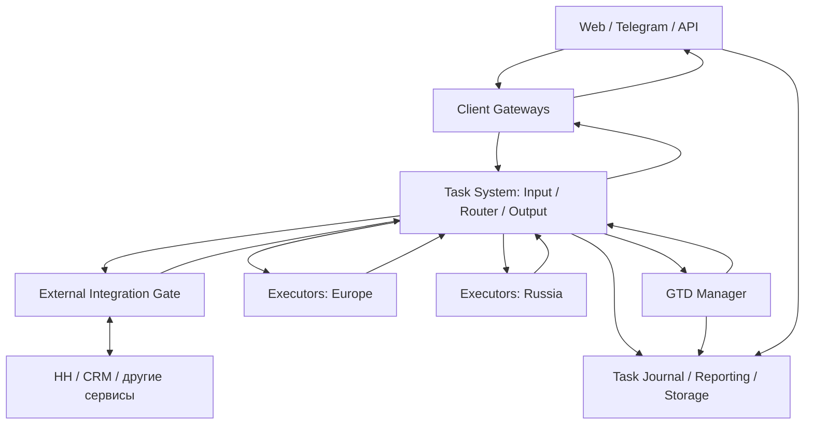
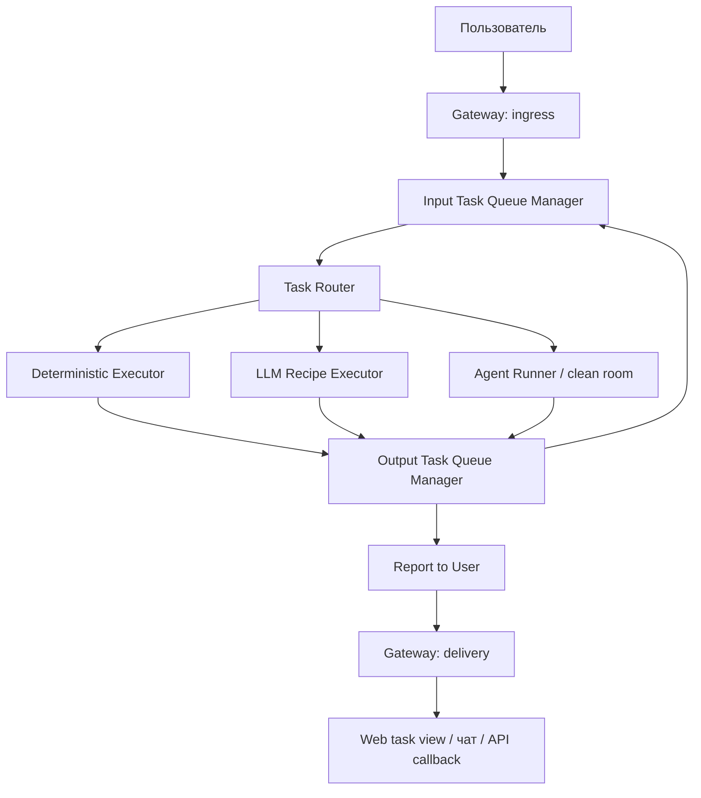
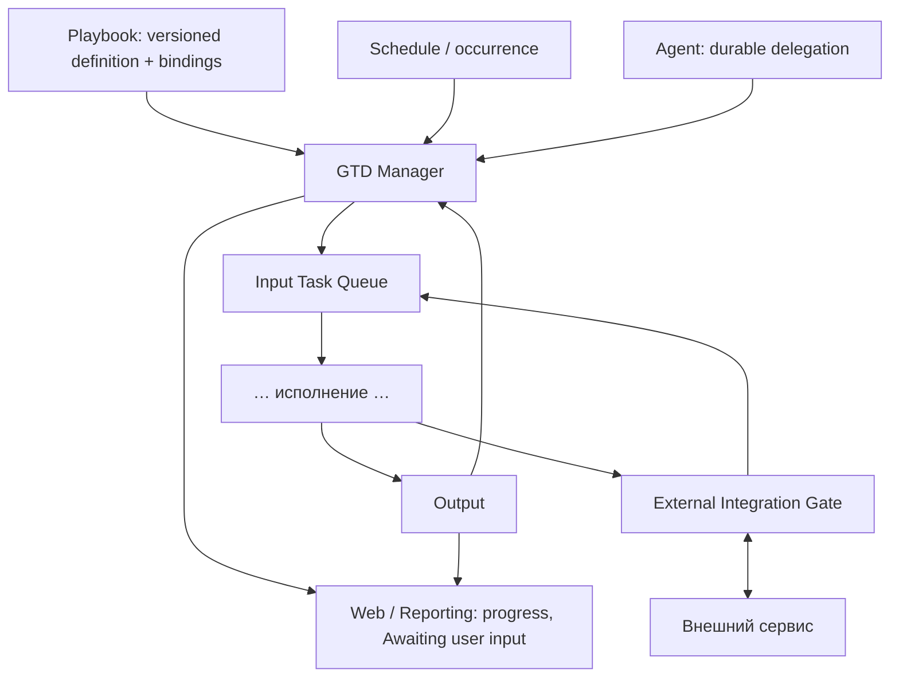

# Архитектура Trained Assist

Версия 0.3 · 30.09.2026 · целевая архитектура, draft. Это схема ответственности, а не утверждение, что все компоненты уже выделены и развёрнуты. Исторические факты, ссылки на код и прежние A01–A13 сохранены в [аудите v0.2](audits/ARCHITECTURE-0.2-CODE-AUDIT.md).

## Цель и границы

Один поток принимает задачи от Web, Telegram, внешнего API, расписания и других агентов. Одна пользовательская задача имеет стабильный **userTaskId**, доступный до окончательного результата. Web предоставляет приватный task view и справочную состояния; чат получает уведомления и результаты по настройке. Чат не владелец фоновой задачи.

Три вида Job: **deterministic-job**, **llm-recipe-job**, **ai-agent-job**. Job — определение работы; Run — конкретное выполнение. Фиксированный LLM recipe получает подготовленный вход и возвращает результат, без самостоятельного доступа к профилям и инструментам. Agent Runner запускает agent process в **Agent clean room**; clean room требуется агенту, а не каждому Job. Детали соответствия OpenLineage — в [терминологии](TERMINOLOGY.md).

**gtdId** означает, что задача находится под контролем Getting Things Done. Расписание и playbook для этого необязательны. GTD контролирует достижение результата, технический контроль следит за живучестью попыток, playbook задаёт методику. Их нельзя подменять одним бесконечным retry.

## 1. Общая схема

Это логические блоки: один блок не обязательно отдельный процесс или репозиторий. Reporting доступен через авторизованный API; стрелка пользователя к нему не означает прямой доступ к базе. География исполнения выбирается политикой движка, провайдера и данных: Claude Code/Codex — вне российской зоны по текущему продуктному требованию; OpenCode — в допустимой зоне с учётом конкретного провайдера. География хранения требует отдельного решения.

Gateways адаптируют каналы, а не выбирают исполнителя. Task Router принимает решение о типе работы и допустимой эскалации. Он stateless относительно долговременной истории; получает её необходимую проекцию во входе. Очереди, результаты, доставка и GTD имеют собственное durable state.

## 2. Одна задача: вход, исполнение, результат

Input хранит ещё не переданные задания: загрузку, подготовку, готовность и ожидание dispatch. После **durable acceptance** исполнителем запись покидает pending queue; активное выполнение остаётся в Task Journal. До подтверждения передачи нельзя «отправить и забыть». Outbox, идемпотентный приём и lease/watchdog нужны против потери между процессами.

Крупные файлы идут в Artifact Storage; в очередь попадают ссылки и метаданные. Загрузка, проверка, транскрипция и сжатие имеют состояния, лимиты, deadlines и backpressure. Не нужно держать тяжёлый файл в webhook/API-запросе на протяжении всего расчёта.

Output принимает результаты и события состояния, проверяет контракт и сохраняет их. Затем он передаёт delivery или follow-up и удаляет pending item после подтверждённой передачи. У **одного перехода ровно один владелец**: для управляемой задачи решение о следующем шаге принимает GTD; для неуправляемой — политика Output/Router. GTD и Output не должны одновременно повторять одну ошибку.

Разговорный запрос по умолчанию получает один полезный bounded LLM recipe «ответь или определи следующий executor». Готовый ответ идёт в Output. Если нужны инструменты и адаптивные действия — Output создаёт typed continuation той же задачи к агенту. Это не новый userTaskId и не ошибка LLM Run. Типизированные команды stop/status, известные доменные задания и callbacks не требуют обязательной LLM-классификации. Подробнее — [Task Router и MCP](TASK-ROUTER-AND-MCP.md).

Эскалация deterministic → LLM → agent допускается политикой, а не любой ошибкой. Отсутствие бюджета, доступа или неопределённый исход внешнего действия требуют соответствующего blocked/reconciliation состояния. «Задача принята» и «агент запущен» — разные события.

Reporting — read model по userTaskId: очередь, подготовка, запуск, ошибка, следующий executor, уровень эскалации, ожидание пользователя и итог. Статус вычисляется из durable событий, а не из наличия процесса или сообщения в чате. Доставка пользователю имеет отдельный статус от исполнения.

## 3. GTD, playbook и внешние сервисы

Playbook — переносимый артефакт методики. Execution Plan — конкретизация с bindings; Checklist — представление исполнения. Доменные репозитории хранят методику; GTD хранит контроль конкретной задачи и переходы. Детальные playbooks здесь не дублируются: [границы](PLAYBOOKS-VS-GETTING-THINGS-DONE-BOUNDARIES.md), [проверка реальными playbooks](REVIEW-WITH-REAL-PLAYBOOKS.md).

Каждый запуск расписания получает occurrence ID и отдельный userTaskId; gtdId — собственный контроль этого запуска. Повторный dispatch того же occurrence дедуплицируется. При продолжении той же задачи gtdId сохраняется; самостоятельная дочерняя задача получает свой userTaskId/gtdId и ссылку на родителя.

**Awaiting user input** — durable состояние с awaitingInputId, ожидаемым ответом и правами отвечающего. Оно отражается в Web, с возможным уведомлением в чат. Run можно завершить после сохранения checkpoint; ответ возобновляет работу новым Run. Не предполагается, что каждый engine уже поддерживает универсальное восстановление. Время ожидания не должно расходовать токены пустым polling.

Агент может заказать независимую задачу через платформенный API: ограниченный principal, бюджет, идемпотентный запрос и correlation к родителю. Принятая задача живёт после смерти родительского процесса. Это отличается от локального subagent, привязанного к engine. Требует ли любая такая задача GTD — открытое решение; durable submission само по себе обязательно.

### External Integration Gate

Gate выполняет исходящие обращения и принимает события **в контексте разрешённой интеграции пользователя**. Он разрешает integrationBindingId в provider/account/scopes, а не доверяет произвольному userId, указанному моделью. Доменные adapters знают API HeadHunter/CRM; общая оболочка отвечает за auth boundary, входящий inbox, дедупликацию и delivery receipts.

Регистрация webhook — отдельное действие с разрешениями и lifecycle подписки. Только сервисы с поддержкой webhook могут использовать эту возможность; наличие такого API у HH здесь не утверждается. Для остальных — scheduled polling. Подлинность callbacks проверяется средствами конкретного провайдера. Callback коррелирует существующую задачу, если это ответ на operation; независимое внешнее событие может создать новую задачу по binding policy.

Повторять побочные эффекты «на всякий случай» нельзя: operationId сохраняется до вызова; timeout после отправки означает outcome unknown, затем reconciliation. Callback получает providerEventId и собственный eventId. Результаты не должны утекать между профилями.

## ID и область видимости

| ID / reference | Назначение и lifecycle | Видимость |
|---|---|---|
| userTaskId | Сквозная задача; неизменен при retry, routing и escalation | Пользователь и авторизованные сервисы |
| gtdId | Контроль одной задачи; сохраняется при продолжениях и в истории | Пользовательская проекция + GTD |
| jobId | Определение Job с типом/версией; много Runs | Внутренний, при необходимости diagnostic |
| runId | Одно выполнение; новый при повторном запуске | Внутренний, возможно diagnostic |
| planId / stepId | Конкретный план и шаг; связи с задачами | Scoped Web/GTD |
| playbookRef + revision | Неизменяемая версия методики | В рамках доступа к артефакту |
| scheduleId / occurrenceId | Правило расписания / один плановый запуск | Scoped Web/GTD |
| awaitingInputId | Одно ожидание ответа, одноразовый идемпотентный ответ | Уполномоченный пользователь |
| operationId | Один логический побочный эффект, стабилен при повторах | Исполнители и integration adapter |
| eventId / resultId | Дедупликация событий и результатов, ссылки на causation | Внутренний |
| artifactId / workspaceRef | Данные и версионированный snapshot/export | Scoped по владельцу |
| tenantId / profileId / projectId | Контекст владения и доступа, не заменяется task ID | Проверяется на каждой границе |
| conversationId / sessionId | Контекст общения / engine session, не владелец задачи | Канал/engine, scoped |
| destinationId / nativeMessageId | Адрес доставки / ID сообщения провайдера | Gateway и delivery store |
| integrationBindingId | Интеграция пользователя с разрешённым аккаунтом/scopes | Gate, пользовательская проекция |
| webhookSubscriptionId / providerEventId | Подписка и дедупликация внешнего события | Gate/provider adapter |
| externalOperationRef | ID операции у провайдера, для reconciliation | Gate/domain |
| parentUserTaskId / parentRunId | Причина независимой дочерней задачи | Scoped lineage |
| traceId / spanId | Технический distributed tracing, не бизнес-задача | Observability |
| providerCallId | Одна попытка вызова модели, связана с runId и расходом | Ledger/Model Gateway |

userTaskId, gtdId при наличии, tenant/profile context и causation прокидываются через Input → Router → executor → Output → GTD/Reporting/delivery. ID не являются секретом и не дают права читать задачу. Повторы API используют отдельный idempotency key. У стабильного gtdId нет магического свойства «не терять»: его обеспечивает durable inbox/outbox и восстановление незавершённых переходов.

Детальная модель статусов и IDs — [User Task и Reporting](USER-TASK-IDS-AND-REPORTING.md).

## Репозитории и ownership

Статус «предложение» не означает созданный репозиторий. Выделять репозиторий полезно по независимому контракту и lifecycle, а не по каждому прямоугольнику.

| Репозиторий / предложение | Целевая ответственность |
|---|---|
| trained-agent-architecture | Эта архитектура, контракты, сквозные сценарии и audit |
| trained-assist-tg-bot | Telegram ingress/delivery, platform message IDs, UX канала; удалить решения о выборе executor |
| trained-assist-web | Web UI и task views; состояние задач получает через общий API |
| ai-agent-runner | Выбранный репозиторий Runner; clean room, engine adapters, region placement, lifecycle; пока draft |
| trained-assist-task-router — имя предложено, пользователь создаст | Stateless routing policy, reply-or-route contract, typed continuation; не queue/GTD/credentials |
| trained-assist-agent | Текущее legacy core; источник извлекаемых модулей, тонкая сборка/совместимость после миграции |
| trained-assist-llm-ladder | Model selection/provider gateway; не выбор типа Job |
| Task Queue/Journal/Reporting — граница предложена | Input/Output state, handoffs, task API, delivery outbox; отдельный repo ещё не выбран |
| GTD Manager — граница предложена | Контроль результата, plan/schedule/wait/delegation; отдельный repo ещё не выбран |
| External Integration Gate — модуль, repo пока не решён | Общий auth/inbox/receipts; API-specific adapters остаются доменными |
| Credential Broker / Storage — модули, размещение не выбрано | Scoped credentials, snapshots, artifacts; не подразумевается repo на каждый модуль |
| Общие contracts/schema — пакет либо каталог | Versioned envelopes и совместимость; без бизнес-логики |

Доменные репозитории из текущего аудита: software-engineering-playbooks, trained-assist-hh-skill, trained-assist-sales, trained-assist-documents, trained-assist-freelance, trained-assist-speech, trained-assist-search, trained-assist-marketing. Точный inventory и происхождение артефактов — в [review](REVIEW-WITH-REAL-PLAYBOOKS.md) и [scenarios](scenarios/README.md). Общая архитектура не переносит их playbooks в core.

### MCP, данные и credentials

MCP — интерфейс, а не монолитное ядро. Есть локальный per-run stdio process/client/proxy, удалённый MCP service, фиксированный вызов handler из headless Job и read-only каталог capabilities. Один доменный handler может иметь API/MCP фасады. Запуск MCP процесса не гарантирует мгновенную готовность; readiness измеряется. Детали — в [Router/MCP](TASK-ROUTER-AND-MCP.md).

Runner загружает разрешённый snapshot пользовательских текстов и ссылок на artifacts; после Run экспортирует разрешённые изменения обратно либо в заданный API destination для разового запуска. Параллельные экспорты требуют версии/conflict policy, а не перезаписи последним процессом. Run/session logs сохраняются отдельно от пользовательского workspace с ownership и retention.

Credentials имеют shared/platform, private/user и replaceable-default scopes. Playground GitHub может заменяться собственной интеграцией пользователя; выбор происходит через binding policy, не через копирование общих секретов в prompt. Секреты не попадают в task events/ledger; Runner получает минимальный scoped доступ.

Стоимость, бюджет, model ladder и Ledger вынесены в [Model Gateway and Costs](MODEL-GATEWAY-AND-COSTS.md). В основном документе сохраняется только обязательная correlation расходов с задачей и Run.

## Что подтверждено сейчас и что меняем

| Область | Текущая находка | Целевая граница |
|---|---|---|
| Быстрый ответ | Core input-router P1 shadow classifier: head/tail по 400 символов при длинном вводе, timeout 4s; mixed quick runner/delivery | Один полезный reply-or-route recipe, полноценный контекст/refs, решения вне TG |
| Изоляция | T0 optional, Unix slots/ACL/env allowlist; исключения Codex/cwd, persistent HOME, MCP service user | Проверяемый lifecycle clean room без скрытых исключений |
| GTD/расписание | Существуют cron и контроль в core, session/chat coupling | Отдельные task/control IDs и Web task views |
| HH cold search | Есть per-vacancy generic cron action hh_proactive_search; 1h поддерживается, default 24h | Schedule occurrence → контролируемая задача; методика вне core |
| Реальное включение HH | Код не доказывает включённые jobs на VM | Проверить runtime отдельно; не объявлять «раз в час уже работает у всех» |
| Ledger | Сбор стоимости — существующий элемент; полнота всех путей не доказана | Все provider calls/attempts связаны с Job/Run/task |

Свежая сверка: [core input-router](https://github.com/trained-assist/trained-assist-agent/blob/bbc0b91e503e65ede3adc0a87abf9bba59a1ad25/src/input-router.js), [TG preflight](https://github.com/trained-assist/trained-assist-tg-bot/blob/b3b703fa3271a3b739bcf315ebf7d247a33c7dc7/src/intake-preflight.js), [HH cron](https://github.com/trained-assist/trained-assist-hh-skill/blob/0a45af2e1173e3d2172f0d025fdd3f7fc100c2f4/src/hh-cold-search-cron.js). Прежний audit сохраняет ограничения и исходные evidence; новые целевые границы не являются утверждением о текущем коде.

## Совместимость эпиков и инварианты

A01–A13 сохраняют прежние значения из [audit](audits/ARCHITECTURE-0.2-CODE-AUDIT.md); эпики не перенумеровываются. Для новой работы добавлять конкретный контракт и владельца из таблицы выше. C01–C09 остаются ссылками, но старое слово Orchestrator раскладывается по новым владельцам в [контрактах](contracts/README.md).

INV-01–INV-13 остаются индексом прежних проверок. **Пересмотр INV-03:** чат больше не ограничивает все фоновые задачи одним execution; отдельная политика интерактивного потока может ограничивать конкуренцию. Старое правило совместимости сохраняется при миграции до явного переключения. INV-14: managed outcome доставляется GTD через durable inbox с gtdId. INV-15: Awaiting user input видим в Web и не требует живого Agent Run.

Миграция не должна удалять работающие старые пути до проверки нового сквозного сценария: приём → результат → Web/чат, stop/supplement, повтор после сбоя, бюджетный отказ, external callback и ожидание ответа. Исторические копии [сценариев](scenarios/README.md) — evidence, а не автоматически новые требования.

## Открытые решения

- Создавать gtdId для всех задач по умолчанию или только для явно контролируемых/длительных?
- External Gate сейчас выделять в repo или сначала сделать модулем с доменными adapters?
- Какие лимиты разрешают автоматическую дорогостоящую эскалацию, а когда требуется согласие пользователя?
- Где хранятся профили, artifacts и journal для RU/EU и допустимы ли трансграничные snapshots?
- Достаточен ли приватный Web task view всем пользователям API, и как выдаётся доступ?
- Какие фактические gaps Ledger и latency baseline подтвердит следующий runtime audit?
