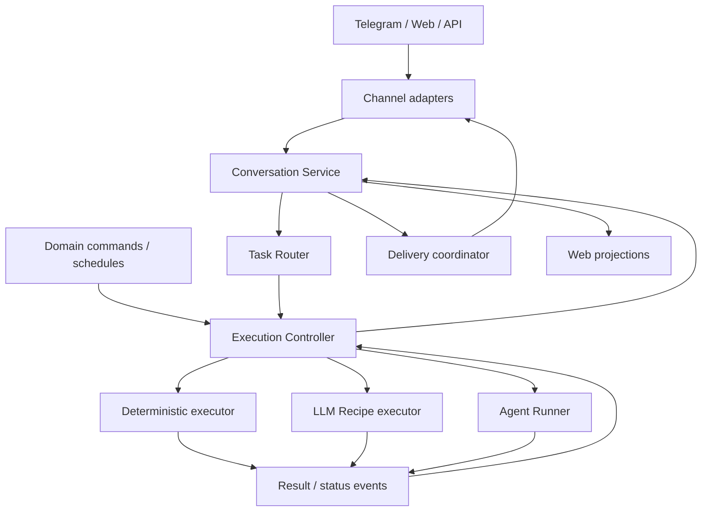

# Brainstorm: core, маршрутизация и границы репозиториев

Статус: **brainstorm / предложения для обсуждения**, 30.09.2026. Это вторая архитектурная итерация, а не утверждённая замена [ARCHITECTURE.md](ARCHITECTURE.md). Код и deployments этой записью не меняются.

## 1. Что обсуждаем

Узел между Telegram/Web/API/доменами, с одной стороны, и выполнением обычного кода, LLM recipes и агентских runs — с другой. Хотим уменьшить core, сохранить надёжность и дать каждому репозиторию понятную ответственность и быстрые локальные проверки.

Предлагаемая идея: **тонкие channel adapters + Conversation Service + Task Router + Execution Controller + специализированные executors**. Это логические модули; отдельный репозиторий не означает обязательный отдельный сетевой сервис.

Главное разделение: сообщение не всегда является новой задачей; задача не всегда требует агента; завершённый run не всегда означает выполненную задачу; доставка результата — самостоятельный надёжный процесс.

## 2. Схема центрального узла



Conversation Service фиксирует вход, собирает разрешённый context snapshot и применяет результат маршрутизации. Task Router возвращает **предложение**, а controller проверяет и принимает execution plan. Для direct reply controller обеспечивает короткий audited путь без тяжёлой очереди и clean room; он может быть локальным модулем в том же процессе.

Domain commands и schedules уже могут содержать JobSpec. Они проходят общие admission, budgets, ownership и execution lifecycle, но не обязаны проходить повторное LLM-распознавание пользовательского текста. Их уведомления попадают в Conversation Service только при наличии audience/destination.

## 3. Четыре разные обязанности вместо одного «роутера»

| Компонент | Input → output | Собственное состояние |
|---|---|---|
| Channel adapter | Telegram/Web protocol ↔ canonical messages/actions | Минимум transport-specific receipts, tokens, uploads и локальные projections |
| Conversation Service | Сообщения, context, session links → RoutingInput / пользовательские события | Durable conversation state, input assembly, message links |
| Task Router | RoutingInput → RouteDecision | Нет авторитетного состояния; получает explicit snapshot |
| Execution Controller | Accepted plan / schedule → Jobs, Runs, status/results | Durable task state, schedules, attempts, leases, cancellation, GTD |
| Delivery coordinator + renderer | Logical output → channel operations → receipts | Outbox, message IDs, retries, edit/delete timers |

Название **Task Router** подходит выбору пути исполнения. Выбор EU/RU worker — отдельная обязанность **Execution Dispatcher** внутри execution control plane. Её не смешиваем с вопросом «можно ли ответить одной LLM».

На выходе нужен **Response Renderer / Delivery Adapter**, а не обязательно второй LLM Router. Детерминированный renderer переводит canonical output в Telegram text/buttons или web view. Если необходима интеллектуальная адаптация ответа, это явный llm-recipe-job с бюджетом и сохранённым результатом.

## 4. Stateless не означает отсутствие контекста

Task Router может быть stateless: `decide(inputSnapshot, policyVersion, catalogVersion) → decision`. Историю, текущую задачу, разрешённые capabilities и факты о пользователе готовит Conversation Service. Router не читает профиль самостоятельно и не исполняет tools.

При LLM-вызове функция не обязательно математически детерминирована. Поэтому сохраняем decision, model/recipe version и связь с исходным сообщением: повтор доставки входа не должен заново случайно выбрать другой маршрут.

Бот может стать тонким, но всему продукту требуется state. Telegram message IDs, незавершённые вложения и outbox не исчезают. Web также сохраняет UI/auth/transport state. Предлагаем **распределить владение**, а не запретить хранение данных каналам.

## 4a. Вариант: Task Queue как отдельная граница

Предложение владельца в этой итерации: **Task Queue**, возможное имя репозитория — **trained-assist-task-queue**. Репозиторий пока не создаём.

Название хорошо описывает durable очередь **готовых к исполнению work items**. Каждый item ссылается на Job и конкретную попытку/Run; если интерфейс допускает более ранний enqueue, точную гранулярность фиксируем контрактом. Queue не интерпретирует пользовательское сообщение.

| Компонент | Решение |
|---|---|
| Task Router | Какой путь нужен: reply, deterministic-job, llm-recipe-job или ai-agent-job |
| Execution Controller | Какая работа принята, какие шаги готовы, достигнута ли цель, можно ли повторить |
| Task Queue | Какой готовый item выдать, когда он доступен, кому и с какой lease/generation |
| Executor / Agent Runner | Как выполнить выданный item и сообщить фактический outcome |
| Conversation / Delivery | Как сохранить и показать пользователю результат |

**Task Queue владеет:** enqueue/dedup receipts, ready/delayed/leased states, priority/fairness, attempts transport metadata, lease expiry, ack/nack и dead-letter/quarantine. Она исполняет заданную bounded retry policy для технических ошибок. Controller задаёт разрешённость повторов; новая агентская попытка получает новый runId, повтор транспортной доставки той же попытки — нет.

**Controller владеет:** goal/acceptance, task cancellation, dependencies, GTD, расписанием и созданием новых логических попыток. Domain workflow state остаётся домену. Queue не становится вторым task planner.

Логический путь: **Controller → Task Queue → выбранный executor**. Structured scheduled JobSpec проходит тот же controller/queue без LLM Task Router. Reply может использовать короткий synchronous путь; очередь для него не обязательна, durable message/outbox остаются обязательны.

Первый этап: **модуль Task Queue внутри controller** с общей transactional storage, отдельным интерфейсом и tests. Отдельный repo/service оправдан несколькими consumers/workers и независимым lifecycle. Выделение требует durable outbox из controller и idempotent enqueue: запись Task в одной БД и enqueue в другой не являются одной транзакцией.

Открытый контракт: enqueue(item, operationId), claim(workerCapabilities), heartbeat(lease), ack(outcomeRef), nack(reason), revoke/cancel(itemId, generation), inspect/reconcile. Это не выбранный framework.

Lease expiry не означает остановку старого исполнителя. Нужны generation/fencing, stop/reconcile и idempotency внешних эффектов. Успех queue ACK означает учтённый outcome попытки, а не acceptance задачи или delivery пользователю.

Если под именем **task-queue** хочется вынести весь нынешний core, имя окажется узким: там останутся orchestration, budgets, schedules и GTD. Предпочтение — использовать его для очереди, сохранив отдельную явную роль Execution Controller.

## 5. Быстрый путь: один вызов вместо «классификатор + повторный ответ»

Не предлагаем обязательную LLM-классификацию каждого сообщения.

1. Deterministic commands/actions, например stop, callback выбора проекта, status — известный handler.
2. Structured domain JobSpec — прямо в admission/controller.
3. Natural language — Router получает подготовленный context; при необходимости делает один LLM recipe call.
4. Decision уже содержит готовый ответ **или** описание требуемой работы **или** уточнение/ожидание продолжения.

Предлагаемый discriminated union:

```json
{
  "schemaVersion": 1,
  "kind": "reply",
  "reply": {
    "text": "Да, эта возможность есть. Она работает так…",
    "evidenceRefs": ["capability-catalog:v12:recruiting"]
  },
  "contextVersion": 42
}
```

| kind | Payload | Что происходит дальше |
|---|---|---|
| reply | Готовый текст + evidence refs | Проверка оснований, durable фиксация и доставка без Agent Runner |
| clarify | Вопрос / недостающие поля | Сохраняем ожидание ответа; не запускаем работу |
| await_more | Признак незавершённого ввода | Conversation intake продолжает сбор |
| supplement | targetTaskId + дополнение | Controller проверяет актуальную задачу и возможность изменения |
| execute | Job proposal / recipeRef / goal | Admission/controller валидирует права, тип и план исполнения |

Для execute нужны, например: `jobType`, `recipeRef` либо `agentGoal`, input refs, ожидаемый output, ограничения. Сгенерированное goal сохраняет исходный запрос и его ограничения; не заменяет его необратимой выжимкой. Модель не выдаёт авторитетные credentials, executable paths, region или permissions.

Повторный LLM-вызов после reply не нужен. Для execute новый вызов выполняет уже целевую работу. Если request требует фиксированного LLM-преобразования — llm-recipe-job; если требует самостоятельного выбора/исполнения tools — ai-agent-job; для известной операции достаточно deterministic-job.

Сам Router, использующий модель, является фиксированным LLM recipe step в собственном bounded runtime. Controller запускает такой шаг напрямую, без рекурсивного обращения к Task Router.

### Как избежать уверенного выдуманного ответа

«Есть у нас такая функция?» — reply только при наличии versioned capability facts в snapshot. «Сколько у меня откликов сейчас?» — необходима актуальная доменная выборка: deterministic domain handler может прочитать данные и вернуть результат без агента. Доступ модели к данным остаётся подготовленным, tools ей не выдаются.

Лимиты и политика отвечают на вопрос «разрешён ли этот путь», а не confidence модели. Stale context, отсутствующие факты, invalid JSON, timeout и budget denial — явные outcomes. Fallback задаётся продуктовой политикой; ошибка дешёвого шага не должна автоматически запускать дорогого агента. Автоматическую маршрутизацию сначала проверяем в shadow mode.

Нынешняя ручная кнопка «Запустить проработку» и автоматический fast path могут сосуществовать. Автоматическое escalation долгой/платной работы — отдельное продуктовое решение, а не побочный эффект рефакторинга.

## 6. Пользовательские и фоновые задачи: один controller, разные входы

| Пример | Тип | Путь |
|---|---|---|
| «Есть ли функция X?» при наличии документации | Bounded router reply recipe | Conversation → Router → reply |
| «Покажи статус HH» | deterministic-job / известный query handler | Command/domain operation → controller |
| «Переформулируй этот текст» | llm-recipe-job | Router → recipe executor |
| «Исследуй кандидата и обнови отчёт» | ai-agent-job | Router → Agent Runner |
| Почасовой HH sync | deterministic-job | Scheduler → готовый JobSpec |
| Ежедневный анализ подготовленной сводки | llm-recipe-job | Scheduler → recipeRef + input snapshot |
| Плановое агентское исследование | ai-agent-job | Scheduler → ограниченный Agent JobSpec |

Расписание — stateful определение trigger, а конкретное срабатывание создаёт Run работы. Нужны occurrenceId, timezone, misfire/catch-up policy, deduplication и запрет нежелательного overlap. Домен владеет логикой HH sync; controller — его запуском по расписанию. Не нужен второй «background agent core».

Отмена Task прекращает будущие attempts/GTD для этой задачи. Отмена одной occurrence не обязана удалять всё расписание; это разные команды. Success работы отделён от success пользовательского уведомления.

## 7. Кто хранит какое состояние

| Данные | Предлагаемый владелец | Что могут хранить остальные |
|---|---|---|
| Account identity и channel-account bindings | Identity/Profile module | Проверенные scoped refs, auth sessions |
| Канонические сообщения и их порядок | Conversation Service | Channel projections/caches |
| Intake batches, ожидание продолжения, связь pending media с вводом | Conversation intake module | Native update receipts и upload progress в adapter |
| taskId/sessionId/projectId links, текущий context version | Conversation Service | Ссылки в UI |
| Job/Run state, schedules, cancellation, leases | Execution Controller | Read models; Runner — локальный recovery journal |
| HH entities/cursors, sales entities, domain workflow state | Соответствующий domain | Разрешённые views/snapshots |
| Content/artifacts | Profile / artifact storage | Scoped refs и кэши |
| Native message IDs, delivery attempts, edit/delete TTL | Delivery module соответствующего канала | Logical message refs в Conversation Service |
| Web layout, composer draft, pagination, optimistic view | Web | Shared canonical APIs/events |

Не делаем Conversation Service новым огромным владельцем всех данных пользователя. Он знает **связи и ход общения**. Identity, domain records, task state и artifacts имеют свои владельцы.

В первый этап Conversation и Delivery могут жить в одном новом репозитории с отдельными модулями. Telegram-native receipt хранится в delivery-модуле; web presentation остаётся в web. Не требуется перемещать всё state в одну БД.

### Межканальная идентичность и порядок

Один profile может иметь несколько независимых conversations/sessions. Telegram private chat, bot audience, group/topic и web session не объединяются автоматически по userId. ConversationRef включает channel/account/endpoint/thread и проверенную session binding.

Порядок ввода фиксируется в conversation lane; запись session имеет свой writer key. Одновременные сообщения web/TG в одну session требуют явной conflict/supplement policy. «Последнее сообщение пользователя» — недостаточный ключ для всей системы.

## 8. Очереди и файлы: сохранить семантику границ

Нужны разные виды очередей, даже если физически они используют одну технологию:

| Очередь | ACK означает |
|---|---|
| Ingress/intake | Ввод надёжно сохранён |
| Media processing | Вложение принято; скачивание/транскрипция могут ещё идти |
| Task admission | Задача принята в durable control plane |
| Execution dispatch | Run назначен executor; это ещё не complete |
| Result delivery | Выходное событие поставлено в outbox; это ещё не отправка |

Единый correlation envelope связывает messageId, requestId, taskId, jobId, runId, artifactId и destinationRef. В каждом hop — идемпотентность и recovery. Outbox атомарен с записью состояния своего владельца; две независимые БД не становятся атомарными от одинакового requestId.

Файл передаётся ссылкой с owner/scope/hash/size; intake не запускает задачу раньше необходимых вложений и продолжения диктовки. Telegram getFile остаётся у adapter; generic transcription/conversion — reusable media/domain executor. Результат связывается с исходным intake batch, даже если поздно пришёл.

Доставка Telegram иногда имеет неизвестный outcome при lost ACK. Не обещаем exactly-once: reconcile где возможно, иначе явно учитываем риск дубля. Cleanup UI сообщений использует канал, native receipt и срок жизни; результат пользователя не удаляем по TTL меню.

## 9. MCP и clean room

**Не вся MCP-система обязана спавниться внутри clean room.** MCP — protocol adapter к capability; место исполнения определяется правами и lifecycle. Официальный SDK различает локальный subprocess через stdio и remote server через Streamable HTTP: [MCP TypeScript SDK — connection](https://ts.sdk.modelcontextprotocol.io/v2/clients/connect). Версию протокола/SDK фиксируем отдельно.

| Вариант | Где живёт | Когда подходит |
|---|---|---|
| Local domain MCP process | В clean room, с теми же либо меньшими правами | Работа с разрешённым workspace и локальными данными |
| Run-scoped MCP client/proxy | В clean room; broker/service снаружи | Действия с credentials, удалёнными API и host resources |
| Shared remote domain service | Вне clean room, строгая авторизация каждой операции | Persistent domain state, sync, общие интеграции |

Run token должен связывать subject/profile, runId, allowed capabilities и срок жизни. Внешний tool service не доверяет profileId из arguments без проверки; не принимает произвольные host paths. Его широкие OS-права не компенсируются тем, что клиент изолирован.

Run завершён — локальные MCP children остановлены, bindings отозваны. Remote service может продолжать работу, но полномочия закрытого Run прекращаются. Известную domain operation controller может вызывать через обычный internal API/adapter без engine и без clean room, с собственной проверкой прав.

В текущем core bridge прямо запускает MCP servers как service user. Поэтому «MCP процесс на каждый Run» и «MCP процесс внутри security boundary» сейчас разные утверждения.

### Должен ли core MCP стать пустым?

**Тонким — да; нулевым — необязательно.** Domain tools, prompts, recipes и domain state принадлежат доменам. Универсальные task/session/artifact операции — platform capabilities с владельцами контрактов. Общее MCP facade может содержать transport/schema/authorization wiring, обращаясь к владельцу операции.

Спецификацией без реализации tool не заменяется. Документированные schemas, policy metadata и contract fixtures должны версионироваться рядом с реализацией capability. Не создаём отдельный repo на каждый MCP method: хорошо выделять domain package с общим владельцем, зависимостями и CI.

## 10. Предлагаемая карта репозиториев

Имена новых repos **предложения; этой итерацией они не создаются**.

| Репозиторий | Ответственность | Что в нём не разрастается |
|---|---|---|
| trained-agent-architecture — существует | Общая схема, cross-repo contracts/scenarios/decisions | Runtime implementation |
| trained-assist-tg-bot — существует | Telegram adapter, rendering, native transport, bot deployment | Domain decision logic, engine policy, global task scheduler |
| trained-assist-web — существует | Web UI, auth adapter, web rendering/streaming и projections | Второй task/session/domain authority |
| trained-assist-conversations — предлагается | Conversation intake/context, message-session links, delivery coordination; разделённые channel delivery modules | Domain entities, engine lifecycle |
| trained-assist-task-queue — кандидат, предложен владельцем | Durable ready/delayed work items, dispatch leases, ACK/NACK и bounded retries | Intent recognition, task acceptance, GTD, channel delivery |
| trained-assist-task-router — кандидат | RouteDecision schema, pure decision policy, bounded LLM recipe и eval fixtures | User DB, queues, execution, credentials |
| trained-assist-agent — существующий core | На первом этапе: Execution Controller / dispatcher / GTD / admission | Engine implementation и канальные send/edit вызовы после извлечения |
| ai-agent-runner — создан | ai-agent-job, Agent clean room, engine adapters, local run supervision | Conversation state, domain logic, GTD |
| trained-assist-llm-ladder — существует | Model gateway/routing; отдельно согласовать budget/ledger ownership | Conversation router и scheduler |
| Domain repositories — существуют | Domain tools/APIs, prompts, recipes, domain state и tests | Копия controller и channel SDK |
| trained-assist-contracts — кандидат | Shared envelopes и schemas, compatibility fixtures | Runtime helpers с business logic |

**Минимальное выделение:** Runner + Conversations; router сначала автономный package/module, даже если живёт в controller repo. Отдельный router repo оправдан, когда у него есть собственные версии, evals и consumers. Простота builds достигается также изолированными packages и targeted CI.

LLM Recipe executor и deterministic executor сначала могут быть отдельными модулями controller или существующего worker. Им не обязательно заводить repo на старте. Controller repo можно переименовать после того, как его реальная ответственность станет ясна.

Contract package вводим при реальных двух consumers; до этого схемы публикует владелец интерфейса. Центральный contracts repo не должен требовать синхронного релиза всех сервисов при каждом доменном изменении.

### Найденные domain repositories / registry

Core registry на проверенной revision содержит:
- hh → trained-assist-hh-skill;
- freelance → trained-assist-freelance-skill;
- engineering → trained-assist-engineering (общий notebook ранее подтвердил переименование в software-engineering-playbooks; wiring нужно сверить);
- sales → trained-assist-sales-skill;
- documents → trained-assist-documents-skill;
- speech → trained-assist-speech-skill;
- search → trained-assist-search-skill;
- marketing → trained-assist-marketing-skill.

Это имена из registry, а не проверка фактического наличия/deployment всех providers на VM. Отдельные доменные repos в этой итерации целиком не аудированы.

## 11. Что реально есть сейчас

Проверены GitHub revisions:
- core: **bbc0b91e503e65ede3adc0a87abf9bba59a1ad25**;
- Telegram: **b3b703fa3271a3b739bcf315ebf7d247a33c7dc7**;
- Web: **be33bc0bce082693eaadc5b70e8ee78562d2dd8c**.

Это новая выборочная проверка центрального узла; предыдущий полный notebook основан на более ранней core revision. Прод и flags не проверены.

| Факт / источник | Вывод для draft |
|---|---|
| [core input-router.js](https://github.com/trained-assist/trained-assist-agent/blob/bbc0b91e503e65ede3adc0a87abf9bba59a1ad25/src/input-router.js): quick/agent, ready, supplement, tools hints; shadow only | Близкая гипотеза уже есть; она не является активным stateless production router |
| [core answer-router.js](https://github.com/trained-assist/trained-assist-agent/blob/bbc0b91e503e65ede3adc0a87abf9bba59a1ad25/src/answer-router.js): durable mode, ручной workrun, oneshot prompt | «One-shot» здесь не доказывает tool-free LLM recipe; mode и jobType — разные оси |
| [core runner/index.js](https://github.com/trained-assist/trained-assist-agent/blob/bbc0b91e503e65ede3adc0a87abf9bba59a1ad25/src/runner/index.js): quick path, session writes, queue/control и Telegram sends | Главный кандидат на разлипание: controller + conversation + delivery + runner смешаны |
| [core BOT-DELIVERY.md](https://github.com/trained-assist/trained-assist-agent/blob/bbc0b91e503e65ede3adc0a87abf9bba59a1ad25/docs/BOT-DELIVERY.md): audience/token mapping, stop scope, durable journals | При выносе нельзя потерять bot audience и маршрутизацию ответа после restart |
| [TG RunOutbox](https://github.com/trained-assist/trained-assist-tg-bot/blob/b3b703fa3271a3b739bcf315ebf7d247a33c7dc7/src/run-outbox.js): DO, FIFO, durable ACK/requestId, alarms | Надёжность приёма сохраняем; меняем адресат/контракт постепенно |
| [TG media-jobs.js](https://github.com/trained-assist/trained-assist-tg-bot/blob/b3b703fa3271a3b739bcf315ebf7d247a33c7dc7/src/media-jobs.js): per-file state machine, R2 refs | Native download остаётся каналу; reusable media processing — кандидат на извлечение |
| [TG transient-ui.js](https://github.com/trained-assist/trained-assist-tg-bot/blob/b3b703fa3271a3b739bcf315ebf7d247a33c7dc7/src/lib/transient-ui.js): expiry receipts, cron deletion и callback freshness | Это законный channel delivery state, а не обязательный мусор в боте |
| [TG intake-preflight.js](https://github.com/trained-assist/trained-assist-tg-bot/blob/b3b703fa3271a3b739bcf315ebf7d247a33c7dc7/src/intake-preflight.js): /intake-quick без full-agent fallback | Fast paths уже существуют; отделяем продуктовую политику от Telegram transport |
| [Web worker.mjs](https://github.com/trained-assist/trained-assist-web/blob/be33bc0bce082693eaadc5b70e8ee78562d2dd8c/worker.mjs): auth, local/demo sessions, delegated real sessions/projects/stop | UI остаётся в web; делегирование заменяем canonical APIs, избегая shadow business state |
| [domain-section-manifest.md](https://github.com/trained-assist/trained-assist-agent/blob/bbc0b91e503e65ede3adc0a87abf9bba59a1ad25/docs/domain-section-manifest.md): domain-owned module/prompt manifests | Разделение уже развивается; core не должен знать каждый domain tool file |
| [how-to-move-a-tool](https://github.com/trained-assist/trained-assist-agent/blob/bbc0b91e503e65ede3adc0a87abf9bba59a1ad25/docs/how-to-move-a-tool-to-a-domain-repo.md): sibling priority, HTTP boundary, CI gates | Продолжаем существующий expand/contract, вместо параллельного несовместимого plugin framework |

## 12. Что вынести из бота, а что оставить

**Кандидаты на перенос/общую реализацию:**
- Общая сборка пользовательского ввода и дополнений, session/project selection policy.
- Выбор Job/engine/region и domain query orchestration.
- Shared transcription/processing recipes и их retries.
- Canonical conversation history и task bindings.
- Общая delivery coordination, если от неё зависят несколько каналов.

**Оставить в Telegram adapter/delivery:**
- Webhook verification, update decoding и native callback conversion.
- Telegram getFile, native receipts, formatting/buttons и API limits.
- Telegram message edit/delete operations и native delivery recovery.
- Transport-local deduplication до durable приёма в общий сервис.

Не переносить UI expiry только ради слова stateless. Можно перенести весь Telegram delivery module в conversations repo или оставить его в bot repo; важнее один владелец receipts и versioned контракт. Разница между code ownership и state ownership описывается явно.

Web оставляет layout, navigation, composer, auth sessions и subscriptions. Shared query/read models предоставляют conversation/controller/domain owners. Уже существующие local demo sessions допустимы как отдельный режим, но не подменяют реальные tasks при недоступности backend.

## 13. Границы API для следующей итерации

| Контракт | Содержание |
|---|---|
| ChannelEvent | eventId, channel/account/endpoint/thread, verified subject, message parts/artifact refs, native refs, timestamps |
| RoutingInput | original input, prepared context/version, active task refs, allowed catalog, policy/budget constraints |
| RouteDecision | union reply/clarify/await_more/supplement/execute, recipe/model provenance |
| TaskSubmission | operationId, subject/scope, goal/JobSpec, source user/domain/schedule, acceptance criteria, destinationRef |
| ExecutionPlan / RunSpec | Versioned resolved executor bindings; Runner-specific subset по C04/C05 |
| ResultEvent | Structured result/status/artifact refs; acceptance и delivery отдельно |
| DeliveryCommand / Receipt | Logical output id, channel destination, send/edit/delete, idempotency/ref, native ACK/unknown outcome |
| DomainCapabilityManifest | Owned operations/schemas, permission/effect metadata, job templates, package versions |

Расширения связать с [C01–C09](contracts/README.md); здесь новые названия иллюстративны. Все границы требуют authorization, schema compatibility, dedup и explicit errors. Универсальный event envelope не даёт права читать чужую conversation.

## 14. Проверка и постепенная миграция

1. Описать пару end-to-end scenarios на fake executors/Telegram capture: quick reply и scheduled HH sync.
2. Зафиксировать envelopes и владельцев состояния, добавить adapters вокруг существующих modules.
3. Убрать прямую channel delivery из Agent Runner; controller публикует structured events.
4. Выделить Conversations intake/history, сохранив receipts, FIFO, audience и media readiness.
5. Подключить bounded LLM reply recipe в shadow/evaluation режиме; отдельно согласовать auto escalation.
6. Подключить Web и TG к одному conversation/task API, сохранив их UI и native delivery modules.
7. Извлекать дополнительные repositories только после стабильной границы и самостоятельной CI.

Каждый repo проверяет свою реализацию и consumer contract fixtures. Отдельная небольшая integration suite проверяет несколько repos по **закреплённым версиям**. Не клонируем всю организацию для любого unit test и не обновляем все dependencies на main без совместимости.

Обязательные сценарии: duplicate webhook, lost ACK, reply после restart, сообщение как supplement, late media, cross-channel same-session conflict, cancel/retry, scheduled overlap, budget denial, tool authorization, Telegram TTL cleanup и unavailable web backend. Сначала инженерная тестовая среда с fake LLM/domain API, затем реальные adapters.

## 15. Решения, которые стоит принять после чтения

- [ ] Task Queue сначала модуль controller или отдельный repo; что является queue item и кто выдаёт новый runId?
- [ ] Conversation Service + Delivery сначала один repo или два modules в существующем core?
- [ ] Router: самостоятельный repo сразу или сначала изолированный package с evals?
- [ ] Какие facts/snapshots доступны bounded reply recipe и сколько они живут?
- [ ] Как соотносятся ручной workrun и автоматический выбор ai-agent-job?
- [ ] Какие domain MCP tools локальны, а какие требуют external broker?
- [ ] Где Telegram delivery state живёт физически при новом logical ownership?
- [ ] Какие sessions пользователь явно связывает между Web и Telegram?
- [ ] Где identity/account bindings и какие ограничения RU/EU для conversation storage?
- [ ] Кто владеет media pipeline после выделения speech domain?
- [ ] Каким минимумом contract fixtures доказываем возможность независимых релизов?

Предпочтение этой итерации: **сохранить небольшой stateful controller, вынести conversation/delivery и execution lifecycle, сделать router stateless по владению данными, домены — владельцами своих capabilities.** Размер repo уменьшаем по устойчивой ответственности; число сервисов увеличиваем по эксплуатационной необходимости.
