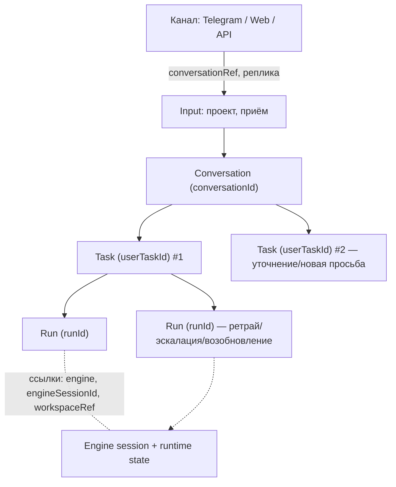

# Контракт разговорной сессии

Статус: **документ гейта M0** · 01.10.2026. Основание — [ARCHITECTURE §5](ARCHITECTURE.md) (v0.7, «Разговорная сессия»), дополнительно §4.1, §4.6, §6, §8, §11; постановка — эпик [#87 A3](https://github.com/trained-assist/trained-agent-architecture/issues/87); приёмка — AC-88 в [E2 #18](https://github.com/trained-assist/trained-agent-architecture/issues/18) («контракт conversation/project/audience опубликован и указан в P12»).

Этот документ фиксирует четыре вещи, без которых не стартует control plane:

1. границы **Conversation vs Task vs Run** (и что слово «сессия» значило в проде);
2. что живёт в **Task Store** и что там не живёт;
3. **resume-семантику** — что происходит при продолжении разговора после рестарта процесса или VM;
4. связь с **legacy session-store** — что переезжает, что остаётся legacy на первом этапе и как они сосуществуют.

**Зависимость A2.** Схема Task Store v1 (A2 того же эпика) на момент публикации не смержена, поэтому «что живёт в Task Store» опирается на целевые поля из #87 и на прод-инвентарь `state.db` (§4.1). После межа A2 сюда добавляется ссылка на его документ, а расхождения DDL исправляются до реализации P12.

**Вне области:** wire API и envelope (C01/C02 в [contracts](contracts/README.md)), DDL схемы (A2), выбор пары «база + движок» (P-DB), регион хранения (§13), политика нативного resume в новом Runner (C05 — отдельная runtime-state policy, решение не принято).

## 1. Терминология: «сессия» — три разных слова

INV-01 требует различать профиль, сессию, задачу, попытку, worker и clean room. В проде словом «сессия» назывались разные вещи, поэтому контракт начинается с разводки терминов:

| Термин в контракте | ID | Что это | Как называется в проде (legacy) | Как называется в ARCHITECTURE |
|---|---|---|---|---|
| **Разговор** (conversation) | `conversationId` | Диалог пользователя с системой в канале; объединяет последовательные содержательные задачи, тему, проект, аудиторию | «сессия» целиком: `sessions/<id>.json` + индекс `sessions.json` + указатель `current-session-*.json` | `conversationId` (§8), «диалог» (§5.1) |
| **Задача** (task) | `userTaskId` | Одна содержательная просьба/работа; стабильный номер до окончательного результата | в legacy — отдельных задач у диалога нет: sessionId де-факто подменял задачу | `userTaskId` (§8, INV-01) |
| **Попытка** (run) | `runId` | Одно конкретное исполнение задачи или шага | `executions.id` у планов; у диалога — фактически один run на ход | `runId` (§1, §8) |
| **Сессия движка** (engine session) | `sessionId` движка, в legacy — `engineSessions[engine]` внутри тела сессии | Runtime state конкретного движка: его собственный нативный транскрипт/продолжение | `claude session_id` / `codex thread_id` / `opencode sessionID`, транскрипты `.agent-home/.claude/projects/` | `sessionId` — «Сессия движка (runtime state), не владелец задачи» (§8) |

**Правило:** в новых документах и коде «сессия» без уточнения — не используется. Есть «разговор» (пользовательский уровень), «задача», «попытка» и «сессия движка» (уровень движка). Legacy-термин «session» при переносе кода означает **разговор**, а не сессию движка.

### 1.1 Границы сущностей: кто создаёт и уничтожает кого

| Сущность | Создаёт | Живёт | Закрывает/уничтожает | Чем не является |
|---|---|---|---|---|
| **Conversation** (`conversationId`) | Input (control plane) при первом содержательном входе в новый диалог; шлюз только передаёт `conversationRef` и не принимает решений о нём | Пока жив диалог; не имеет TTL. Указатель «текущий разговор чата» — отдельная сущность с TTL 4 ч (§6, модель прода) | Явной операцией/политикой ретеншна, не истечением времени; архивация тела не уничтожает разговор | Не задачей и не сессией движка. Не «чат сессия» из прода: канал — не владелец задачи (§1) |
| **Task** (`userTaskId`) | Input — один раз по `requestId`, идемпотентно; в диалоге — на каждую содержательную просьбу (§5.1) | До терминального статуса и далее как запись истории; ID неизменен при повторах, маршрутизации и эскалации (§8) | Не уничтожается: терминальный статус ≠ удаление. Удаление — только отдельной политикой ретеншна | Не сессией, не run, не записью чата |
| **Run** (`runId`) | Попытка исполнения: передача исполнителю в одной транзакции (запись с owner + generation, смена статуса, событие — §3) | Один lifecycle; после терминального события новая попытка получает новый `runId` (TERMINOLOGY) | Завершением исхода; поздний результат со старым `generation` отвергается (INV-02) | Не задачей: у задачи может быть много runs; сетевой разрыв при живом агенте не создаёт новый run (§4.6) |
| **Engine session** (сессия движка) | Движок при первом ходе; ид запоминается в `engineSessions[engine]` (legacy) | Между ходами и между рестартами; одна на движок, движок можно сменить (`/switch*`) — id хранится отдельно по каждому движку (§5.1) | Смена движка, ретеншн runtime state, чистка транскриптов; не закрывается вместе с задачей автоматически | Не владельцем задачи (§8) и не разговором |

Отношения: разговор 1—N задач; задача 1—N runs; run ссылается на сессию движка и рабочие данные. Ссылки идут «наружу» (taskId → run → engine session), обратной зависимости нет: сессия движка не создаёт и не закрывает задачи.

Дополнительные границы, которые контракт не ослабляет:

- **INV-03** — одна интерактивная работа на полосу Telegram и один писатель на сессию; вторая только явным флагом и в отдельной сессии, session-scope не снимается никогда. Состояние допуска — в Task Store (сейчас в памяти процесса, §6).
- **INV-15** — ожидание ответа пользователя видно в Web и не требует живого Run.
- **INV-19** — доставка идёт по `audienceId`/`destinationId`, записанным при приёме.
- **INV-20** — Task Store — единственный источник истины о задаче; движок исполнения заменяется без потери задач, статусов и результатов.

## 2. Что живёт в Task Store и что там не живёт

Task Store (§4.1) — одна транзакционная база управляющего состояния. Правила: текущий статус — колонка, история — журнал событий; доступ только через repository-интерфейс; владелец попытки записан в базе (owner, lease, generation); байты — в Artifact Storage, в базе только ссылки.

### 2.1 Живёт в Task Store

Первая колонка — целевые поля из #87/A2; вторая — откуда берётся.

| Содержимое | Что именно | Происхождение |
|---|---|---|
| Прод-инвентарь `state.db` | `durable_tasks`, `task_items` (ожидание `wait_json`, веер `fanout_json`), `executions`, `task_validation_results`, `hook_executions`, `cron_jobs` | Ядро схемы, «В проде ✅» (§4.1, §6) |
| `userTaskId` | Сквозная задача: статус (колонка), связанная conversation, проект, бюджет, lineage | Новое поле к прод-схеме |
| **Conversation** | Связи диалога: `conversationId` ↔ `userTaskId`, указатель «текущий разговор чата/темы/аудитории», привязка projectId / audienceId / destinationId, метаданные разговора (тема, объём истории) | Новое; переезд указателей из JSON-файлов (§4.1 п.7, §5.2, §6) |
| **Delivery** | Outbox доставки, свой статус отдельно от исполнения, идемпотентность по `eventId` | Новое; заменяет прямой вызов Bot API из агента (§6) |
| **Awaiting input** | `awaitingInputId`, ожидаемый ответ, права отвечающего, срок; в движке — `waitFor` | Новое; §7, INV-15 |
| **Сигналы с дедупликацией** | Входящие сообщения/ответы/callbacks: ключ идемпотентности (id входящего сообщения; внешние вызовы — (userTaskId, шаг)) | Новое; пилот P-DB, §4.5 |
| **Журнал событий** | История для отчётов, отладки и replay; события жизненного цикла | Новое; §4.1 |
| Fencing/допуск | owner, lease, `generation` попыток; состояние полос и писателей (INV-03) | `generation` — из прод-доработок (§4.5); допуск сейчас в памяти процесса (§6) |

Эти строки — **управляющее состояние**: они маленькие, транзакционно важные и должны пережить любую замену движка и рестарт процесса.

### 2.2 Не живёт в Task Store

| Что | Где живёт | Почему |
|---|---|---|
| **Полный корпус реплик разговора** (транскрипт переписки) | Сейчас — legacy `sessions/<id>.json` + GCS-архив (§4). Целевое место — журнал разговора как отдельный слой данных (append-only, с blob по retention); точное решение — A2 | Не управляющее состояние; объём непредсказуем, писать его в транзакционную базу каждого хода — лишняя нагрузка. В Task Store — связи, метаданные и оперативные проекции, не байты (§4.1, §4.6) |
| **Сессия движка: нативный транскрипт, engine SQLite, tool cache** | Runtime state — отдельный класс данных со своим владельцем, сроком и регионом (§5.1); доступ — по отдельной runtime-state policy (C05) | Clean room получает/отдаёт его как рабочие файлы; текстовые документы пользователя не обязаны хранить engine-состояние |
| Крупные файлы, артефакты | Artifact Storage (R2); в базе — ссылка, владелец, размер, контрольная сумма | §4.1 |
| Рабочие данные clean room | Task-scoped workspace/volume с привязкой к tenant/userTaskId и поколениям Run (§4.6) | Переживают процесс, но это не управляющее состояние |
| Ход оркестрации движка | Workflow engine (у Cloudflare Workflows история — 30 дней) | Журнал оркестрации, не архив задач; INV-20 |
| Расходы и вызовы моделей | Ledger (C08), журнал llm-ladder в D1 | Связаны IDs (INV-10), но учёт — отдельный контракт |
| Логи Run, трейс | Observability (§9); в Task Store только ссылки/IDs | §4.1 |
| **Legacy-файлы сессий** (`sessions.json`, `sessions/*.json`, `current-session-*.json`) | Остаются legacy на первом этапе (§4) | Модель переезжает, файлы — нет: двойной писатель хуже отложенного переезда |

## 3. Resume-семантика: продолжение разговора после рестарта

### 3.1 Три разных случая «продолжения»

1. **Обычный ход** — процесс жив: реплика в активном диалоге закрепляется за текущим исполнителем и сессией без повторной классификации (§5.1).
2. **Рестарт процесса исполнителя посреди Run** — исход неизвестен, см. §3.2 п.5.
3. **Рестарт процесса/VM между репликами** — главное для A3: пользователь пишет через минуту после того, как сервис перезапустился, и ждёт полного контекста. Ниже — нормативный порядок именно для этого случая.

### 3.2 Нормативный порядок восстановления

1. **Резолюция входа.** Входящая реплика резолвится в разговор: явный `conversationRef` → указатель «текущий разговор чата» (chat + тема + аудитория, TTL 4 ч — модель прода) → активная задача/сессия. На новой платформе резолюция читается из Task Store, а не сканированием файлов (§6: «убираем сканирование файлов при старте»). Не нашли — новая сессия законна, **но**: если индекс знает о разговоре, а тела нет, это не «разговора нет», а ошибка доступа (см. §4.1, red-team B6) — честная ошибка вместо слепого создания пустого разговора.
2. **Закрепление.** Реплика активного диалога идёт текущему исполнителю и сессии, без повторной классификации, пока пользователь явно не сменит тему или проект (§5.1).
3. **Сбор контекста — два уровня, порядок из прода сохраняется (§5.1):**
   - уровень приложения: контекст обычного хода собирается из хранилища сессий (последние реплики, summary);
   - уровень движка: после рестарта используется родное продолжение движка (`--resume`); для этого нативный транскрипт должен быть на диске — если он архивирован, он материализуется обратно перед запуском (§4.1).
4. **Продолжение задачи.** Новый Run получает новый `runId` и явные refs предшествующего результата; `userTaskId` и `conversationId` не меняются (§4.6). Повторный вход дедуплицируется по ключу идемпотентности — вторая копия задачи и вторая реплика не создаются.
5. **Рестарт посреди Run.** Потеря связи ≠ смерть процесса: `connection_lost` даёт «исход неизвестен», уведомление и ожидание — ни timeout, ни истечение lease сами по себе не запускают агента повторно (§4.6). Перезапуск — отдельное решение с источником/полномочиями и дополнительными инструкциями; перед запуском проверяются предыдущий процесс, сохранённые данные и неизвестные внешние действия. Уточнение владельца к P06: reconnect/replay без rerun, `userTaskId` сохраняется, `runId` меняется.
6. **Ожидание ответа.** Долгое ожидание — `awaitingInputId` без живого Run (INV-15); ответ возобновляет работу новым Run.
7. **Данные.** Рабочие данные переживают процесс: следующая разрешённая попытка видит их в новой clean room (§4.6). Управляющее состояние переживает рестарт VM, только если лежит вне VM — на первом этапе прод-SQLite на VM это риск, который снимается размещением control plane (P-DB).

### 3.3 Что из прода уже работает и переносится как есть

| Механизм прода | Статус | Что меняется |
|---|---|---|
| Журнал `pending-tasks` + продолжение сессии движка, окно 2 часа, 3 попытки | «С правками» (§6) | Журнал переезжает в Task Store; убирается сканирование файлов при старте |
| Родное продолжение движка `--resume` после рестарта | «В проде ✅» (§5.1) | Порядок сохраняется; транскрипт при необходимости материализуется из архива |
| `engineSessions` — свой нативный id на движок, переключение движка не теряет id | «В проде ✅» (legacy) | Переносится как runtime-state данные, не в Task Store |
| Политика восстановления: два повтора на уровне, затем уровень выше; платные движки автоматически не выбираются | «Как есть» (§4.4) | Ложится на Workflow Port без изменений |

### 3.4 Приёмка

- Пять последовательных уточнений в одном диалоге с **рестартом исполнителя между 3-м и 4-м** — без потери контекста (§5.1).
- P06: принятый запрос переживает рестарт; reconnect/replay без повторного запуска; `runId` меняется, `userTaskId` — нет.
- Архив недоступен в момент продолжения — громкая типизированная ошибка пользователю, **не** новый пустой разговор (§4.1).
- Рестарт процесса между репликами: разговор резолвится из Task Store, контекст собирается тем же порядком, что и до рестарта.

## 4. Связь с legacy session-store

### 4.1 Фактические механизмы (проверено по исходникам trained-assist/trained-assist-agent, `main` @ `d7fff67`, 01.10.2026)

| Механизм | Факт | Источник |
|---|---|---|
| **Индекс** `sessions.json` (корень профиля) | JSON-массив метаданных: `id, topic, projectId, audience, createdAt, lastAt, messageCount, lastUserMessage/lastAssistantSnippet, summary, archived`. Один писатель (`saveIndex`), сортировка по `lastAt`, кап `MAX_SESSIONS = 50`, атомарная запись (tmp + fsync + rename) | [session-store.js](https://github.com/trained-assist/trained-assist-agent/blob/d7fff67e502a6ba3a2a4e7375f859e0d0dac556e/src/session-store.js) |
| **Тела** `sessions/<id>.json` | Полная переписка `messages[]` + `liveChatId`, `messageThreadId` (тема форума), `projectId`, `audience`, `sideSession`, `engineSessions{engine → native id}`, `ocModels`, `summary` | там же |
| **Указатели** `sessions/current-session-<chat>[-<thread>].json` | «Текущая сессия чата» per audience/тема, TTL 4 часа; разрешение: явный id → указатель → новая сессия (`resolveChatSession`) | там же |
| **GCS-архив** (эпик [#1784](https://github.com/trained-assist/trained-assist-agent/issues/1784) M2, [#1916](https://github.com/trained-assist/trained-assist-agent/issues/1916), PR-B/C/D) | Закрытая сессия → gzip-объект `profiles/
/sessions/<id>.json.gz`; транскрипт движка → `profiles/
/transcripts/<slug-cwd>/<id>.jsonl.gz` (бакет `$GCS_BUCKET`, по умолчанию `trained-assist-workspaces`) | [session-archive.js](https://github.com/trained-assist/trained-assist-agent/blob/d7fff67e502a6ba3a2a4e7375f859e0d0dac556e/src/session-archive.js), [session-blob-store.js](https://github.com/trained-assist/trained-assist-agent/blob/d7fff67e502a6ba3a2a4e7375f859e0d0dac556e/src/session-blob-store.js) |
| **Порядок архивации** | gzip → upload → контрольная загрузка и sha256 → маркер `archived:{key,sha256,size,at}` в индексе → unlink локально. «Ничего не удаляется без подтверждённой загрузки» | session-archive.js |
| **Read side / materialize** | Между ранами на VM **нет тел сессий** — только индекс и указатели. Для рана тело материализуется на диск на admission; для web/API/session_search — чтение в память без записи на VM. Ошибки `ARCHIVE_MISSING` / `ARCHIVE_UNAVAILABLE` — громкие, не «null = сессии нет». Native resume тянет транскрипт обратно по ключу из `cwd` | [session-materialize.js](https://github.com/trained-assist/trained-assist-agent/blob/d7fff67e502a6ba3a2a4e7375f859e0d0dac556e/src/session-materialize.js) |
| Индекс vs тело | Индекс отвечает на «существует / заархивирована» без чтения тела; архивация не удаляет запись индекса | session-store.js (`getSessionRecord`, `markSessionArchived`) |

### 4.2 Переезжает / остаётся legacy / как сосуществуют

| Что | Этап 1 (M0 → первый slice control plane) | Целевое состояние |
|---|---|---|
| Модель привязок: диалог ↔ задача, чат/тема/аудитория/проект, «текущий разговор», допуск писателей | **Переезжает**: указатели и связи — в Task Store (таблицы A2); legacy-файлы перестают быть источником истины для новых путей | Только Task Store |
| Резолюция входа в диалог | **Переезжает**: control plane читает указатели из Task Store | Там же |
| Тела реплик (`sessions/<id>.json`) | **Остаётся legacy**: файлы + GCS-архив работают и покрыты red-team B6; новый control plane читает их явным адаптером | Журнал разговора по схеме A2 (см. §2.2) |
| Нативные транскрипты, `--resume`, `session_search`, `buildContext`, digests | **Остаётся legacy**: это runtime state и инструменты чтения поверх него; контракт их не переизобретает | Runtime-state policy отдельно (C05); lifecycle — ai-agent-runner |
| Индекс `sessions.json` и его кап 50 | **Остаётся legacy** для старых когорт; для новых диалогов не читается | Архив; кап не переносится |
| Архивная политика M2 (gzip → blob → materialize) | **Переиспользуется как есть** — она уже решает задачу «тела не живут между ранами на VM» | Та же blob-схема под runtime state |

**Правила сосуществования** (следуют §10, «без скрытых импортов старого ядра»):

1. **Один писатель на данные в каждый момент.** Ровно одна система пишет разговор: legacy core или новый control plane — переключение per-cohort с записанным условием перехода (§10 п.2). Двойная запись запрещена: иначе «последний писатель выигрывает» возвращается уже между двумя системами.
2. **Доступ к legacy — только через явный адаптер** в control plane (разрешить разговор, прочитать тело, дописать реплику); новые модули не делают `require` старого ядра напрямую.
3. **ID mapping — явно и в одну сторону.** Legacy `s-…` (разговор), native id движка и `userTaskId` — разные сущности; при миграции — dry-run и таблица соответствий, без автопереклеивания (см. аудит user stories, инвентарь `users/<profile>/{projects,sessions}/`, `agent-data/pending-tasks`).
4. **Fail loud.** Новый путь не нашёл разговор, а legacy-индекс его знает — это интеграционная ошибка, а не повод создать пустой разговор (§4.1 п.1).
5. **Ретеншн отдельно от переезда.** Удаление/архивация тел не является способом «переезда»; оно имеет свой ledger и откат (эпик #1784).

### 4.3 Что снимается позже (не блокирует первый slice)

- Перенос тел реплик из файлов в журнал разговора (ждёт схему A2 и её retention).
- Передача lifecycle runtime state от legacy к ai-agent-runner (нужна C05 runtime-state policy).
- Уход от `MAX_SESSIONS` и TTL-эвристики к ретеншну в Task Store.

## 5. Границы владения

| Владелец | Что держит из этого контракта |
|---|---|
| **Control plane** ([trained-assist-control-plane](https://github.com/trained-assist/trained-assist-control-plane)) | Conversation/Task/Run как сущности, резолюция входа, статусы, ожидания, сигналы с дедупом, журнал, delivery, состояние допуска; Workflow Port |
| **ai-agent-runner** | Clean room, попытка (lease/generation исполнения), жизненный цикл Run, runtime state (сессия движка) и его materialize/экспорт |
| **trained-assist-tg-bot** | Канал: приём, ID сообщений, UX; выбор исполнителя отсюда уходит; доставка — через outbox control plane (§6) |
| **trained-assist-agent** | Legacy-хранилище разговоров; источник переносимых модулей; на первом этапе — только фиксы (эпик #87, группа B) |
| **Blob-стор (GCS/R2)** | Тела разговоров и транскрипты как архив; в Task Store — только маркеры/ссылки |

## 6. Открытые вопросы

- Физическое место полного корпуса реплик на целевой платформе (строки Task Store против blob) — решает A2 вместе с retention; граница «не управляющее состояние» уже зафиксичена (§2.2).
- Регион и срок хранения runtime state (§13, C05) — решение не принято.
- Native resume в первом slice: допустимо ли опираться на legacy materialize или нужен свой механизм уже в I03 — проверяется на первом вертикальном сценарии.
- TTL указателя (4 ч) и объём оперативной истории в Task Store — подтверждаются на том же сценарии, значения не меняются задним числом.

## 7. Приёмка документа

- **A3 (эпик #87):** контракт смержен в этот репозиторий — галочка в issue с доказательством-ссылкой.
- **AC-88 (E2 #18):** контракт опубликован и указан в P12 плана — доказательство: ссылка на документ.
- **Первый вертикальный сценарий (§11):** диалог из пяти реплик в Web с рестартом исполнителя посередине проходит по этому контракту — он и есть проверка §3.
- Схема Task Store — AC-87, отдельный гейт A2; расхождения этого документа с DDL исправляются до реализации P12.

## Источники

- [ARCHITECTURE](ARCHITECTURE.md) §1 (Job/Run), §3, §4.1 (Task Store), §4.5 (P-DB), §4.6 (Workflow—Runner—данные), §5 (разговорная сессия), §6 (что берём из прода), §8 (ID), §10 (переход), §11 (порядок работ), §12 (инварианты).
- [IMPLEMENTATION-AND-INTEGRATION-PLAN](IMPLEMENTATION-AND-INTEGRATION-PLAN.md): P12 (зависимость «conversation contract»), E2 #18 (AC-87/AC-88).
- [contracts/README](contracts/README.md): C01 (envelope с `conversationRef`), C04 (lease/fencing), C05 (runtime-state policy).
- [TERMINOLOGY](TERMINOLOGY.md): Task/Session/Run, терминальность, новый `runId` после terminal.
- Эпик [#87](https://github.com/trained-assist/trained-agent-architecture/issues/87) A2/A3; эпик [#1784](https://github.com/trained-assist/trained-assist-agent/issues/1784) M2 и [#1916](https://github.com/trained-assist/trained-assist-agent/issues/1916).
- Исходники legacy: `src/session-store.js`, `src/session-archive.js`, `src/session-materialize.js`, `src/session-blob-store.js` trained-assist/trained-assist-agent @ `d7fff67`.
