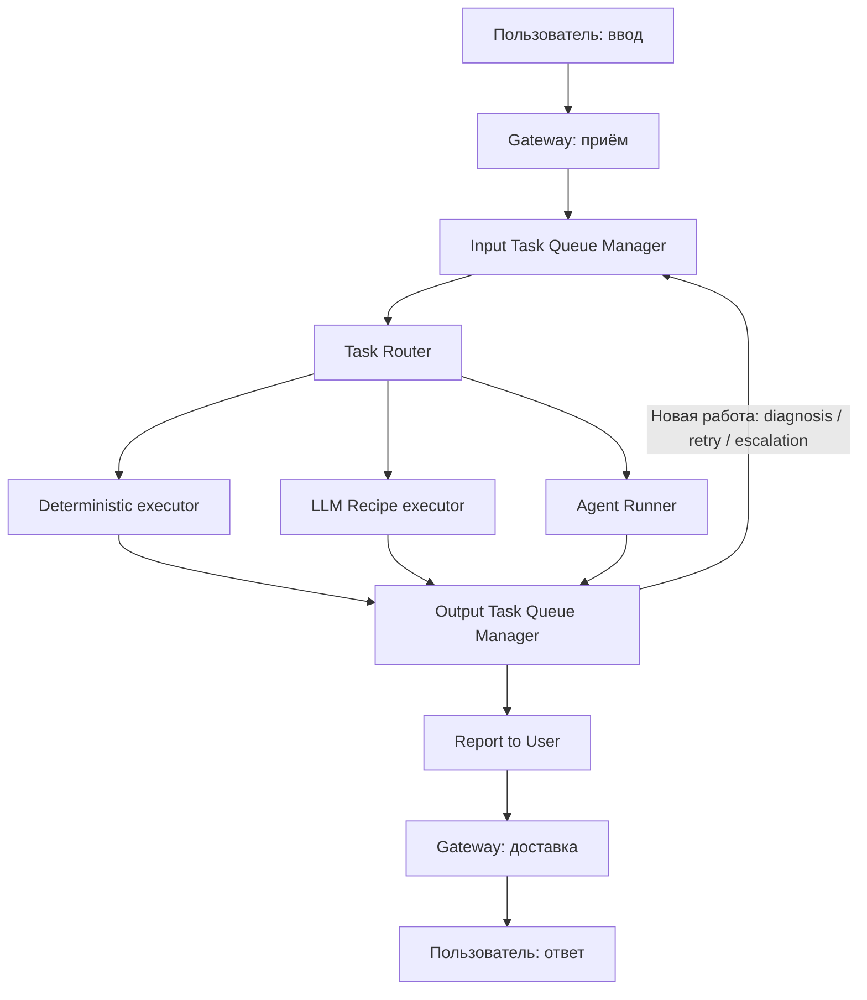

# Linearization Step

Статус: **brainstorm v0.2 · 30.09.2026**. Новая итерация по предложению владельца. Заменяет предыдущую схему центрального узла **для текущего обсуждения**, но не утверждает изменение production architecture. Предыдущий [brainstorm](BRAINSTORM-CORE-AND-REPOSITORIES.md) остаётся историей вариантов.

**Продолжение для одной задачи:** [User Task — ID и Reporting](USER-TASK-IDS-AND-REPORTING.md). Главный сквозной ID — userTaskId; Task Reporting служит справочной по состоянию, Report to User отправляет сообщение. Playbook/group/batch здесь не проектируем.

**Отдельный слой над этим потоком:** [Playbooks / GTD boundaries](PLAYBOOKS-VS-GETTING-THINGS-DONE-BOUNDARIES.md). Playbook plans, schedules и agent-created tasks используют Input/Output contract. Для plan-owned работы continuation выбирает GTD, для простой — Output; два владельца одного продолжения недопустимы. Web task view — основной; chat notifications задаются отдельно.

## 1. Основная идея

Строим сквозной поток: **принять и собрать ввод → направить работу → выполнить → разобрать результат → сообщить пользователю**.

Input Task Queue хранит то, что ещё не передано в исполнение. Output Task Queue хранит результаты, которые ещё не переданы на следующий шаг. Running jobs принадлежат исполнителям; очереди не держат их как активные элементы. Между стадиями передаём владение после durable ACK, а не после отправки HTTP-запроса.

Не ставим общий Execution Controller в центр этой схемы. Надёжность распределяем по конкретным стадиям и их журналам. Одна бизнес-связь назад: из Output в Input для новой работы по обработке результата/ошибки.

## 2. Сквозная схема, включая ответ пользователю

Два gateway-блока показывают вход и выход **тех же channel adapters**, а не два новых сервиса. Связи обратно пользователю нарисованы явно: Report to User → Gateway → пользователь. API-вызов может получить result endpoint/webhook вместо chat message; web получает persisted output и событие для view.

Все три executor возвращают единый ResultEnvelope. Только ai-agent-job использует Agent Runner и Agent clean room. Domain tools/API остаются реализацией возможностей выбранного executor.

## 3. Терминология и границы

| Название | Обязанность |
|---|---|
| **Input Task Queue Manager** | Собрать пользовательский ввод и ссылки на вложения; подготовить готовый item; хранить до подтверждённой передачи исполнителю |
| **Task Router** | Проверить указанный тип либо выбрать deterministic-job / llm-recipe-job / ai-agent-job; передать совместимому executor |
| **Deterministic executor** | Выполнить известный handler/script с явными правами |
| **LLM Recipe executor** | Выполнить фиксированный LLM recipe на подготовленном input без автономных tools |
| **Agent Runner** | Исполнить агентский Run в Agent clean room |
| **Output Task Queue Manager** | Проверить ResultEnvelope, применить заданную outcome policy, надёжно передать report либо новую работу в Input |
| **Task Reporting** | По userTaskId предоставить состояние и историю всех стадий из durable journal; чтение без запуска LLM/агента |
| **Report to User** | Преобразовать результат в пользовательское сообщение/артефакты и передать channel gateway |
| **Gateway** | Channel protocol, rendering, send/edit/delivery receipts и показ пользователю |

Имена Input/Output Task Queue Manager сохраняем по предложению владельца. Уточнение: **Output очередь содержит результаты запусков**, а не ту же задачу до исполнения. Альтернативное короткое имя — Result Queue Manager; сейчас его не вводим.

Manager — роль обработчика очереди, а не обязательно отдельный repo или deployment. Task — цель пользователя, Job — определённая работа, Run — попытка Job. Report to User — известная операция; обычно deterministic-job/handler без LLM и clean room.

## 4. Что хранит Input и когда забывает

Состояния активного item: **assembling → preparing → ready → handing-off**. После подтверждённого приёма executor item удаляется из активной входной очереди. Короткий dedup receipt и ссылки в журнале сохраняются по retention policy. User Task record с userTaskId и история стадий остаются доступны через Task Reporting после удаления активного queue item.

- Router не принимает на себя пользовательскую задачу навсегда: он передаёт dispatch и возвращает receipt executor.
- ACK Router «запрос получил» не достаточно для удаления Input item.
- Executor подтверждает приём после durable записи Run. Если нет capacity, item остаётся во входе или в явном bounded dispatch buffer.
- Потерян ACK — Input повторяет передачу с тем же operationId/runId; executor возвращает прежний receipt.
- Новый Run для retry/escalation имеет новый runId; повтор доставки существующего Run не создаёт новую попытку.

**Очередь освобождена, история не потеряна.** Минимальные task/job/run records, ownership, deadline, userTaskId, correlation и cancellation generation нужны вне активных queue items. В первом варианте это общий operational journal модулей, не ещё один controller-сервис.

Executor владеет принятой работой и durable result outbox до ACK Output. При падении исполнитель восстанавливается либо технический watchdog формирует failed/unknown outcome в Output. Без такого механизма принятый Run может исчезнуть навсегда, хотя обе очереди пусты. Watchdog не выбирает бизнес-продолжение и не запускает GTD; он сообщает факт остановки/неизвестного состояния.

## 5. Intake и тяжёлые файлы

Input Manager управляет сборкой task, но тяжёлую обработку исполняют workers. В webhook/request не загружаем весь большой файл в память и не ждём транскрипции/пережатия.

1. Gateway сохраняет message metadata/native file reference и подтверждает durable приём.
2. Download/upload worker потоково пишет оригинал в object storage; очередь содержит artifact ref, owner, size/hash и stage.
3. Media worker создаёт transcript/preview/compressed derivative, сохраняя связь с оригиналом.
4. Input item готов после явного завершения ввода либо quiet window и готовности необходимых вложений.
5. Новое сообщение после dispatch — отдельный supplement с targetUserTaskId; старую переданную задачу не открываем незаметно заново.

Object storage выбираем отдельно: R2 либо другой подходящий bucket. Низкая стоимость хранения не отменяет limits, retention и cleanup. Оригинал не заменяем необратимо пережатым файлом.

Чтобы «трубы» не забились: лимиты размера/числа вложений и параллельной обработки; bounded buffers и backpressure; timeouts; stage progress/deadline; повтор с той стадии, которая упала; quarantine для неисправимого input; сборка мусора только после завершения всех ссылок/retention. Manager остаётся диспетчером этих стадий.

Ошибка обязательного attachment делает input неполным: отправляем структурированный outcome в общий Output/report путь, а не запускаем executor с молча пропущенным файлом. Такие служебные ошибки не являются дополнительной бизнес-петлёй назад.

Cloudflare deployment и конкретные лимиты здесь не выбираем. Рецепт воспроизводимой media-проверки в инженерной среде — отдельная implementation задача.

## 6. Task Router: одна дверь для всех типов

**Да, deterministic jobs тоже можно пропускать через Task Router.** Для них это проверка готового jobType/operationRef и dispatch без вызова модели. Единый маршрут даёт одинаковые receipts, correlation, policy checks и возможность последующей escalation.

Natural-language input может потребовать bounded LLM-классификации. Типизированный input, callback и scheduled JobSpec — нет. Router не переписывает любой известный script в агентский prompt.

Fast reply: Input помечает подходящий recipe либо Router выбирает llm-recipe-job; LLM executor получает разрешённый context snapshot и возвращает **готовый ответ**, не только yes/no. Output ставит Report to User, тот доставляет этот текст. Второй LLM для «сгенерировать отчёт из готового ответа» не требуется.

Число стрелок само по себе не задаёт задержку: нужны немедленное пробуждение очередей, небольшие metadata payloads и отсутствие обязательного polling interval. Долгую работу и короткие replies разделяем по concurrency/priority, чтобы reply не ждал за видеообработкой. Это требование к реализации, а не обещание текущей скорости.

## 7. Output: разобрать, передать, забыть

Output Manager — небольшой **детерминированный обработчик policy**, а не LLM, эксперт или универсальный planner.

1. Принимает результат и dedup по resultId.
2. Валидирует output contract/schema; например, превращает invalid JSON в структурированный failure.
3. Атомарно фиксирует решение и outgoing command: report или follow-up input item.
4. После durable ACK следующей стадии удаляет активный output item. Decision receipt остаётся для защиты от повторов.

После enqueue/ACK новой работы Output не ждёт её исполнения. Так реализуется «передал и забыл», без потери между записью результата и следующей отправкой. При разных хранилищах нужен durable outbox плюс idempotent receiver; простой fire-and-forget HTTP не даёт этой гарантии.

Минимальный ResultEnvelope: resultId, userTaskId, jobId, runId, outcome, outputRef, errorCode/detailsRef, outputSchemaVersion, effectStatus, usageRef и destinationRef. `effectStatus=unknown` запрещает слепой повтор внешней мутации. Секреты и лишние пользовательские данные в diagnostic payload не включаются.

## 8. Ошибки и одна обратная связь

Идея отправлять ошибки на LLM review подходит как **новый llm-recipe-job diagnosis**, которому готовят original request, allowed context, errorCode и redacted result. Модель возвращает ограниченную рекомендацию; действия разрешает deterministic policy. Diagnosis сам ничего не исполняет и не получает tools.

| Ситуация | Что делает Output |
|---|---|
| Invalid JSON | По policy: bounded repair/diagnosis recipe через Input либо report failure |
| Известная временная техническая ошибка | Bounded retry по готовой policy; новый Run через Input |
| Deterministic handler не справился | При разрешении escalation — diagnosis/LLM job, затем отдельная проверка результата |
| Закончился бюджет | Report blocked; платный diagnosis только при отдельном доступном резерве |
| Auth/permission/region denial | Report/action-required; LLM не расширяет права |
| Неизвестен результат внешней записи | Reconciliation/review; не слепой rerun |
| Diagnosis или repair сам упал | Ограниченный fallback/report; не бесконечная диагностика диагностики |

**Все ошибки можно учитывать единообразно; не все нужно немедленно оплачивать LLM-вызовом.** Если владелец выберет обязательный review, задаём отдельный бюджет, доступность diagnosis и детерминированный fallback. Без этого «закончились деньги → спросить LLM» может не сработать.

Follow-up содержит parentRunId, reason, purpose, escalationDepth, attemptsRemaining и budget/deadline. Ответственность за limits явная; после исчерпания report blocked/failed. Только одна топологическая стрелка Output → Input, но она может переносить разные виды follow-up.

Original jobType не меняем задним числом: escalation создаёт новую Job с lineage к исходной Task. Ошибка не является разрешением на новые побочные эффекты.

## 9. Reporting и доставка

**Task Reporting — справочная:** Web/TG запрашивают состояние по userTaskId напрямую, без нового Job. Input, Router, executors, Output и delivery записывают durable события с этим ID; Reporting читает journal/projection, включая pending/stale/failures/escalation. Успешная диагностика ещё не означает успех пользовательской задачи. Snapshot содержит version/updatedAt/freshness, а deliveryState учитывается отдельно. Подробные ID и переходы: [USER-TASK-IDS-AND-REPORTING.md](USER-TASK-IDS-AND-REPORTING.md).

**Report to User — исходящее сообщение:**

Report to User получает уже принятый output, destinationRef, logicalMessageId и вариант report. Он формирует canonical message, refs/attachments и доступные actions. По умолчанию это лёгкий deterministic handler.

- Telegram gateway делает send/edit, хранит native message IDs, delivery retries и UI cleanup.
- Web gateway сохраняет/получает message projection и уведомляет подключённый UI; отсутствующий браузер не означает потерю результата.
- API gateway предоставляет result либо выполняет заранее разрешённый callback.

Report handler хранит outgoing delivery до durable gateway ACK. Gateway ACK «доставку принял» и provider ACK/«пользователь увидел» — разные состояния. Если необходим контроль provider delivery, это gateway delivery record; основной результат Run уже сохраняется отдельно.

Ошибки delivery не перезапускают исходную вычислительную задачу. Gateway повторяет доставку с тем же logicalMessageId; неизвестный outcome отдельно учитывается. Сбой Report to User не должен автоматически порождать ещё один Report-to-User Run бесконечно.

Если требуется LLM-summary, это явный llm-recipe-job через Input, а итоговый Report handler только передаёт результат. Для фоновой работы без audience политика может выбрать сохранение результата без уведомления.

## 10. Репозитории: минимальная версия

| Репозиторий | Что живёт |
|---|---|
| trained-agent-architecture | Эта схема, термины, cross-repo scenarios/contracts |
| **trained-assist-task-queue — кандидат** | Input и Output managers отдельными modules, queue contracts, operational journal, outcome policy; Report handler, Task Reporting и User Task journal как небольшие modules |
| **Task Router package/repo — кандидат** | Job type policy, routing recipes и executor dispatch adapters |
| ai-agent-runner | Agent Runner / clean room / engine adapters |
| Deterministic / LLM executor modules | Могут сначала жить рядом с Router или в существующих workers; отдельные repos не обязательны |
| trained-assist-tg-bot / trained-assist-web | Вход/выход channel gateways и собственный UI/delivery state |
| Domain repositories | Известные operations, recipes, tools, domain records |
| Existing LLM gateway/ledger и storage | Calls/accounting и данные по своим контрактам |

В первой реализации один task-queue repo с Input/Output уменьшает число release boundaries. Если нагрузки или owners разойдутся — разделим позже. Router может быть package, а не дополнительным HTTP hop. Никакие новые репозитории этим документом не создаются.

Conversation/session context остаётся доступным через explicit storage contract; не вводим обязательный большой Conversation Service в линейную схему. Расписания и GTD — producers новых готовых input items. Их persistent rules не исчезают, но внутренняя реализация сейчас вне фокуса.

## 11. Что проверить следующим шагом

- [ ] Input удаляет item только после executor acceptance; потерянный ACK не дублирует Run.
- [ ] Принятый executor Run после crash не исчезает без outcome.
- [ ] Ready input дожидается обязательных вложений; большие файлы не блокируют webhook.
- [ ] LLM reply доходит через Output → Report → Gateway → пользователя без второго model call.
- [ ] Output crash между decision и handoff восстанавливается без дубля follow-up.
- [ ] Invalid JSON может пройти bounded repair; budget denied доставляется без платного fallback.
- [ ] Diagnosis failure, report failure и delivery failure не создают бесконечные loops.
- [ ] Cancelled Task не возрождается поздним result/follow-up; generation проверяется перед dispatch.
- [ ] Delivered/accepted/computed статусы различимы; история живёт после освобождения очереди.

Дальнейшее обсуждение: обязательный ли LLM review для каждой ошибки; какие outcomes разрешают escalation; где хранится минимальный operational journal. Эти решения уточняют линейный поток, а не возвращают общий controller в центр картинки.
