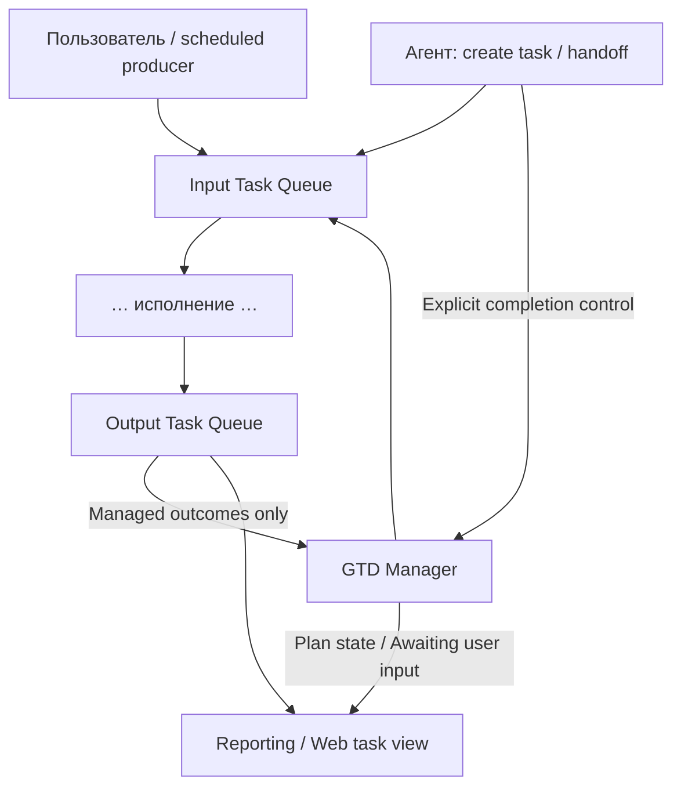

# Playbooks vs Getting Things Done Boundaries

Статус: **brainstorm / draft v0.3 · 30.09.2026**. Продолжение [Linearization Step](LINEARIZATION-STEP.md) и [User Task / Reporting](USER-TASK-IDS-AND-REPORTING.md). Здесь рассматриваем только слой над Input → … → Output: методики, конкретный план, расписание, ожидание пользователя и работы, созданные агентом.

## Решение владельца: GTD только там, где нужен следующий контроль

GTD **не включён по умолчанию**. Наличие долгой работы, cron, delegation, ошибки или playbook как справочника не создаёт gtdId. Обычный результат и bounded error escalation остаются в Output/Router.

GTD подключаем, когда пользователь явно просит довести цель до конца с проверкой результата или задан конкретный следующий шаг после текущего execution: дождаться CI и проверить release, пройти migration gate, продолжить многошаговый план. При регистрации сохраняем reason, completion criteria, next trigger/check, continuation owner, deadline и attempt/budget caps. Слово «контролировать» без конкретного следующего действия недостаточно.

| Пример | GTD |
|---|---|
| FAQ / сложный ответ без tools | Нет |
| Разовый агент выполнил действие и вернул результат | Нет по умолчанию |
| Hourly cold search, terminal result | Нет; расписание создаёт occurrences, Output принимает итог |
| LLM diagnosis → OpenCode investigation | Нет по умолчанию; это bounded routing escalation |
| PR создан → ждать CI → проверить интеграцию | Да, concrete next-step contract |
| Агент передал самостоятельный расчёт другой программе | Нет по умолчанию; Task API и technical recovery достаточны |
| Пользователь просит «доведи до конца и проверь» | Да с зафиксированным критерием |
| GTD контролирует свой собственный GTD | Не допускается; только deterministic health supervision |

Agent может адаптировать playbook к новой фиче: разделить feature/integration, добавить migration и dependencies. Сохраняются pinned base revision, compiled plan revision и evidence изменений; running steps не переименовываются задним числом. Planning не обязывает контролировать каждую микрооперацию.

В prompt исполнителя передаётся текущий шаг, релевантные ограничения и ожидаемый result/evidence contract. Полный GTD meta-process не копируется в каждый prompt. GTD получает structured outcomes и двигается по событиям/таймерам; не запускает постоянные LLM «проверить, что контроль контролируется». Исчерпание caps даёт stopped/needs input, а не создание нового GTD для обхода лимита.

## 1. Контекст: какие противоречия разрешаем

| Неясная граница | Предлагаемое разделение |
|---|---|
| Общая методика или «наш плейбук для этого пользователя» | Переносимый Playbook artifact отдельно; scoped варианты и bindings отдельно |
| Playbook или уже исполняемый checklist | Playbook — определение; Execution Plan — экземпляр; Checklist — его view |
| Порядок шагов или обязательность выполнения | Dependencies/order отдельно от gates, acceptance и enforcement policy |
| Разовая или периодическая работа | Один Plan/Task отдельно; Schedule создаёт новые исполнения |
| Процесс жив или цель достигнута | Runner supervision отдельно от GTD progression/acceptance |
| Привязка к чату или видимость пользователю | Постоянный web task view отдельно от chat notifications |
| Ждём человека или продолжаем жечь токены | Durable Awaiting user input + checkpoint; после ответа новая попытка продолжения |
| Агент создал работу и умер | Durable submitted task живёт независимо от процесса создателя |

**Playbooks выносим из core как контент и authoring.** Они пригодны другим пользователям и другим исполнителям. Но утверждение «они никак не влияют на исполнение» слишком сильное: concrete plan задаёт шаги и проверки. Core/queue не знают отдельные playbooks; GTD понимает общий versioned plan contract.

## 2. Термины

| Термин | Значение |
|---|---|
| **Playbook** | Версионированная методика: цель, inputs, шаги, dependencies, проверки и требуемые capabilities. В роли шаблона можно писать Playbook Template |
| **Playbook Binding** | Выбранные параметры и разрешённые ресурсы конкретного пользователя/проекта; credential refs вместо секретов |
| **Execution Plan** | Конкретное durable исполнение методики для userTaskId, с pinned playbook revision, параметрами и состояниями шагов |
| **Checklist** | Читаемый список шагов и их состояний; view над Execution Plan, а не отдельный источник истины |
| **Schedule** | Определение когда создавать работу: cron/interval/event и связанные policies |
| **Scheduled occurrence** | Одно срабатывание Schedule; создаёт отдельный userTaskId и при необходимости Execution Plan |
| **GTD Manager** | Владелец durable progression: активировать план, выдать готовый шаг, принять outcome, ждать условия/input, решить продолжение и acceptance |
| **Awaiting user input** | Адресованный пользователю durable запрос информации/решения, связанный с конкретной задачей и checkpoint |
| **Delegated Task** | Работа, которую создал агент через разрешённый submission API; может пережить его процесс |
| **Agent harness** | Техническая обвязка исполнения агента: engine/tools/context/limits/lifecycle. В нашей схеме значительная часть относится к Agent Runner |

Предлагаю **не называть исполняемый checklist harness**: методика, экземпляр и технический runtime тогда снова смешаются. Execution Plan точнее. Для пользовательского UI можно оставить «план» или «чек-лист».

Разделение definition/instance и ожидание с сохранением состояния встречается в durable workflow системах: [Temporal Workflow Definition](https://docs.temporal.io/workflow-definition), [LangGraph interrupts](https://github.com/langchain-ai/docs/blob/main/src/oss/langgraph/interrupts.mdx). Это ориентир для терминов и свойств, **не решение установить эти frameworks**.

## 3. Общий playbook, приватный вариант и экземпляр

Три независимые оси:

1. **Definition scope** — где виден сам artifact: public/domain, organization, profile, project.
2. **Execution scope** — от чьего имени и для какого profile/project запускается concrete plan.
3. **Access / notifications** — кто может посмотреть runtime data и куда отправлять сообщения.

Общий playbook «поиск кандидатов» может быть public. Его bindings, результаты, checkpoints и параметры вакансии — приватны. Project playbook может уточнять процесс и gates для проекта, не публикуя их всем.

Выбор определения фиксируем явно: `playbookRef + version/revision/digest`, scope и происхождение. Scoped вариант имеет свой ref и связь с base version. Изменение template не меняет запущенный plan; переход на новую версию — отдельная migration/новое исполнение.

Platform bindings содержат capabilities вроде search_candidates/report_result, а не жёсткие chatId, абсолютный host path или обязательный Claude. Конкретные engine, endpoints, credentials и region выбираются adapters/policy по разрешённым bindings.

**Пользовательский override методики не отменяет platform restrictions.** Template может требовать возможность, но не выдаёт permission. Отдельно сохраняем кто активировал план и какие внешние действия разрешены.

## 4. Порядок, строгость, автоматизация и повторяемость — разные настройки

| Ось | Что определяет |
|---|---|
| Dependencies / order | Какие шаги могут начаться после каких результатов |
| Step gate | Когда конкретный шаг считается выполненным; required или optional |
| Validation | Каким evidence/validator подтверждаем результат |
| Enforcement | Advisory/manual или enforced execution; допустимые recorded exceptions |
| Automation | Кто двигает шаг: человек, deterministic handler, LLM recipe, агент |
| Completion policy | Что должно выполниться для acceptance всей User Task |
| Trigger / schedule | Когда создаём новое исполнение |
| Notification policy | О каких событиях сообщаем в чате |

Один порядок шагов не обязывает запускать их автоматически. Advisory checklist можно проходить вручную. Enforced plan не становится completed при одном успешном exit code; required gates проверяются.

Hard gate не пропускаем молча. Разрешённое исключение имеет actor/reason/evidence и отображается в view. Infra failure, invalid response contract и failed acceptance — разные outcomes: ошибка протокола не должна автоматически запускать дорогой повтор всей работы.

**Once/repeatable** относится к trigger, а не виду checklist. Методика остаётся одной; каждый запуск имеет свой plan и историю. Намеренный цикл внутри одного плана задаётся отдельным bounded условием/лимитом и не равен cron. Не создаём бесконечный «один и тот же чек-лист навсегда».

## 5. Кто за что отвечает

| Компонент | Ответственность | Граница |
|---|---|---|
| Playbook registry / authoring | Определения, scoped variants, версии и schema conformance | Не запускает jobs и не хранит их процессы |
| Plan compiler / adapter | Definition + bindings → конкретный plan по общему контракту | Не выполняет шаги |
| Schedule module | due occurrences, timezone, dedup, overlap/catch-up | Не проверяет бизнес-результат |
| **GTD Manager** | Plan/step state, dependencies, waits, acceptance, next-step submission | Не спавнит engines напрямую и не делает channel delivery |
| Input Task Queue Manager | Принять готовую работу, подготовить input, передать executor | Не интерпретирует playbook |
| Router / executors | Направить и исполнить Job | Не перепланируют весь playbook |
| Runner / technical watchdog | Процессы, heartbeat, stop, crash reconciliation | Не решают достигнута ли цель |
| Output Task Queue Manager | Учитывает outcome, передаёт report/recovery по policy | Не выбирает одновременно с GTD следующий шаг того же плана |
| Reporting / Web | Состояние, plan/checklist view, Awaiting user input и ответы | Не угадывает статус по сообщениям чата |

Schedule module может жить внутри GTD repo отдельным module. GTD при этом остаётся **производителем работ и потребителем outcomes над линейной системой**, а не центральным исполнителем каждого пользовательского запроса.

### Один владелец продолжения

Для простой User Task Output применяет outcome/recovery policy как в Linearization Step. Для plan-owned работы Output фиксирует результат и передаёт событие GTD; **GTD выбирает следующий шаг и разрешённую escalation**.

Используем явное `continuationOwner = output | gtd`. Один failed Run не должен одновременно породить follow-up в Output и ещё один в GTD. Технические redelivery того же Run остаются transport-level; GTD управляет новыми попытками и progression своего плана.

## 5a. gtdId — запись контроля, даже без playbook

**gtdId** создаёт GTD Manager при регистрации одной User Task на контроль. Это постоянный ID control record, не scheduleId, не planId и не runId. Простой запрос «сделать и проверить до конца» тоже может иметь gtdId, без плейбука и cron.

В этой версии один gtdId связан с одной userTaskId; при нескольких шагах/повторах сохраняется. Независимая дочерняя User Task получает собственную запись контроля, если контроль нужен. Handoff внутри прежней Task сохраняет gtdId. Следующая occurrence расписания получает новую User Task; gtdId создаётся только если этот запуск отдельно зарегистрирован на контроль. scheduleId остаётся постоянным.

Контроль имеет отдельные настройки: completion criteria, allowed retry/escalation, next checks, budget/deadline, wait/resume и статус active/paused/awaiting_user/completed/cancelled. Наличие ID означает регистрацию; для текущего признака «на контроле» Reporting показывает также gtdState. ID закрытой записи остаётся в истории.

**Контракт:** у managed work gtdId обязателен в Input → Router → executor → Output → GTD outcome и в continuation. Перед запуском запись и binding уже durable. Агент не выбирает чужой gtdId произвольно: host проверяет userTaskId/scope/control generation.

Output сохраняет outcome и отправляет его в GTD inbox по gtdId, включая ошибки, awaiting-user/condition и окончательный результат. GTD находит control record, учитывает eventId/resultId и решает следующий шаг. Output освобождает outgoing item после durable GTD ACK; после ACK replay/continuation принадлежит GTD. Reporting/message delivery может идти независимо.

Отсутствующий/неизвестный gtdId у managed outcome — contract error: quarantine/reconciliation и явный статус, не тихий переход к Output-owned recovery. Поздний результат закрытой записи дополняет историю, но не возрождает работу. Сам ID не гарантирует отсутствие потерь: нужны durable inbox/outbox, dedup и восстановление lease/deadline.

continuationOwner=gtd при зарегистрированном контроле; для неконтролируемой Task gtdId=null и continuationOwner=output. Два механизма не создают новые работы по одному outcome.

[Review with real playbooks](REVIEW-WITH-REAL-PLAYBOOKS.md) приземляет контракт на проверенные artifacts.

## 6. Узкая схема: только границы Input и Output

Task Submission API принадлежит Input/admission. Он проверяет и сохраняет agent-created работу без обязательного GTD. Только explicit managed work регистрируется в GTD и возвращает ему outcome по gtdId.
Полный response/delivery flow остаётся в Linearization Step. Здесь intentionally скрыт executor internals, а не изменён протокол вывода.

## 7. Расписание: включить, выключить, остановить — разные команды

- **Activate Plan** запускает конкретное разовое исполнение; template сам не активируется.
- **Enable Schedule** разрешает новые occurrences.
- **Disable Schedule** запрещает будущие occurrences; уже принятые User Tasks продолжаются, если не указана cancel policy.
- **Pause Plan** прекращает новые dispatch для данного plan; судьба активного Run задаётся явно.
- **Cancel Task/Plan** отменяет конкретное исполнение, закрывает будущие continuation и отзывает активные runs по policy.
- **Archive / hide from default list** меняет view, не отменяет исполнение и не стирает историю.
- **Disable chat notifications** меняет канал доставки, не скрывает web task и не выключает GTD.

Schedule хранит timezone, nextDueAt, occurrence key, overlap policy, catch-up/misfire policy и budget limits. Waiting-user occurrence не должна создавать неограниченный backlog каждую минуту/час: skip, coalesce или bounded overlap выбираем явно.

Каждая occurrence получает новый userTaskId. Вопрос пользователя «почему этот запуск не закончился?» отвечает Reporting конкретной Task. Group dashboard для расписания можно добавить позже; batch/group semantics здесь не проектируем.

## 8. Web — основной view, чат — optional notifications

**Каждая User Task имеет отдельный web view по userTaskId**, независимо от источника: Telegram, Web, scheduler или агент. Там видны status/history, checklist если есть, artifacts, ожидания пользователя и ошибки. Plan execution не требует origin chat/session.

Telegram может отправить короткое «Задача принята — открыть в web» и финальное сообщение по выбранной notification policy. Слово «запущена» используем только после фактического start; acceptance и running не смешиваем.

Человек может включить progress reporting в конкретном чате как отдельную subscription. Хранится destination/subscription, а не «чат владеет задачей». Смена/удаление чата не меняет ownership, GTD или результат.

Web видимость включает access scope: задача показывается владельцу и явным collaborators. «Всегда есть view» не означает публичную публикацию приватного результата. Для started/result/needs-input события имеются notification defaults, но отключённый канал не удаляет событие из web.

При archive остаются deep link и история по retention. Настройка UI filter не заменяет permissions.

## 9. Запрос input: durable пауза вместо живого окна агента

Называем это **Awaiting user input**; пользовательский статус — **awaiting_user**. Это бизнес-пауза, не ошибка и не обязательное сохранение живого process.

1. Executor сохраняет checkpoint/continuation artifact и создаёт Awaiting user input: вопрос, schema, buttons/options, reason, deadline, allowed respondent.
2. Через durable outcome/outbox в Output передаётся `awaiting_user` с request ref. Для такой паузы **новую работу в Input пока не создаём**.
3. Reporting/Web показывает запрос в task view и общем списке «Нужен ваш ответ». Optional chat notice содержит web link.
4. Engine Run завершается корректным outcome `suspended / needs_input`, clean room освобождается после сохранения state. Logical step остаётся waiting.
5. Ответ пользователя сохраняется через authenticated Awaiting user input API с requestId/version/operationId.
6. GTD (или continuation adapter простой Task) проверяет, что ожидание ещё актуально, и идемпотентно enqueue-ит **новый Run** с тем же userTaskId и checkpoint/ответом.

Поэтому связь с Input есть **после ответа**. Сам запрос проходит только в Output/Reporting. Ответ не теряется в произвольном сообщении чата.

Native engine interrupt может остаться внутри короткого Run, если adapter умеет это безопасно. Durable pause/resume разных engines — целевой контракт, не уже готовая функция: нужны явный checkpoint, поддержка adapter и граница побочных эффектов. Если восстановление невозможно, status blocked с понятной причиной; не обещаем «продолжить с той же строки» универсально.

### Что обязательно хранит Awaiting user input

`awaitingInputId, userTaskId, planId/stepId?`, sourceRunId, checkpointRef, kind (data/choice/approval), schema/options, respondentScope, createdAt/deadline, status и version.

Ответ после timeout/cancel/supersede не возрождает задачу. Повтор submit ответа возвращает прежний receipt. Одновременно открытые requests имеют разные IDs и явно адресуются; неизвестный «да» не применяется ко всем.

Отказ пользователя, отсутствие ответа и изменение решения — отдельные outcomes. По timeout policy: оставить waiting, напомнить, blocked или cancel; **не расходовать LLM токены периодическими вопросами «он уже ответил?»**.

Approval связывается с конкретным action payload/digest/scope/сроком; обычный ответ не выдаёт произвольное разрешение. Текст пользователя не должен попадать в secrets store.

## 10. Агент запускает другого агента: delegation и handoff

Разделяем:

| Вид | Lifecycle / результат |
|---|---|
| **In-process subagent** | Зависит от engine runtime; детали прав/времени определяет adapter |
| **Independent delegated task** | Durable отдельная User Task, собственные Job/Run, view/result; переживает родительский процесс по явно выбранной policy |
| **Handoff / next step** | Новая работа внутри прежней User Task; другой engine продолжает цель, исходный Run может закончиться |

Для Claude → OpenCode поддерживаем обычный ai-agent-job через общий submission API и Agent Runner. Агент передаёт goal/input refs, desired executor hint и результат-контракт. Host policy разрешает capabilities, engine/region/budget. Дочерний агент не наследует все credentials/permissions автоматически.

**GTD не обязателен как бизнес-план для одиночной делегации.** Но обязателен durable admission: проверка доступа, dedup, бюджет, lifecycle ownership и запись task до ACK. Admission реализуется Task Submission API независимо от GTD; у простой delegation нет control loop.

После durable acceptance родитель вправе закончить Run. Результат ребёнка всегда сохраняется в Output/Reporting, а не только в stdin живого родителя. Если нужен следующий шаг после ребёнка, зависимость регистрируется до выхода родителя; GTD создаёт continuation с новым Run, когда outcome ребёнка принят.

### Отвязать от процесса — не от политики пользователя

Выбираем `lifetimePolicy = independent | cancel_with_parent_task`. Смерть parent Run не равна cancel родительской Task. Для independent работы parent task failure не удаляет ребёнка; explicit cancellation учитывает выбранную policy. Родительская Task не должна считаться успешно выполненной, если её required child ещё не завершён.

Сохраняем `parentUserTaskId, createdByRunId` для независимой работы; `parentRunId` для handoff/follow-up в той же Task. Нет необходимости вводить batch/group entity ради одной связи parent → child.

Лимиты delegation: depth, child count/concurrency, aggregate budget/deadline и permitted operations. Timeout/lost ACK не создаёт второго ребёнка благодаря operationId. Нельзя обойти родительский budget созданием множества «независимых» children.

**Hermes**: имя само по себе не определяет тип. Фиксированный structured-output вызов — llm-recipe-job; исследование с tools — ai-agent-job; известный compute — deterministic-job. Статус и durable result одинаково доступны после смерти создателя.

## 11. Минимальные новые идентификаторы

Сохраняем ранее определённые userTaskId/jobId/runId и добавляем только нужное этому слою:

| Поле | Назначение |
|---|---|
| playbookRef + revision/digest | Версионированное определение и provenance |
| gtdId | Запись контроля одной User Task; опциональна для неконтролируемой работы |
| planId | Конкретный экземпляр исполнения методики |
| stepId | Шаг в этом plan, сохраняется между попытками |
| scheduleId + occurrenceKey | Определение расписания и dedup конкретного срабатывания |
| awaitingInputId | Точный запрос ответа/approval |
| parentUserTaskId + createdByRunId | Происхождение independent delegated task |

planId не заменяет userTaskId. Шаги одного плана и их retries сохраняют userTaskId текущей пользовательской цели; independent delegated task получает новый userTaskId. Checklist не требует ещё одного ID — это view выбранного planId.

`continuationOwner`, `lifetimePolicy`, `notificationPolicy` и `enforcementMode` — явные настройки, а не «магия» имени playbook или engine.

## 12. Что нашли в текущей системе

Выборочно прочитан core revision **bbc0b91e503e65ede3adc0a87abf9bba59a1ad25**. Это evidence границ, не проверка текущего deployment.

- [playbook-store.js](https://github.com/trained-assist/trained-assist-agent/blob/bbc0b91e503e65ede3adc0a87abf9bba59a1ad25/src/playbook-store.js): playbook уже versioned artifact; profile override → sibling → system. Project-scope как полноценная новая модель этой проверкой не установлен.
- [docs/playbooks.md](https://github.com/trained-assist/trained-assist-agent/blob/bbc0b91e503e65ede3adc0a87abf9bba59a1ad25/docs/playbooks.md): compilation в durable plan, activation, validation, hooks. Content живёт в domain repos, но contracts/interpreter ещё в core.
- [gtd-controller.js](https://github.com/trained-assist/trained-assist-agent/blob/bbc0b91e503e65ede3adc0a87abf9bba59a1ad25/src/gtd-controller.js): смешаны schedule, durable progression, validation/hooks, fanout и session/chat lookup. Target разделяет эти modules.
- [FOLLOWUP-CONTROLLER.md](https://github.com/trained-assist/trained-assist-agent/blob/bbc0b91e503e65ede3adc0a87abf9bba59a1ad25/docs/FOLLOWUP-CONTROLLER.md): текущий timer переоткрывает session; новая модель опирается на Task и durable continuation, а не живой chat.
- [Внутренний аудит 30.09](https://github.com/trained-assist/trained-assist-agent/blob/bbc0b91e503e65ede3adc0a87abf9bba59a1ad25/docs/audits/playbook-background-execution-audit-2026-09-30.md) описывает missing terminal markers, невидимые awaiting_user, уведомления/consent и protocol errors, попадающие в quality retry. Его production-цифры независимо не перепроверены; используем как список сценариев для новой модели.
- [hermes-run.js](https://github.com/trained-assist/trained-assist-agent/blob/bbc0b91e503e65ede3adc0a87abf9bba59a1ad25/src/hermes-run.js) описан как один structured-output LLM вызов без tools/cron. Нельзя объединять все Hermes операции под единственным agent-job типом.

## 12a. Уточнения после review реальных artifacts

[Review with real playbooks](REVIEW-WITH-REAL-PLAYBOOKS.md) прочитал 11 JSON artifacts / 132 шага и добавил требования:

- Compiler сохраняет stepId: в проверенных definitions нет step.id. Legacy stage/ordinal mapping допустим только при pinned revision.
- Wait различает **Awaiting user input**, external condition и timer/observation. Нужны awaitingInputId либо condition/timer refs; run deadline не равен wait/task deadline.
- Между clean rooms сохраняются workspaceRef, artifact manifest/version и typed externalOperationRefs (GitHub Actions run_id не platform runId).
- Детерминированный шаг требует execution operationRef/handler contract отдельно от validator; named validators разрешаются до dispatch.
- Cleanup obligations для test/external mutations переживают ошибку/cancel основного Run; effect receipts ограничивают повтор.
- CI report «тесты красные» может завершить reporting Task успешно; тот же conclusion не проходит required gate feature plan.
- Существующий HH launch artifact не задаёт hourly cold search; schedule создаём отдельно. Chat как source data не равен chat как notification destination.

GTD record сохраняет ожидаемый accepted Run/deadline. Если исходного outcome нет, technical reconciliation формирует missing/unknown result и уведомляет GTD; нельзя ждать результата бесконечно только потому, что gtdId корректен.

## 13. Репозитории и следующая проверка

| Место | Предлагаемое содержимое |
|---|---|
| Domain / public playbook repos | Методики, схемы inputs/capabilities, validators/fixtures, authoring |
| Profile/project storage | Scoped definitions/bindings, private artifacts |
| **GTD package/repo — кандидат** | Plan compiler/runtime, step progression, waits/input resume, schedule module, submission adapter |
| Task-queue package/repo | Input/Output, journal/Reporting и согласованный continuationOwner |
| ai-agent-runner | Execution adapters, clean room, checkpoint/export контракт и technical supervision |
| Web | Task/plan/checklist view, Awaiting user input UI, history |
| Telegram gateway | Optional started/final/needs-input notifications и web links |

Сначала выделяем interfaces/modules; новые repos этим draft не создаются. GTD compiler/runtime может быть общим reusable package: portable playbook не означает обязательную привязку к нашей платформе.

Проверки перед переносом:
- [ ] Public методика применяется к двум профилям без утечки bindings.
- [ ] Изменён template, активный plan продолжает pinned revision.
- [ ] Gate, порядок, schedule и visibility независимо включаются/выключаются.
- [ ] Disable Schedule не путается с cancel текущего Run.
- [ ] Task без Telegram/chat binding видна и исполняется через Web/Reporting.
- [ ] Awaiting user input переживает restart; во время ожидания engine не жжёт токены.
- [ ] Дубликат/поздний ответ не возобновляет работу дважды.
- [ ] Родительский engine умер, accepted independent child завершается и публикует результат.
- [ ] Handoff Claude → OpenCode сохраняет userTaskId, создаёт новый Run и проверяет permissions.
- [ ] Output и GTD не создают два continuation на один outcome.

Предпочтение draft: **Playbook — переносимая методика; Execution Plan — экземпляр; Checklist — view; GTD — progression; Schedule — trigger; Awaiting user input — durable ожидание; delegation — обычная разрешённая Task, независимая от живого parent process.**
