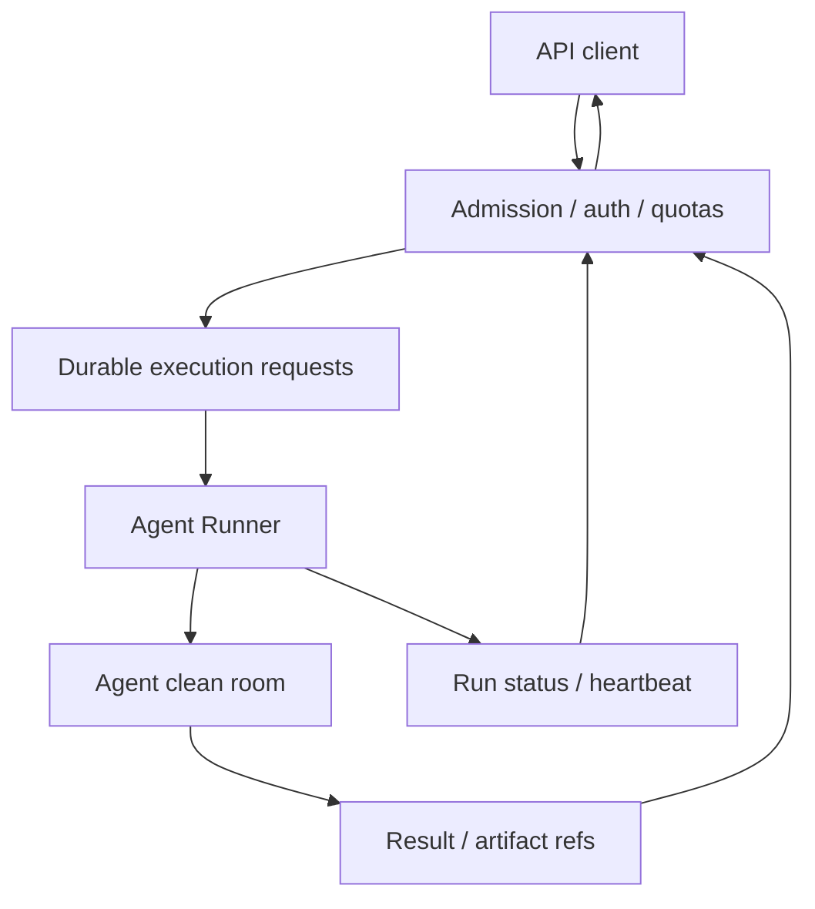

# Serverless Agent API

Статус: architecture draft · 30.09.2026. Продуктовый режим **agent execution as a service**. Пользователь вызывает API и не управляет VM; сервер может быть постоянным. Это не решение о покупке новых VM или конкретном cloud framework.

## Граница и минимальный путь

Клиент с ключом/scopes заказывает один ai-agent-job: API admission → durable Run request → Agent Runner → Agent clean room → result/status/artifacts → polling либо callback. В продуктной установке admission может подключиться через общий Input/typed Router/Output; наружу детали не выдаются.

Отдельная поставка Runner должна работать без Telegram, Web UI, GTD, playbook registry и error watcher. Небольшое состояние запросов и результат/receipt нужны даже в standalone; этот admission/result adapter не превращается в платформенный GTD. Runner остаётся владельцем process/clean room lifecycle, не истории всех пользовательских задач.

Выбор режима поставки: core platform adapter или standalone runner adapter. Контракт один; две независимые очереди не отправляют одну и ту же работу одновременно. Бизнес-эскалация до OpenCode относится к Task Router платформы; typed запуск клиента использует разрешённый явно выбранный engine/default.

## Логический API

| Действие | Семантика |
|---|---|
| submit | scoped prompt/input refs, engine policy, limits, output destination, idempotency key → durable accepted receipt |
| status | queued/starting/running/awaiting_user/succeeded/failed/cancelled и export state |
| cancel | requested receipt; terminated — отдельное подтверждение |
| result | outcome, artifact manifest, доступные logs, ошибки экспорта |
| events | ordered replay с cursor/sequence |
| callback | authenticated delivery с eventId, bounded retries и статусом доставки |

Public receipt: requestId/userTaskId для одной клиентской задачи; runId — отдельная попытка. Retry меняет runId; idempotency повтор submit возвращает прежний receipt. Standalone adapter может назвать public поле requestId, но в platform mapping оно однозначно соответствует userTaskId. Callback destinationRef отдельно от integrationBindingId provider операции.

Без user folder вход материализуется из разрешённых input refs, выход экспортируется в storage/API destination. При наличии folder — scoped snapshot/version contract. Данные очищаются после подтверждённого экспорта по lifecycle policy; при неудаче export результат не теряется молча.

## Логи и события

[Observability contract](OBSERVABILITY-AND-ERROR-CONTRACT.md) обязателен и standalone adapter: user/tenant context, request/run IDs, error и основные lifecycle events, declared TTL. Для API-only клиента replyContext=web_only/API destination либо explicit unavailable; профиль нельзя потерять из-за отсутствия Telegram. Внешний principal связан с platform profile/binding или эквивалентным scoped account в standalone.

## Clean room и право запуска

API key связан с tenant/principal, allowed engines/tools/regions, credentials bindings и квотами. Engine defaults не предоставляют клиенту произвольный root command, соседние profiles или shared secrets. Подключение user keys — через credential binding, а не prompt.

При текущей политике автоматический агент платформенной эскалации — OpenCode. Явно заказанные клиентом Claude Code/Codex возможны лишь при отдельном разрешённом runtime profile и подходящей зоне; никакой автоматической лестницы OpenCode → Claude/Codex здесь нет.

Caps: concurrent runs, input/output size, runtime deadline, token/cost quota, disk/process resources и storage retention. «Недорогой OpenCode» не означает unlimited capacity или бесплатность любой выбранной модели. Reporting и минимальный technical recovery обязательны; **GTD по умолчанию отсутствует**.

Awaiting user input либо поддерживается данным API/engine profile через durable prompt+response, либо возвращается declared unsupported/blocked policy. Не держать Run бесконечно ожидающим; resume/checkpoint возможности не объявляются универсальными.

## Репозитории

Agent Runner lifecycle — [ai-agent-runner](https://github.com/trained-assist/ai-agent-runner). Serverless admission/result adapter логично начать package в этом repo с versioned contract; дополнительный repo не обязателен без независимого lifecycle.

Прежний Deploy-Playbooks/serverless-ai-agent-run — отдельная историческая инициатива; это не второй активный владелец той же реализации. Нужен inventory и решение о переносе/архивировании перед извлечением кода. Эта документация не объявляет репозитории слитыми.

## Acceptance

No-profile run, two tenants isolation, duplicate submit, worker loss, cancel, late result, export failure, callback retries, missing credentials, region refusal и resource exhaustion. Standalone fixture запускается без GTD/domain/frontend modules. Полный production clean room не подтверждён текущими draft.

## Implementation refinement: direct artifact transfer

Control API остаётся небольшим: artifactId/manifest, version/hash/size/MIME, scoped upload/download session, status и commit receipt. Клиент передаёт/получает bytes напрямую через короткоживущие signed object URLs; большой upload — multipart/resume с abort/expiry cleanup. FTP, mount пользовательского host directory и большие bodies через Worker не нужны.

Manifest публикуется после export commit; partial/failed exports явны. No-profile request всё равно имеет tenant/principal ownership. Auth проверяется при выдаче session; signed URL чувствителен и не пишется в общие logs. Test fixtures проверяют browser CORS, expiry, interrupted transfers, digest mismatch, wrong scope и folder version conflict. Source HTML можно доставить как файл; publishing/serving untrusted page — отдельная capability.

[Cloudflare direct signed URLs](https://developers.cloudflare.com/r2/api/s3/presigned-urls/), [large object upload](https://developers.cloudflare.com/r2/objects/upload-objects/), [browser CORS](https://developers.cloudflare.com/r2/buckets/cors/) — primary sources для выбранного adapter. [Sandbox approach](ENGINEERING-APPROACH.md) включает local storage fixture и separate cloud smoke.
