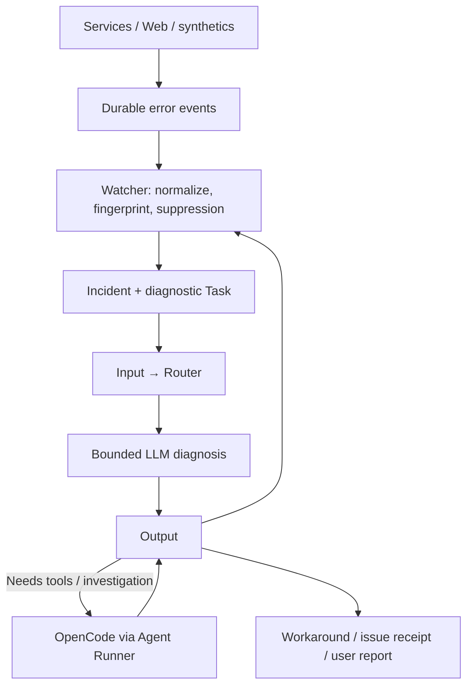

# System Error Watcher

Статус: architecture draft · 30.09.2026. **Отдельный подключаемый репозиторий**, предлагаемое имя trained-assist-error-watcher. Это спецификация, не включённый мониторинг production.

## Цель

Watcher превращает наблюдаемую ошибку системы в полезный ответ: классификация, workaround, diagnosis и при необходимости issue для product/engineering. Источники: Telegram gateway, Web, queues/executors, integration adapters, model gateway, Runner и синтетические проверки.

Сервис слушает поток ошибок, а не каждое пользовательское сообщение. Баг в вёрстке не всегда создаёт exception: нужны Web telemetry, пользовательские reports и отдельные visual/synthetic checks. «Все баги» означает coverage источников, а не обещание автоматически увидеть любой дефект интерфейса.

## Поток

Сложное исполнение скрыто: все Job outcomes проходят обычный Output; typed follow-up к OpenCode создаётся через Input/Router. Стрелка Output → Agent — логическая эскалация, не обход admission. Error watcher не заменяет Output, task state или delivery service.

Внешний API submission позволяет подключать watcher к другой установке с ключом и правами. Local deployment может использовать тот же versioned contract без сетевого hop. [Integration Gate](EXTERNAL-INTEGRATION-GATE.md) нужен для provider событий, а не как обязательный посредник каждого diagnostic request.

## IDs и права

| Поле | Значение |
|---|---|
| errorEventId | Одна наблюдаемая ошибка; immutable, dedup доставки |
| incidentId | Одна группа одного дефекта в пределах scope |
| fingerprint | Детерминированная normalized signature: service, error class, operation, relevant stack location/version |
| sourceUserTaskId / sourceRunId | Исходная работа; могут отсутствовать у фонового infrastructure failure |
| diagnosticUserTaskId | Самостоятельная задача расследования, связана с incident и источником |
| gtdId | Только если для diagnosis/repair явно нужен контроль следующего этапа |
| suppressionId | Scoped правило подавления с причиной и lifecycle |
| issueRef | Только подтверждённый receipt реально созданного issue |

Один incident может затрагивать много исходных задач; каждое разрешённое уведомление адресуется своему пользователю. Нельзя прикреплять чужие raw logs к общей issue. Diagnostic agent получает минимальные scoped refs и platform support principal, а не все данные всех пользователей. Целевой проект/репозиторий для issue и право его создания объявляются binding.

Исходная userTaskId сохраняется в истории; diagnosis не меняет failed исходный Run задним числом. Есть пользовательская проблема и отдельно состояние расследования. Агент может подготовить workaround или issue; фразы «создал задачу» / «исправлено» публикуются лишь после receipt/evidence.

## Подавление шума

Термин для этой функции — **event suppression / incident deduplication**. Bloom filter не используем как единственный источник решения «не рассматривать»: вероятностный фильтр способен скрыть новое событие. Основной store хранит точные fingerprints и правила.

| Настройка | Поведение |
|---|---|
| deduplicate | Объединить повторные события в один incident; хранить count/firstSeen/lastSeen |
| mute until | Не создавать повторную diagnosis/уведомления до expiresAt, например 24h |
| ignore until revoked | Постоянное явное правило для конкретного scope/fingerprint с reason/actor |
| reopen | Новый error class, изменившаяся severity/affected scope, regression после исправления либо expiry |
| rate/budget limit | Ограничить calls/dispatch на incident и глобально; excess виден backlog/summary |

Suppression не удаляет исходные errors, не делает исходные задачи успешными и не отключает обязательный platform health signal. Даже при mute агрегируем повторы; retention payload ограничена. Шторм группируется до LLM, не после тысячи оплаченных вызовов.

Watcher agent может предложить и применить правила через узкий API в своём scope; не нужен user approval на каждый штатный mute. Запрещены wildcard «все ошибки всей платформы» и бесконтрольное расширение scope. Permanent ignore имеет audit и может быть отозван. Repeated delivery failure пользовательского отчёта группируется отдельно от исходного дефекта.

## Границы затрат и циклов

- Default GTD отсутствует. Нужен только конкретный следующий контроль, например CI после repair PR.
- На один incident одновременно одна активная diagnostic Task; новые события дополняют его, не запускают новых агентов.
- Автоэскалация LLM → **OpenCode** разрешена в ограничениях policy. Claude Code/Codex автоматически не выбираются.
- Максимум диагностических попыток, TTL, concurrency и budget задаются конфигом; исчерпание даёт stopped/needs human, а не новый watcher/GTD loop.
- Ошибка самого watcher, его diagnosis или delivery маркируется origin/cause/diagnosticDepth. Она не создаёт бесконечное расследование себя. Независимый deterministic health alarm сообщает о неработоспособном watcher.
- Возможность report/workaround/issue не даёт права автоматически менять production. Repair flow задаётся отдельно.

## Пример: ошибка Telegram

1. Gateway сохраняет normalized errorEventId со sourceUserTaskId/destinationRef и выдаёт честное минимальное сообщение об ошибке, если доставка доступна.
2. Watcher объединяет incident и создаёт одну diagnostic Task.
3. LLM даёт workaround либо просит OpenCode исследовать разрешённые source/log refs.
4. Diagnostic outcome проходит Output; user report доставляется существующим Gateway с task correlation.
5. Issue создаётся только при наличии configured permission; receipt прикладывается. При повторениях растёт count, агент заново не стартует.
6. Если delivery Telegram недоступна, результат остаётся в Web/task API и delivery outbox. Нельзя обещать чат-ответ при сломанном канале.

## Проверка

Fixtures: exception TG, provider auth expiry, invalid LLM JSON, budget refusal, repeated storm, middle task failure, visual synthetic report, diagnostics self-failure, mute expiry, regression, duplicate issue submission, недоступный Telegram и watcher crash. Проверяем bounded число calls, отсутствие cross-profile data, receipts и отсутствие GTD по умолчанию.
