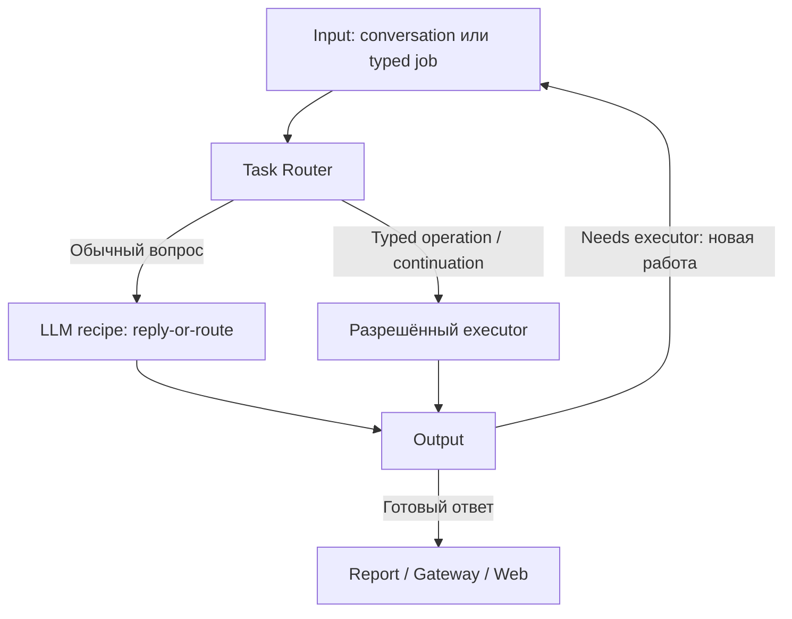

# Task Router — routing, fast replies и MCP

Статус: architecture draft v0.1 · 30.09.2026. Выбор владельца: **самостоятельный репозиторий Task Router**. Предлагаемое имя: **trained-assist-task-router**; репозиторий создаёт владелец, здесь пока только спецификация.

## Принятая policy 30.09.2026

Автоматический агентский executor эскалации — **OpenCode**. Автоматическую цепочку OpenCode → Claude Code/Codex не проектируем. Явный пользовательский запуск другого engine — отдельная allowed policy, не следующий escalation rung.

GTD opt-in: error diagnosis, fast reply и ordinary delegation не создают gtdId. Output/Router выполняют ограниченную progression; только registered managed task передаёт решение GTD. Системные ошибки могут поступать от [Error Watcher](SYSTEM-ERROR-WATCHER.md) с incidentId/sourceUserTaskId и отдельной diagnosticUserTaskId.

LLM budget/auth denial не позволяет продолжать платные вызовы по отсутствующему разрешению. Можно сформировать deterministic report/blocked или использовать заранее разрешённый доступный OpenCode profile; caps и provider readiness всё равно проверяются. Низкая стоимость не равна отсутствию лимитов.

Error и основные routing lifecycle events обязаны выполнять [Observability contract](OBSERVABILITY-AND-ERROR-CONTRACT.md): trusted profile, reply context когда известен, source/task/run IDs и TTL. Длинная диагностическая задача не должна терять канал исходной пользовательской ошибки.

## 1. Ответственность

Router определяет разрешённый способ работы: deterministic-job, llm-recipe-job или ai-agent-job. Он получает scoped input/context/capability snapshot и отдаёт resolved dispatch/decision. Авторитетного пользовательского task state у него нет: состояние и receipts принадлежат task queue/journal/GTD.

Два разных вопроса: **нужен ли агентский цикл?** и **какая LLM подходит фиксированной задаче?** Второй относится к model gateway/ladder, не превращает любой сложный reasoning в агента.

Без чтения текущих данных модели нельзя уверенно отвечать «у вас сейчас…». Complexity, data freshness, required actions и autonomy — отдельные признаки.

## 2. Основной conversational путь: один полезный первый вызов

Для обычного natural-language запроса задаём default **reply-or-route**:

1. Input передаёт original input ref, prepared context и разрешённый capability catalog.
2. Router выбирает bounded llm-recipe-job reply-or-route.
3. Recipe возвращает готовый reply, clarify или needs_executor. Это одновременно попытка ответа и выбор следующего пути.
4. Outcome идёт через общий Output. Готовый reply → Report/Gateway. needs_executor → владелец continuation создаёт следующую работу через Input.
5. Router получает typed continuation и передаёт выбранному executor; повторять initial classifier не нужно.

В базовом пути избегаем пустого LLM «да/нет» перед второй генерацией. В implementation iteration сравниваем с двухэтапным selection → template/handler/LLM reply; второй этап не обязательно модель. Выбор фиксируется по correctness/latency/calls eval, а не объявляется заранее. Router policy может быть чистым кодом; initial reasoning выполняет LLM Recipe executor.

Для уже известных /stop, status lookup, buttons, typed domain operation и GTD step действуют deterministic paths. Их не отдаём LLM только ради единого входа. Запрет бюджета/прав также проверяется до платного вызова.



При gtdId следующий шаг выбирает GTD; без него — Output policy. Router **предлагает** escalation; не создаёт скрытый второй workflow manager.

## 3. Контракт reply-or-route

```json
{
  "schemaVersion": 1,
  "kind": "reply",
  "reply": {
    "text": "Да, можем делать сайты на Tilda…",
    "evidenceRefs": ["capabilities:v7:tilda"]
  },
  "assessment": {
    "contextSufficient": true,
    "needsFreshData": false,
    "needsActions": false,
    "needsAdaptiveTools": false
  }
}
```

Union kinds: reply, clarify, needs_executor. Последний содержит proposedJobType, reasonCode, nextGoal, requiredCapabilities, preservedConstraints и priorOutputRef. confidence может быть debug hint, **не автоматический quality gate**. Уверенное число от той же модели не доказывает правильность.

Original input сохраняется неизменно; reformulated goal дополняет его, а не отбрасывает ограничения. userTaskId/gtdId, budgets и authorization приходят в trusted envelope, не генерируются моделью в текстовом ответе.

needs_executor — нормальный результат routing, не failed Run. LLM timeout, invalid JSON, budget denied и unsupported context — отдельные technical outcomes. По ним нельзя незаметно включать дорогого агента.

## 4. Примеры решений

| Ввод | Первый/следующий путь |
|---|---|
| «Умеешь делать сайты?» | Reply recipe на prepared capabilities; static answer допустим известному deterministic handler |
| «А именно Tilda?» | Та же recipe с явным Tilda readiness; описание возможности отдельно от user integration enabled |
| «Продумай сложную архитектуру по этому тексту» | Может хватить сильной LLM без tools и clean room |
| «Узнай актуальную цену в интернете» | Known fetch operation + fixed recipe, если путь заранее определён; adaptive research → агент |
| «Создай сайт и опубликуй» | Агент/известный domain workflow по actions и policy, а не по длине текста |
| Ошибка скрипта → diagnosis LLM не справилась | Новая agent Job, те же userTaskId/gtdId, новая jobId/runId, bounded escalation |
| Auth/permissions отсутствуют | blocked/action required; агент не является средством обхода |
| Awaiting user input / status query | Durable pause либо Reporting read; без agent start |

Product rule «любой запрос в интернет сразу агент» возможен, но не техническая необходимость. Базовая рекомендация: агент нужен для **самостоятельного выбора и итерации tools**; заранее заданный query можно исполнить deterministic worker.

## 5. MCP: несколько adapters к одним capabilities

MCP не является самим Router, storage или механизмом быстрого ответа.

| Роль | Исполнение |
|---|---|
| Agent-local MCP | Engine client подключает local stdio process/proxy на Run; ограниченные bindings |
| Remote domain MCP | Shared external service, auth per operation; не спавнится для каждого Run |
| Headless fast action | Router/executor вызывает тот же capability handler через internal API либо bounded MCP client |
| Capability knowledge | Versioned resources/catalog/facts о поддержке и readiness; host заранее готовит context |

Если fast path требует MCP tool, его вызывает host-owned deterministic step, а затем передаёт данные в LLM recipe. **Сама llm-recipe-job не получает tools или автономного filesystem**. Client/process pooling возможен для совместимых stateless handlers; per-user credentials нельзя перемешивать.

Один domain handler имеет contract и разные transport facades. Не копируем business logic в Telegram, Router и MCP server. Core MCP становится тонким platform facade (task/status/delegation/artifacts); domain methods остаются в domain repos.

Процесс стартует/handshake-ится, поэтому «мгновенно» — целевой latency budget, а не свойство MCP. В текущем core MCP bridge запускает servers с service UID, это не clean room boundary. Локальный proxy и privileged host tool — разные границы.

## 6. Input budget: не только первые/последние 500

Нет основания выбрать head/tail как универсально достаточный input. Критическое условие может быть в середине.

Для короткого текста передаём **весь текущий запрос** в пределах measured token budget. Для длинного сохраняем original artifact и готовим RoutingContext:

- актуальная просьба, explicit constraints и цель;
- active task/session refs и relevant summary;
- attachment manifest, content types и extraction readiness;
- capability facts/readiness с версиями;
- relevant retrieved chunks с source refs;
- length/compression/missingContext flags.

Head/tail допустимы как preview для routing, с digest/extracted constraints, но **preview не основание для полного substantive ответа**. Если reply нуждается в отброшенном middle — host retrieval/context expansion или continuation. Не называем символы токенами; token budget считаем tokenizer/usage данного provider.

Context builder — bounded host function: retrieval выполняется до recipe либо по одному явному recipe outcome, не безлимитно. Фиксируем snapshot/contextVersion; кэш ключ включает tenant/profile, permissions/capabilities, contextVersion, source purpose и policy. Только text hash недостаточен.

## 7. Research basis и наши выводы

- [Anthropic — Building effective agents](https://www.anthropic.com/engineering/building-effective-agents): distinction fixed workflows/adaptive agents и routing specialised handlers. **Наш вывод:** не каждое сложное рассуждение требует tool loop.
- [Anthropic — Context engineering](https://www.anthropic.com/engineering/effective-context-engineering-for-ai-agents): relevant retrieval, compaction и риск потери важных деталей. **Наш вывод:** head/tail preview дополняем refs/constraints; сохраняем full original.
- [RouteLLM paper v4](https://arxiv.org/abs/2406.18665): preference-trained routing между более сильной и слабой LLM. Это не готовый классификатор потребности в filesystem/tools. **Наш вывод:** оценивать routing на собственных сценариях, не полагаться на self-confidence.
- [Official MCP SDK](https://ts.sdk.modelcontextprotocol.io/v2/clients/connect): local stdio и remote transport имеют разные lifecycle. **Наш вывод:** не спавнить одинаковый domain server для каждого fast reply по умолчанию.

## 8. Сверка с текущим процессом

Проверены core revision bbc0b91e503e65ede3adc0a87abf9bba59a1ad25 и Telegram b3b703fa3271a3b739bcf315ebf7d247a33c7dc7.

| Источник | Факт | Что переносим/уточняем |
|---|---|---|
| [input-router.js](https://github.com/trained-assist/trained-assist-agent/blob/bbc0b91e503e65ede3adc0a87abf9bba59a1ad25/src/input-router.js) | P1 shadow quick/agent classification, не production decision | Отдельный Router contract и eval; нельзя заявлять, что universal LLM-first уже активен |
| Там же | ≤1200 chars full input, иначе head/tail по 400 + keyword digest; timeout 4s | Сравнить с full/retrieved context, измерить middle-constraint recall |
| Там же | Cache ключ по text hash | При extraction проверить scoped key; identical text разных contexts не должен смешиваться |
| [runner/index.js](https://github.com/trained-assist/trained-assist-agent/blob/bbc0b91e503e65ede3adc0a87abf9bba59a1ad25/src/runner/index.js) | Quick handlers, queue, session record и Telegram delivery смешаны | Handler в domain/platform owner, decisions в Router, delivery в gateway |
| [answer-router.js](https://github.com/trained-assist/trained-assist-agent/blob/bbc0b91e503e65ede3adc0a87abf9bba59a1ad25/src/answer-router.js) | Manual deep/oneshot mode; oneshot может пользоваться tools | Mode не является jobType=tool-free LLM |
| [TG intake-preflight](https://github.com/trained-assist/trained-assist-tg-bot/blob/b3b703fa3271a3b739bcf315ebf7d247a33c7dc7/src/intake-preflight.js) | /intake-quick path, media rules, guarded fallback | Generic policy переносим, native normalization/receipts оставляем gateway |

Текущие fast paths — основа для extraction, но target reply-or-route union и gtdId propagation ещё не подтверждены в production.

## 9. Скорость, прозрачность и проверка

Latency measure: acceptance, time-to-first-useful-reply, route decision, executor start и complete. Предлагаемые budgets сначала измеряем; hard numbers не обещаем без baseline.

- Reply recipe ограничены deadline/output/schema; heavy media и long jobs имеют отдельную concurrency.
- Cache scoped/versioned, capability retrieval компактный.
- Готовый reply не повторно «переформулируем» ещё одной LLM.
- Ненужную first LLM для typed jobs исключаем.
- UI получает accepted/queued; «агент запущен» только после start receipt. До него: «передаём агенту».
- partial draft не публикуется как окончательный ответ до финального decision; streaming strategy измеряем отдельно.

Evals: common FAQ/Tilda, сложное tool-free reasoning, fresh/private data, constraints в середине длинного ввода, stop/typed jobs, late media, unavailable LLM/budget, invalid JSON, repeated escalation, duplicate request/context changes. Измеряем false-fast (неосновательный ответ), unnecessary-agent, latency p50/p95, correctness и стоимость вместе.

## 10. Будущий repo

Минимальная структура: contracts/, policy/, recipes/reply-or-route/, context/, capability-adapters/, evals/, integration fixtures. Router не импортирует внутренние core modules и не хранит credstore.

API: route(preparedInput, resolvedPolicy) → decision/dispatch spec; typed continuation сохраняет U/G refs. Transport выбирается отдельно, package adapter допустим между repositories. Весь durable task state остаётся за boundary.

## Implementation refinement: compact capabilities

[Capability Catalog and Fast Replies](CAPABILITY-CATALOG-AND-FAST-REPLIES.md) задаёт supportedModes template/deterministic/llm/agent, explicit labels/aliases, required input/readiness, tier-1 brief + retrieved schemas. Это platform metadata, не новый Job type и не переименование всех native MCP tools. Regex внешних URL/keywords высокоточные intent features; простое присутствие ссылки не доказывает необходимость tools. Fixed LLM получает данные от host handler; browsing/fs автономия остаются Agent Job.

[Engineering Approach](ENGINEERING-APPROACH.md) определяет sandbox и evidence. Corpus готовим из sanitized current fast-path logs плюс labelled fixtures до выбора окончательного recipe. Missing email/login — required input outcome, не запуск агента ради отсутствующего параметра.
