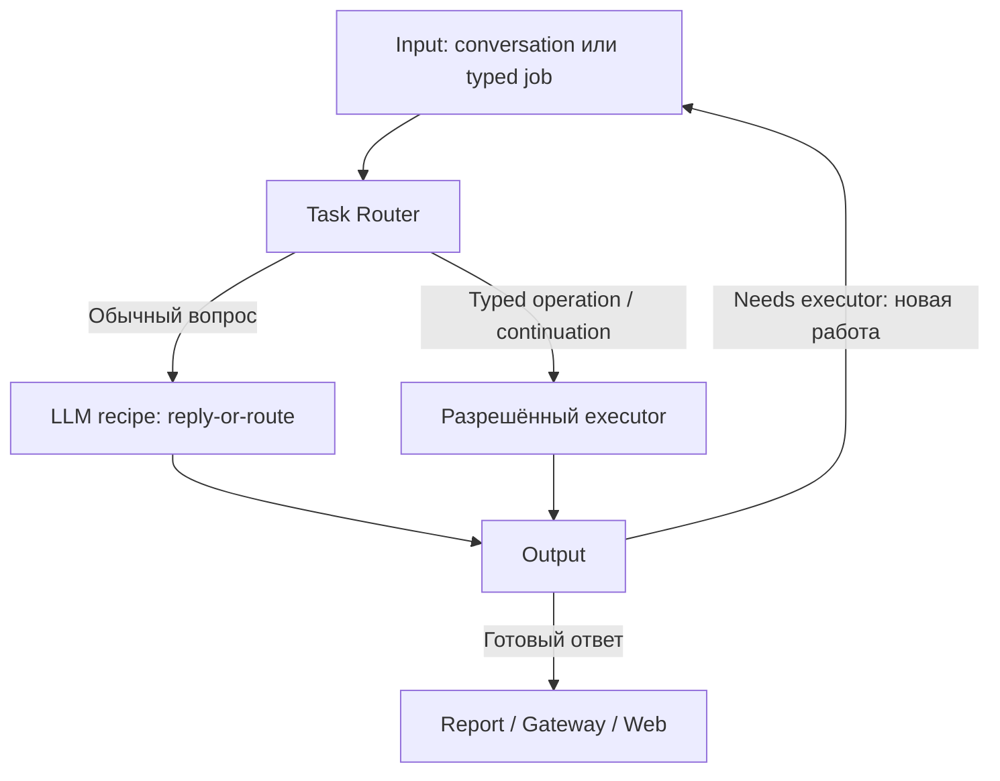

# Task Router — routing, fast replies и MCP

Статус: актуальная спецификация Task Router/MCP · 01.10.2026. Реализация и точный wire API не объявляются готовыми. Размещение по [ARCHITECTURE §9](ARCHITECTURE.md): **Router сначала модуль общего control plane над Task Store**. Отдельный репозиторий — возможное последующее выделение при независимом жизненном цикле, не prerequisite реализации. Этот документ специфицирует routing/MCP, не вводит второго владельца task state.

## Принятая policy 30.09.2026

Автоматический агентский executor эскалации — **OpenCode**. Автоматическую цепочку OpenCode → Claude Code/Codex не проектируем. Явный пользовательский запуск другого engine — отдельная allowed policy, не следующий escalation rung.

GTD opt-in: error diagnosis, fast reply и ordinary delegation не создают gtdId. Output/Router выполняют ограниченную progression; только registered managed task передаёт решение GTD. Системные ошибки могут поступать от [Error Watcher](SYSTEM-ERROR-WATCHER.md) с incidentId/sourceUserTaskId и отдельной diagnosticUserTaskId.

LLM budget/auth denial не позволяет продолжать платные вызовы по отсутствующему разрешению. Можно сформировать deterministic report/blocked или использовать заранее разрешённый доступный OpenCode profile; caps и provider readiness всё равно проверяются. Низкая стоимость не равна отсутствию лимитов.

Error и основные routing lifecycle events обязаны выполнять [Observability contract](OBSERVABILITY-AND-ERROR-CONTRACT.md): trusted profile, reply context когда известен, source/task/run IDs и TTL. Длинная диагностическая задача не должна терять канал исходной пользовательской ошибки.

## 1. Ответственность

Router определяет разрешённый способ работы: deterministic-job, llm-recipe-job или ai-agent-job. Он получает scoped input/context/capability snapshot и отдаёт resolved dispatch/decision. Авторитетного пользовательского task state у него нет: состояние и receipts принадлежат task queue/journal/GTD.

Два разных вопроса: **нужен ли агентский цикл?** и **какая LLM подходит фиксированной задаче?** Второй относится к model gateway/ladder, не превращает любой сложный reasoning в агента.

Без чтения текущих данных модели нельзя уверенно отвечать «у вас сейчас…». Complexity, data freshness, required actions и autonomy — отдельные признаки.

## 2. Основной conversational путь: один полезный первый вызов

Для обычного natural-language запроса задаём default **reply-or-route**:

1. Input передаёт original input ref, prepared context и разрешённый capability catalog.
2. Router выбирает bounded llm-recipe-job reply-or-route.
3. Recipe возвращает готовый reply, clarify или needs_executor. Это одновременно попытка ответа и выбор следующего пути.
4. Outcome идёт через общий Output. Готовый reply → Report/Gateway. needs_executor → владелец continuation создаёт следующую работу через Input.
5. Router получает typed continuation и передаёт выбранному executor; повторять initial classifier не нужно.

В базовом пути избегаем пустого LLM «да/нет» перед второй генерацией. В implementation iteration сравниваем с двухэтапным selection → template/handler/LLM reply; второй этап не обязательно модель. Выбор фиксируется по correctness/latency/calls eval, а не объявляется заранее. Router policy может быть чистым кодом; initial reasoning выполняет LLM Recipe executor.

Для уже известных /stop, status lookup, buttons, typed domain operation и GTD step действуют deterministic paths. Их не отдаём LLM только ради единого входа. Запрет бюджета/прав также проверяется до платного вызова.



При gtdId следующий шаг выбирает GTD; без него — Output policy. Router **предлагает** escalation; не создаёт скрытый второй workflow manager.

## 3. Контракт reply-or-route

```json
{
  "schemaVersion": 1,
  "kind": "reply",
  "reply": {
    "text": "Да, можем делать сайты на Tilda…",
    "evidenceRefs": ["capabilities:v7:tilda"]
  },
  "assessment": {
    "contextSufficient": true,
    "needsFreshData": false,
    "needsActions": false,
    "needsAdaptiveTools": false
  }
}
```

Union kinds: reply, clarify, needs_executor. Последний содержит proposedJobType, reasonCode, nextGoal, requiredCapabilities, preservedConstraints и priorOutputRef. confidence может быть debug hint, **не автоматический quality gate**. Уверенное число от той же модели не доказывает правильность.

Original input сохраняется неизменно; reformulated goal дополняет его, а не отбрасывает ограничения. userTaskId/gtdId, budgets и authorization приходят в trusted envelope, не генерируются моделью в текстовом ответе.

needs_executor — нормальный результат routing, не failed Run. LLM timeout, invalid JSON, budget denied и unsupported context — отдельные technical outcomes. По ним нельзя незаметно включать дорогого агента.

## 4. Примеры решений

| Ввод | Первый/следующий путь |
|---|---|
| «Умеешь делать сайты?» | Reply recipe на prepared capabilities; static answer допустим известному deterministic handler |
| «А именно Tilda?» | Та же recipe с явным Tilda readiness; описание возможности отдельно от user integration enabled |
| «Продумай сложную архитектуру по этому тексту» | Может хватить сильной LLM без tools и clean room |
| «Узнай актуальную цену в интернете» | Known fetch operation + fixed recipe, если путь заранее определён; adaptive research → агент |
| «Создай сайт и опубликуй» | Агент/известный domain workflow по actions и policy, а не по длине текста |
| Ошибка скрипта → diagnosis LLM не справилась | Новая agent Job, те же userTaskId/gtdId, новая jobId/runId, bounded escalation |
| Auth/permissions отсутствуют | blocked/action required; агент не является средством обхода |
| Awaiting user input / status query | Durable pause либо Reporting read; без agent start |

Product rule «любой запрос в интернет сразу агент» возможен, но не техническая необходимость. Базовая рекомендация: агент нужен для **самостоятельного выбора и итерации tools**; заранее заданный query можно исполнить deterministic worker.

## 5. MCP: несколько adapters к одним capabilities

MCP не является самим Router, storage или механизмом быстрого ответа.

| Роль | Исполнение |
|---|---|
| Agent-local MCP | Engine client подключает local stdio process/proxy на Run; ограниченные bindings |
| Remote domain MCP | Shared external service, auth per operation; не спавнится для каждого Run |
| Headless fast action | Router/executor вызывает тот же capability handler через internal API либо bounded MCP client |
| Capability knowledge | Versioned resources/catalog/facts о поддержке и readiness; host заранее готовит context |

Если fast path требует MCP tool, его вызывает host-owned deterministic step, а затем передаёт данные в LLM recipe. **Сама llm-recipe-job не получает tools или автономного filesystem**. Client/process pooling возможен для совместимых stateless handlers; per-user credentials нельзя перемешивать.

Один domain handler имеет contract и разные transport facades. Не копируем business logic в Telegram, Router и MCP server. Core MCP становится тонким platform facade (task/status/delegation/artifacts); domain methods остаются в domain repos.

Процесс стартует/handshake-ится, поэтому «мгновенно» — целевой latency budget, а не свойство MCP. В текущем core MCP bridge запускает servers с service UID, это не clean room boundary. Локальный proxy и privileged host tool — разные границы.

## 6. Input budget: не только первые/последние 500

Нет основания выбрать head/tail как универсально достаточный input. Критическое условие может быть в середине.

Для короткого текста передаём **весь текущий запрос** в пределах measured token budget. Для длинного сохраняем original artifact и готовим RoutingContext:

- актуальная просьба, explicit constraints и цель;
- active task/session refs и relevant summary;
- attachment manifest, content types и extraction readiness;
- capability facts/readiness с версиями;
- relevant retrieved chunks с source refs;
- length/compression/missingContext flags.

Head/tail допустимы как preview для routing, с digest/extracted constraints, но **preview не основание для полного substantive ответа**. Если reply нуждается в отброшенном middle — host retrieval/context expansion или continuation. Не называем символы токенами; token budget считаем tokenizer/usage данного provider.

Context builder — bounded host function: retrieval выполняется до recipe либо по одному явному recipe outcome, не безлимитно. Фиксируем snapshot/contextVersion; кэш ключ включает tenant/profile, permissions/capabilities, contextVersion, source purpose и policy. Только text hash недостаточен.

## 7. Research basis и наши выводы

- [Anthropic — Building effective agents](https://www.anthropic.com/engineering/building-effective-agents): distinction fixed workflows/adaptive agents и routing specialised handlers. **Наш вывод:** не каждое сложное рассуждение требует tool loop.
- [Anthropic — Context engineering](https://www.anthropic.com/engineering/effective-context-engineering-for-ai-agents): relevant retrieval, compaction и риск потери важных деталей. **Наш вывод:** head/tail preview дополняем refs/constraints; сохраняем full original.
- [RouteLLM paper v4](https://arxiv.org/abs/2406.18665): preference-trained routing между более сильной и слабой LLM. Это не готовый классификатор потребности в filesystem/tools. **Наш вывод:** оценивать routing на собственных сценариях, не полагаться на self-confidence.
- [Official MCP SDK](https://ts.sdk.modelcontextprotocol.io/v2/clients/connect): local stdio и remote transport имеют разные lifecycle. **Наш вывод:** не спавнить одинаковый domain server для каждого fast reply по умолчанию.

## 8. Сверка с текущим процессом

Проверены core revision bbc0b91e503e65ede3adc0a87abf9bba59a1ad25 и Telegram b3b703fa3271a3b739bcf315ebf7d247a33c7dc7.

| Источник | Факт | Что переносим/уточняем |
|---|---|---|
| [input-router.js](https://github.com/trained-assist/trained-assist-agent/blob/bbc0b91e503e65ede3adc0a87abf9bba59a1ad25/src/input-router.js) | P1 shadow quick/agent classification, не production decision | Отдельный Router contract и eval; нельзя заявлять, что universal LLM-first уже активен |
| Там же | ≤1200 chars full input, иначе head/tail по 400 + keyword digest; timeout 4s | Сравнить с full/retrieved context, измерить middle-constraint recall |
| Там же | Cache ключ по text hash | При extraction проверить scoped key; identical text разных contexts не должен смешиваться |
| [runner/index.js](https://github.com/trained-assist/trained-assist-agent/blob/bbc0b91e503e65ede3adc0a87abf9bba59a1ad25/src/runner/index.js) | Quick handlers, queue, session record и Telegram delivery смешаны | Handler в domain/platform owner, decisions в Router, delivery в gateway |
| [answer-router.js](https://github.com/trained-assist/trained-assist-agent/blob/bbc0b91e503e65ede3adc0a87abf9bba59a1ad25/src/answer-router.js) | Manual deep/oneshot mode; oneshot может пользоваться tools | Mode не является jobType=tool-free LLM |
| [TG intake-preflight](https://github.com/trained-assist/trained-assist-tg-bot/blob/b3b703fa3271a3b739bcf315ebf7d247a33c7dc7/src/intake-preflight.js) | /intake-quick path, media rules, guarded fallback | Generic policy переносим, native normalization/receipts оставляем gateway |

Текущие fast paths — основа для extraction, но target reply-or-route union и gtdId propagation ещё не подтверждены в production.

## 9. Скорость, прозрачность и проверка

Latency measure: acceptance, time-to-first-useful-reply, route decision, executor start и complete. Предлагаемые budgets сначала измеряем; hard numbers не обещаем без baseline.

- Reply recipe ограничены deadline/output/schema; heavy media и long jobs имеют отдельную concurrency.
- Cache scoped/versioned, capability retrieval компактный.
- Готовый reply не повторно «переформулируем» ещё одной LLM.
- Ненужную first LLM для typed jobs исключаем.
- UI получает accepted/queued; «агент запущен» только после start receipt. До него: «передаём агенту».
- partial draft не публикуется как окончательный ответ до финального decision; streaming strategy измеряем отдельно.

Evals: common FAQ/Tilda, сложное tool-free reasoning, fresh/private data, constraints в середине длинного ввода, stop/typed jobs, late media, unavailable LLM/budget, invalid JSON, repeated escalation, duplicate request/context changes. Измеряем false-fast (неосновательный ответ), unnecessary-agent, latency p50/p95, correctness и стоимость вместе.

## 10. Размещение модуля

Логические каталоги модуля внутри control-plane repo: contracts/, policy/, recipes/reply-or-route/, context/, capability-adapters/, evals/, integration fixtures. Router не импортирует внутренние core modules и не хранит credstore.

API: route(preparedInput, resolvedPolicy) → decision/dispatch spec; typed continuation сохраняет U/G refs. Transport выбирается отдельно, package adapter допустим при последующем выделении. Весь durable task state остаётся за boundary.

## Implementation refinement: compact capabilities

[Capability Catalog and Fast Replies](CAPABILITY-CATALOG-AND-FAST-REPLIES.md) задаёт supportedModes template/deterministic/llm/agent, explicit labels/aliases, required input/readiness, tier-1 brief + retrieved schemas. Это platform metadata, не новый Job type и не переименование всех native MCP tools. Regex внешних URL/keywords высокоточные intent features; простое присутствие ссылки не доказывает необходимость tools. Fixed LLM получает данные от host handler; browsing/fs автономия остаются Agent Job.

[Engineering Approach](ENGINEERING-APPROACH.md) определяет sandbox и evidence. Corpus готовим из sanitized current fast-path logs плюс labelled fixtures до выбора окончательного recipe. Missing email/login — required input outcome, не запуск агента ради отсутствующего параметра.

## 11. Fast-path v1: алгоритм до запуска агента

Статус: **предлагаемый implementation contract, 01.10.2026**. Основной вариант для исследования — один полезный reply-or-route; двухэтапный selection → execution сравнивается на тех же входах. Это уточнение дизайна, не объявление runtime готовым. Цель — сократить необязательные Agent Runs без ухудшения полноты ответа и исполнения действий.

### 11.1 Вход и владельцы

Input фиксирует неизменный originalRequestRef, attachment manifest, conversation/context snapshot и trusted envelope: userTaskId, principal/profile, authorization/bindings, budgets, catalogVersion, policyVersion. Данные модели не могут менять эти поля. Relevant предыдущие сообщения необходимы для «а Tilda?» и «да, сделай»; один последний текст недостаточен.

Catalog compiler публикует scoped brief; Router policy выбирает путь; Recipe executor выполняет модель; capability adapter вызывает проверенный handler; общий Output валидирует outcome и ведёт continuation/delivery. Это логические функции **одного control plane**, не новые очереди/сервисы. Профиль/Task Store читает host до вызова recipe в рамках разрешённого контекста. LLM recipe не получает свободный MCP-клиент, FS или цикл произвольных tools.

### 11.2 Последовательность

0. **Admission и normalization.** Дедуп user request, принадлежность profile/conversation, состояние вложений, caps. Pending audio extraction не превращать в ответ на пустое сообщение. Запрос остановки/статуса/ответ на существующее ожидание маршрутизируется по typed contract, не как новая задача.
1. **Детерминированные пути.** Кнопка/команда/точное template match/заданная domain operation идут в их handler. Missing required field → Awaiting user input. Запрос использовать конкретный engine сохраняется и проверяется policy, не заменяется скрыто fast reply.
2. **Подготовить context/catalog.** Для короткого и среднего ввода дать полный запрос, relevant conversation и compact allowed catalog. Для длинного дать bounded context с coverage flags и refs (11.6). Выбрать relevant candidates; отсутствие capability среди candidates не доказывает её отсутствия во всей системе.
3. **Один reply-or-route.** Модель получает данные и strict decision contract. Возвращает один outcome: reply / clarify / needs_executor. needs_executor может означать bounded capability или ai-agent-job. Вариант template определяется capabilityId; модель не сочиняет «стандартный» ответ вместо существующего template.
4. **Host validation.** Schema и semantic checks: существует ли capability/version, разрешён ли mode, соответствуют ли args inputSchema, есть ли поля/права/readiness/freshness; согласованы ли evidence и assessment; достаточен ли context. JSON-валидность не доказывает истинность ответа. Semantic invalid decision не исполняется.
5. **Исполнение capability.** Handler выбирается из verified catalog. Он может вернуть template/result, fixed llm-recipe-job spec, missing_input, blocked либо needs_agent. LLM не выбирает произвольный backend/URL/секрет из текста. После handler при необходимости один фиксированный renderer/LLM answer по возвращённым данным; для готового template второй LLM не нужен.
6. **Ответ или эскалация.** Итог через общий Output/Report. Для агента сохраняется userTaskId, создаются новая jobId/runId. Original input, контекст, результат предыдущего шага и причины эскалации прикладываются refs; structured agentGoal дополняет исходную просьбу. Обычный routing не добавляет gtdId.
7. **Bounded termination.** На одну decision attempt: максимум один schema repair и максимум один capability execution плюс один post-tool recipe. Chain of tools/повторный поиск/новая итерация неизвестного пути → agent либо явный blocked/clarify. Лимиты — предлагаемые v1 defaults, подлежат измерению; retry общего workflow сохраняет operationId/idempotency key и не повторяет внешний effect без защиты. Общий deadline/call/token budget проверяется между этапами.

**Смысл ответа важнее cheap route.** «Создай и опубликуй» нельзя закрыть объяснением «умеем создавать». Пропуск действия — false-fast. Missing credentials не лечится запуском агента. Резервный агент — OpenCode по разрешённой policy; автоматического перехода к Claude/Codex нет.

### 11.3 Decision JSON

Используем существующие union kinds из §3, без второго несовместимого API. Ниже example needs_executor для host-owned capability; финальная JSON Schema будет частью пилота. Для каждого kind задаются отдельные обязательные поля и запрещённые лишние поля. При provider support — strict structured output; иначе JSON parse + schema validation, один bounded repair. Refusal, truncated output и timeout имеют отдельные outcomes.

```json
{
  "schemaVersion": 1,
  "kind": "needs_executor",
  "proposedJobType": "deterministic-job",
  "capabilityId": "recruiting.search_status",
  "capabilityVersion": 1,
  "arguments": {"searchId": "search-example"},
  "reasonCode": "NEEDS_CURRENT_USER_DATA",
  "assessment": {
    "contextSufficient": true,
    "needsFreshData": true,
    "needsActions": false,
    "needsAdaptiveTools": false
  }
}
```

IDs/versions в примере — иллюстрация, не утверждение, что такой handler реализован. Модель выбирает только существующие entries из snapshot.

- **reply:** reply.text + evidenceRefs; assessment.contextSufficient=true. Для platform facts refs ведут к catalog/resources; для task-dependent данных — к host snapshot/result. Обычное рассуждение по данному пользователем тексту не требует выдуманных внешних citations.
- **clarify:** question, missingFields, reasonCode. Awaiting user input оформляет host с waitId и typed expected reply; модель не генерирует waitId. Не запускать Agent Run для просьбы «укажите email».
- **needs_executor/capability:** proposedJobType, capabilityId/version, arguments, reasonCode. supportedModes решает allowed dispatch; template — deterministic-job, а не новый Job type.
- **needs_executor/agent:** proposedJobType=ai-agent-job, nextGoal, preservedConstraints, requiredCapabilities, reasonCode. Reason например ADAPTIVE_TOOL_LOOP, CONTEXT_NOT_COVERED, ARTIFACT_WORKSPACE_REQUIRED. Пользовательский запрет публикации или бюджет не могут исчезать при reformulation.

Не используем probability/confidence той же модели как единственное разрешение fast reply. Опора: typed metadata, context coverage, host validation и измеренная ошибка на holdout.

### 11.4 Handler outcome и readiness

Capability не «думает сама» по умолчанию: deterministic handler может вернуть проверенные данные/инструкцию; declared LLM recipe генерирует текст; агент имеет автономию. Контракт handler:

| Outcome | Действие host |
|---|---|
| completed + result/template | Render и общий Output |
| needs_llm + recipeId + preparedDataRef | Запустить разрешённый fixed recipe; максимум один post-tool вызов |
| missing_input + fields | Awaiting user input; привязать ответ к waitId/task, не к случайной последней задаче |
| blocked + reason | Сообщить, как подключить integration/пополнить бюджет; без escalation обхода |
| needs_agent + reason + partialResultRef | Разрешённый Agent Job с full original и partial result |
| technical_error + typed code | Ограниченный технический retry/diagnosis policy; не рекурсивный fast-path loop |

supportedModes и effect/readiness — статическое ограничение; handler outcome — факт конкретного invocation. Разрешения, key bindings и budget host проверяет повторно перед effect. Mutating операции сохраняют существующее правило подтверждения/авторизации; selection модели не является approval. Read-only/freshness/per-user отличаются от «просто текст».

### 11.5 Что получает агент

AgentWorkOrder содержит originalRequestRef + full-content access, user goal, explicit constraints, relevant conversation refs, attachments, capability/data snapshot versions, completed actions/results, unresolved questions и escalationReason. Запрещено выдавать предположение classifier за новое требование пользователя. Уже совершённые внешние действия снабжаются operation receipts, чтобы агент их не повторял.

Оптимизация промпта измеряется отдельно: structured brief может уменьшить поиск, но не гарантирует более дешёвый Run. Prepared goal не заменяет исходник и не теряет запреты/обязательные результаты. «Агент запущен» UI получает только после start receipt; до этого допустим routing/queued status.

### 11.6 Input: полный текст по умолчанию, не произвольное обрезание

1. В пределах provider budget передаём **полный актуальный запрос** и релевантную conversation, а не 500 токенов head + tail.
2. При превышении — original остаётся artifact; context builder помечает что покрыто/пропущено, извлекает relevant chunks и constraints с source spans. Extraction тоже имеет цену и не гарантирует completeness.
3. По preview разрешено выбрать candidate route; полный ответ на весь документ/анализ нельзя выдавать при неполном coverage. Контекст расширяется host bounded step либо путь передаётся агенту с исходником.
4. Ссылка не равна обязательному агенту: обсуждение процитированного URL может быть text-only; известный live lookup — deterministic + LLM; самостоятельное browsing/research — agent.
5. Token budget зависит от tokenizer/model. В исследовании сравнить full vs prepared retrieval vs head/tail preview и отдельно считать потерю constraints в середине.

### 11.7 Неблокирующее исследование и тестовый стенд

**Размещение:** отдельный pilot/fast-path каталог в trained-assist-control-plane, собственная ветка/worktree и владелец. Не менять рабочие TG/Web/core/Runner, их shared bindings и native MCP names. Routing contracts/templates/compiler + fixture UI/API образуют research artifact. Реальные domain handlers подключаются позже через adapter; никаких скрытых core imports.

1. Inventory текущих quick handlers и catalog definitions в domain repos: stable IDs, labels, schemas, effects, supported modes, readiness, native mapping. Публиковать mapping и gaps, не массовый rename PR.
2. Составить протокол сбора истории; владелец утверждает sanitized dataset до выгрузки. Read-only исследование не перезапускает старые mutating requests.
3. Label по минимальному **достаточному** пути template/deterministic/LLM/agent/clarify/blocked; фактический legacy agent start не ground truth. Отдельно спорные примеры для human adjudication.
4. Сравнить: current baseline, one-pass reply-or-route, two-pass selection + answer/handler. Одинаковые разрешённые данные/модели/budgets; считать все provider calls, retrieval overhead и clean-room startup.
5. Offline fixtures: deterministic replay input/context/catalog, scripted model decisions и tool responses, expected actions/results. Это проверяет orchestration, не качество живой LLM.
6. Отдельный live model eval на holdout с mocked external effects. Он проверяет selection/answer; не обзывать mocked LLM replay модельной accuracy.
7. Shadow: получать decision без dispatch/effects; compare с историей/экспертной разметкой. Затем явный opt-in sandbox adapter. Production promotion — отдельная приёмка.

### 11.8 Какие данные собрать из истории

Минимальная строка исследования: anonymized sampleId, domain/intent label, sanitized full request и relevant preceding turns, attachment type/readiness (содержимое лишь когда нужно и разрешено), разрешённый на тот момент catalog/readiness snapshot либо явный missing snapshot flag, фактический route/engine, был ли tool/action, outcome/user correction, timing, usage/cost availability. Не собирать auth tokens, cookies, credential values или full profile dump. Если historical capability snapshot отсутствует, counterfactual eval обозначается неполным; не реконструировать готовность задним числом как факт.

Включить FAQ, capability questions, connect instructions, status, simple transforms, сложное reasoning без tools, private/live queries, bounded tool call, adaptive research, website/file actions, неоднозначность, продолжения «да/нет», длинные middle constraints, pending audio/files, failures и unavailable bindings. Вложенный/цитируемый текст с инструкциями также нужен для проверки, что он не переопределяет envelope/policy.

Split по conversation/user-group/time, не по отдельным соседним сообщениям; иначе leakage. Отдельный holdout новых перефразировок и rare critical cases. Размер/TTL/access/export destination утверждаются в research protocol; соблюдать observability retention. Live user text не включать в публичные fixtures.

### 11.9 Метрики, логи, acceptance

Главная ошибка — **false-fast**: система дала неполный/необоснованный ответ или не выполнила обязательное действие. Затем unnecessary-agent среди запросов, для которых проверенный более простой путь достаточен. Дополнительно: correct capability+args, missing-input accuracy, unsafe effect attempts (host должен отвергать), p50/p95 useful reply и completion, calls/tokens/cost на successful task, JSON failures, escalation count, same-task repeated effect, quality по domain. Процент отказа от агента без качества ничего не доказывает.

Research report фиксирует corpus/labels/version, holdout size, uncertainty, модели и лимиты, результаты отдельных классов, latency/cost и принятый вариант. Целевые пороги выбираем до holdout; для critical synthetic fixtures — ни одного нарушения инвариантов. Synthetic нулевые ошибки не доказывают нулевую live error rate. Если выигрыш не подтверждён, policy остаётся консервативной.

RoutingDecision event: trusted profile/userTaskId, decisionId, input/context/catalog/policy versions, candidates/selected capability, reasonCode, mode, schema/semantic validation, coverage, timings, actual usage source, continuation/job/run refs. Логи не содержат секреты и полный текст по умолчанию; replay data имеет отдельный scoped доступ/TTL. Политика выполняет общий OBSERVABILITY-AND-ERROR-CONTRACT.md.

Fault fixtures: invalid/refused/truncated JSON, timeout, budget denied, no enabled candidates, missing args, stale context/cache другого пользователя, late attachment, unknown capability/version, conflicting reply/effects, duplicate submit, restart после effect до receipt, tool timeout, agent admission failure, terminal late event. Missing credentials/permission → blocked/clarify, а не бесконечная escalation.

### 11.10 Основания и границы рекомендаций

- https://www.anthropic.com/engineering/writing-tools-for-agents — ясные имена/описания, namespaces, meaningful results и eval. Применяем к каталогам; длина имени сама по себе не является оптимизацией.
- https://www.anthropic.com/engineering/advanced-tool-use — поиск relevant definitions вместо загрузки всех tools, важность различимых имён и параметров. Это основание candidate retrieval, не обязательство использовать vendor-specific feature.
- https://developers.openai.com/api/docs/guides/function-calling — schema constraints/strict mode и уменьшение набора функций для selection. Strict помогает форме, но не доказывает correctness выбора/args.
- https://www.anthropic.com/engineering/building-effective-agents — fixed workflows vs adaptive agents и routing. Наш v1 bounded fast path — workflow; исследование определяет, когда его достаточно.

Точное число candidates, контекстный budget, один/два вызова и качество модели — **наши проверяемые гипотезы**, не универсальные best practices с гарантией.

## 12. Два исследования: multimodal routing и интерактивное выполнение

02.10.2026: Research A уточняет intent/domain/capability selection, input preparation и быстрые пути; Research B — [интерактивное выполнение](INTERACTIVE-EXECUTION-AND-USER-INPUT.md), формы/кнопки, ожидание и policy вопросов. Они неблокирующие относительно текущей PR-приёмки и нового ядра; исследование не является массовым rename/native agent implementation.

### Multimodal RoutingContext

User request — envelope сообщений/attachments, не строка. Соблюдаем порядок и batch revision: 5 voice + 3 MD + screenshot может ещё собираться. Manifest содержит artifactId, kind, size/pages/duration, extraction state/version, hash/ref, privacy и relationship к запросу. Pending/failed extraction видно явно; решение по неполному batch не публикуется как полное.

По типам:
- voice: transcript refs, время/порядок, confidence/неразобранные spans; ASR — bounded preprocessing job со своей ценой;
- Markdown/doc: headers, sections, relevant chunks/constraints с provenance; полный original сохраняется;
- screenshot: image metadata + при необходимости bounded vision/OCR по intent; OCR не заменяет visual understanding layout/графики;
- large/irrelevant binary: metadata/ref, не вставка blob в prompt.

Не требуется анализировать каждый пиксель/транскрипт заранее для любого вопроса. Известный typed click или статус идёт напрямую. Для обычного multimodal routing context builder выбирает bounded extraction; если информация отсутствует, contextSufficient=false, expand/clarify/agent. RAG помогает выбрать контекст, но сам по себе не доказывает coverage.

Сравнить policies full feasible / head-tail + section manifest / relevant retrieved chunks / progressive expansion на нескольких моделях и payload sizes. Измерять end-to-end preprocessing + routing + outcome, не только токены classifier. Слабая/сильная модель не возвращает потерянные в preview ограничения. Preview допустим для гипотезы маршрута и capability shortlist, не полного substantive ответа.

Routing assessment дополняется domainTags (multi-label/unknown), intentTags, candidate capabilities и suggestedInteractionMode с reason; это аналитика/подготовка, не authorization и не изменение explicit preferences. AgentWorkOrder получает полные definitions выбранных capabilities плюс compact discovery index остальных **разрешённых** возможностей; неизвестные заранее tools остаются доступны через scoped discovery. Не ограничивать агента ошибочным первичным shortlist.

### Внешний доступ и постепенное развитие

Known GitHub PR status, единичный search/query и declared Playwright operation могут идти в host-owned bounded tool workflow с LLM rendering — без clean room. Browser capabilities имеют effect/session/privacy metadata; «Playwright» не означает автоматически read-only. Если после результата нужен самостоятельный выбор следующих действий или итерации, отправляем OpenCode.

Это плавная лестница возможностей, а не запрет tools вне агента. Позднее собственный native agent loop возможен как отдельный executor; fast-path v1 остаётся bounded workflow и не превращается незаметно в бесконечный цикл. Возможность reusable external tool не означает, что она уже реализована/разрешена данному пользователю.

### Research A: конкретный поиск при малом корпусе

Дополнить историю частыми простыми случаями: «работаешь?», «какой статус PR?», «ключ получен?», «как подключить?», «что умеете?», «отправил», «да» после меню. Для health/readiness нужны текущие host facts, не ответ по общим знаниям. Различать native typed button и текстовую фразу.

Сохранять sanitized message ordering, attachment manifest/extraction availability и версии контекста в момент решения. Majority dev/agent-heavy corpus не использовать как единственную оценку: отдельно natural frequency и balanced challenge set, не обещать большой savings всем юзерам по synthetic tests. Дополнительные fixtures — гипотезы, не подмена статистики live usage. Исследовательские вопросы/разметка interactions — Research B §8.

### Приоритет пользовательских инсайтов — решение владельца 02.10.2026

Для обоих исследований (A: fast-path/context, B: interactions) **первый приоритет — сессии пользователей, отличных от Вовы Кобзева**. В первую очередь исследовать реальное использование Людой, Антоном, Димой Хромовцовым и сценарии получения/обработки фриланс-заказов у других пользователей. Для начинающего пользователя особенно важны понятность кнопок/форм, подключения, выборов, статусов и отсутствие неожиданных запусков агента.

**Второй приоритет — все сессии Вовы Кобзева**, включая разработчика, product manager, рекрутера и другие его роли/профили. Разные роли владельца не считать независимыми внешними пользователями. Их использовать для дополнительных технических инсайтов и edge cases после первого прохода по пользовательскому корпусу.

Исследователь сначала составляет подтверждённый inventory user/profile → sessions по доступным метаданным; имена выше — ориентиры для поиска, не выдуманные account IDs. В опубликованных fixtures/отчётах применять обезличенные sample/group IDs. Пользовательское «приоритет» не означает разрешения публиковать сырой текст или секреты.

Отчёт и eval разделяют реальные пользовательские сессии, owner/development sessions и synthetic fixtures. Показать отдельно объём, проблемы и результаты каждого корпуса; большой объём owner-сессий не должен определять общий ranking проблем или скрывать external-user failures. При малом количестве пользовательских данных явно отметить ограничение и дополнить релевантными fixtures, не подменяя первый приоритет owner-статистикой.

Для A искать прежде всего лишние Agent Runs в пользовательских FAQ/status/connect и фриланс-сценариях; для B — непонятные действия, формы, потерянные уточнения/ответы и необходимость выбора у начинающих пользователей. Приоритет означает порядок сбора, анализа и исправлений, а не предположение, что любая задача внешнего пользователя обязательно простая.
