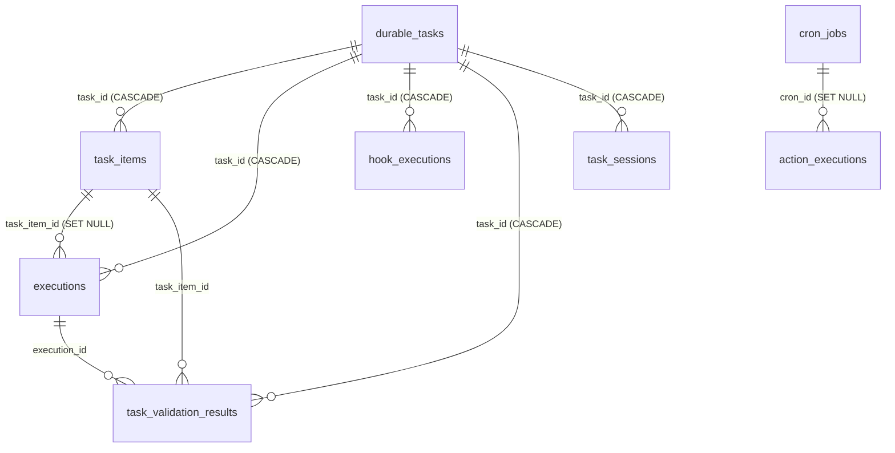

# Task Store v1: схема — инвентарь прода и целевое состояние

Статус: **предложение, готово к review** · пункт A2 эпика [#87](https://github.com/trained-assist/trained-agent-architecture/issues/87) · инвентарь прода снят **read-only** 01.10.2026 15:20–15:33 UTC.

Документ отвечает на вторую из трёх предпосылок до первой строки кода control plane: пилот P-DB ([COMPARISON](pilots/p-db/COMPARISON.md)), **схема Task Store** (этот документ), контракт разговорной сессии (A3). Порядок работ — [IMPLEMENTATION-AND-INTEGRATION-PLAN, «Актуальный порядок старта», п. 2](IMPLEMENTATION-AND-INTEGRATION-PLAN.md#актуальный-порядок-старта) и [ARCHITECTURE §11](ARCHITECTURE.md#11-порядок-работ); требования к содержимому — [ARCHITECTURE §4.1](ARCHITECTURE.md#41-одна-транзакционная-база-состояния-задач-task-store). Пункт M0 «схема Task Store v1» эпика миграции — [#11](https://github.com/trained-assist/trained-agent-architecture/issues/11).

**Что здесь лежит:** (1) инвентарь реальной прод-базы `durable-tasks/state.db`, снятый только чтением; (2) целевая схема Task Store v1 — новые таблицы и аддитивные колонки поверх прод-схемы, с типами, индексами и комментарием «зачем» к каждому; (3) матрица покрытия требований A2 и границы скоупа.

Схема описывает **и текущее состояние (legacy), и целевое v1**, потому что v1 не проектируется с нуля: прод-таблицы — это ядро Task Store, новые сущности добавляются к ним ([ARCHITECTURE §4.1](ARCHITECTURE.md#41-одна-транзакционная-база-состояния-задач-task-store)).

---

## 1. Как снят инвентарь (метод и воспроизводимость)

Прод-база — **read-only источник фактов**. Запись, миграция и пересборка на проде запрещены; все запросы ниже открыты в режиме только чтения.

- Файл: `vova@136.65.7.197:/home/vova/agent-data/durable-tasks/state.db` (WAL: рядом `state.db-wal`, `state.db-shm`; есть резервные копии `state.db.bak-20260930-epic-escalation`, `state.db.bak-20261001-step40m`).
- На VM **нет `sqlite3` CLI**; читали через встроенный `python3` (SQLite 3.37.2) с открытием `file:…/state.db?mode=ro` — соединение физически не может писать. Никаких `ALTER`/`INSERT`/`VACUUM`/миграций на проде не выполнялось.
- Снимок: 01.10.2026, 15:20–15:33 UTC (18:20–18:33 МСК). База живая (writer держит WAL), поэтому счётчики — на момент чтения и растут.

Воспроизвести (только чтение):

```bash
ssh vova@136.65.7.197 'python3 - <<'"'"'PY'"'"'
import sqlite3
con = sqlite3.connect("file:/home/vova/agent-data/durable-tasks/state.db?mode=ro", uri=True)
cur = con.cursor()
for t, in cur.execute("SELECT name FROM sqlite_master WHERE type=\"table\" ORDER BY name"):
    print(t, cur.execute("SELECT COUNT(*) FROM \"%s\"" % t).fetchone()[0])
for r in cur.execute("SELECT type, name, sql FROM sqlite_master ORDER BY type, name"):
    print(r)
PY'
```

Полная выгрузка DDL (`sqlite_master`) и `PRAGMA table_info/index_list/foreign_key_list` по восьми таблицам лежит в разделах 3–4; расхождение с файлом на проде = ошибка этого документа, переснимите.

---

## 2. Факты масштаба

### 2.1 Счётчики (срез 01.10.2026 15:30 UTC)

| Таблица | Строк | Что это |
|---|---:|---|
| `durable_tasks` | **56** | Планы (в т.ч. 4 дочерних от `parent_task_id`) |
| `task_items` | **769** | Шаги планов |
| `executions` | **713** | Попытки исполнения шагов |
| `task_validation_results` | 483 | Результаты проверок acceptance |
| `action_executions` | 275 | Действия из расписания (274 cron + 1 user) |
| `hook_executions` | 77 | Срабатывания хуков |
| `cron_jobs` | 11 | Правила расписания (все `enabled=1`) |
| `task_sessions` | 4 | Привязки задач к сессиям движка |

### 2.2 Сверка с цифрами в ARCHITECTURE §6 («52 плана, 706 шагов, 625 запусков у 6 профилей»)

Цифры §6 воспроизводятся **точно**, если отсечь записи до 2026-09-30 16:00 UTC (счётчики сняты 30.09 около 20:00 МСК):

```sql
SELECT COUNT(*) FROM durable_tasks WHERE created_at < 1790784000000;                 -- 52
SELECT COUNT(*) FROM task_items WHERE created_at < 1790784000000;                    -- 706
SELECT COUNT(*) FROM executions WHERE started_at < 1790784000000;                    -- 625
SELECT COUNT(DISTINCT profile_id) FROM durable_tasks WHERE created_at < 1790784000000; -- 6
```

То есть **52/706 — это срез 30.09, а не «почти»**: расхождение с 56/769 — это рост базы за 01.10 (+4 плана, +63 шага, +88 запусков). Обе цифры верны, разница — дата.

### 2.3 Распределения, которые влияют на схему

```sql
-- durable_tasks.status (CHECK уже ограничивает набор)
active 22 · done 18 · cancelled 12 · paused 2 · draft 2

-- task_items.status
done 406 · pending 288 · skipped 54 · failed 11 · waiting 10

-- executions.status
success 383 · failed 241 · waiting 47 · interrupted 41 · running 1

-- executions.engine
opencode 574 · claude 81 · NULL 50 · codex 8

-- профили
trained-assist-product-owner 42 · playbooks-e2e 5 · iso-smoke 5 · flexi-consult 2 · vova 1 · hh-bg-test-77777 1
```

Прочие факты: `executions.tier` — free 710 / standard 2 / strong 1 (бесплатная ступень доминирует, платные движки автоматически не выбираются); `task_items.wait_json` заполнен у 79 шагов, `hooks_json` — у 66 шагов и 40 задач; `durable_tasks.request_id` и `execution_session_id` **пусты у всех строк** (колонки заведены под будущее, данные в них не пишутся — это ровно тот пробел, который закрывает v1: приём по `request_id` и связь с сессией); диапазон создания задач 23.09.2026 21:46 — 01.10.2026 06:45 UTC.

### 2.8 Параметры базы

`page_size=4096`, `journal_mode=wal`, `user_version=0` (**версионирования схемы нет**: миграции в коде опираются на наличие колонок, а не на номер версии — см. §6.4), `foreign_keys=0` на чтущем соединении (FK объявлены в DDL; фактическое принуждение включает соединение, которое пишет). Триггеров, представлений и `WITHOUT ROWID`-таблиц нет.

---

## 3. Текущая схема (legacy): прод `durable-tasks/state.db`

Восемь таблиц, десять именованных индексов, десять автоиндексов (PK/UNIQUE). DDL ниже — перенос из `sqlite_master` с сохранением порядка и типов колонок (переносы строк отформатированы для читаемости). Колонки, добавленные впоследствии через `ALTER TABLE ADD COLUMN`, видны в конце определения — это и есть действующая практика аддитивных миграций этого прода.

### 3.1 Связи



### 3.2 `durable_tasks` — планы; **`id` этого таблицы и есть userTaskId v1**

```sql
CREATE TABLE "durable_tasks" (
    id          TEXT PRIMARY KEY,              -- userTaskId (см. §5.1); PK
    profile_id  TEXT NOT NULL,                 -- владелец/область доступа (INV-01, §8)
    project_id  TEXT,                          -- проект, унаследованный от сессии (#1843); NULL = не определён
    goal        TEXT NOT NULL,                 -- цель плана
    status      TEXT NOT NULL DEFAULT 'active'
                CHECK (status IN ('draft','active','paused','blocked','done','failed','cancelled')),
                                                      -- ЕДИНСТВЕННАЯ колонка состояния задачи; v1 добавляет 'awaiting_input' (§5.4)
    created_at  INTEGER NOT NULL,              -- epoch ms
    updated_at  INTEGER NOT NULL,              -- epoch ms
    revision    INTEGER NOT NULL DEFAULT 0,    -- bump на каждое изменение (оптимистическая блокировка)
    -- далее аддитивные колонки (ALTER TABLE ADD COLUMN):
    playbook_id TEXT,                          -- закреплённая методика; 48 из 56 планов
    playbook_version INTEGER,                  -- pinned версия методики
    user_value TEXT,                           -- вход плана (в пилоте сюда клали input Port)
    acceptance_criteria_json TEXT,             -- критерии приёмки
    contract_revision INTEGER NOT NULL DEFAULT 1,
    execution_policy_json TEXT,                -- политика исполнения
    execution_session_id TEXT,                 -- ПУСТО у всех строк: связь с сессией не ведётся
    request_id TEXT,                           -- ПУСТО у всех строк: приём по ключу идемпотентности не ведётся
    blocker_reason TEXT,                       -- причина blocked (текстом, без кода причины)
    hooks_json TEXT,                           -- хуки событий; 40 из 56 планов
    parent_task_id TEXT,                       -- дочерний план; 4 строки (fanout)
    parent_item_id TEXT,                       -- шаг-задача родителя, породивший дочерний план
    batch_item_key TEXT,                       -- ключ элемента веера; 4 строки
    origin_session_id TEXT,                    -- сессия-источник
    origin_chat_json TEXT                      -- чат-источник; 2 строки (JSON, не нормализован)
);
```

**Индексы:** только PK (`sqlite_autoindex_durable_tasks_1`). Ни одного индекса по `profile_id`, `status`, `parent_task_id`, `conversation`/чату — выборки идут сканированием (при 56 строках это неважно; v1 добавляет индексы под запросы Reporting, §5.9).

**Что важно:** `status` — колонка, а не вычисление из событий ([ARCHITECTURE §4.1](ARCHITECTURE.md#41-одна-транзакционная-база-состояния-задач-task-store)). Журнала переходов `status` **нет** — история собирается грубым объединением `executions` + `task_items` (пилот T8: «отдельной таблицы событий нет»).

### 3.3 `task_items` — шаги планов

```sql
CREATE TABLE task_items (
    id                  TEXT PRIMARY KEY,
    task_id             TEXT NOT NULL REFERENCES durable_tasks(id) ON DELETE CASCADE,
    position            INTEGER NOT NULL,      -- позиционный порядок; v1 заменяет графом зависимостей (§6)
    title               TEXT NOT NULL,
    status              TEXT NOT NULL DEFAULT 'pending'
                        CHECK (status IN ('pending','running','waiting','done','failed','skipped')),
                                                      -- состояние ШАГА; 'waiting' = парковка (в т.ч. ожидание ввода)
    execution_tier      TEXT NOT NULL DEFAULT 'free'
                        CHECK (execution_tier IN ('free','standard','strong')),
    current_tier        TEXT NOT NULL DEFAULT 'free'
                        CHECK (current_tier IN ('free','standard','strong')),
    escalation_count    INTEGER NOT NULL DEFAULT 0,
    delay_after_sec     INTEGER NOT NULL DEFAULT 0,
    due_at              INTEGER,               -- плановый срок/дедлайн; 172 шага
    last_execution_id   TEXT,                   -- последняя попытка; 393 шага (указатель, не история)
    last_error          TEXT,                   -- текст ошибки без класса
    created_at          INTEGER NOT NULL,
    updated_at          INTEGER NOT NULL,
    -- аддитивные колонки:
    stage TEXT,
    instructions TEXT,                          -- промпт шага (LLM-шаг)
    execution_kind TEXT NOT NULL DEFAULT 'agent'
                         CHECK (execution_kind IN ('agent','programmatic')),
    executor_role TEXT CHECK (executor_role IN ('researcher','developer','reviewer','verifier')),
    minimum_model_level TEXT CHECK (minimum_model_level IN ('bachelor','master','doctor')),
    current_model_level TEXT CHECK (current_model_level IN ('bachelor','master','doctor')),
    context_budget TEXT CHECK (context_budget IN ('small','medium','large')),
    validation_json TEXT,
    attempt_count INTEGER NOT NULL DEFAULT 0,
    max_attempts INTEGER NOT NULL DEFAULT 3,   -- бюджет попыток шага
    execution_timeout_seconds INTEGER NOT NULL DEFAULT 600,
    wait_deadline_at INTEGER,                  -- ПУСТО у всех строк (дедлайн ждёт в wait_json, см. ниже)
    evidence_json TEXT,
    completed_at INTEGER,
    validation_mode TEXT CHECK (validation_mode IN ('programmatic','programmatic+llm','programmatic+llm-fastpass')),
    last_failure_class TEXT,
    last_recovery_action TEXT,
    hooks_json TEXT,
    wait_json TEXT,                             -- СОСТОЯНИЕ ОЖИДАНИЯ в JSON: 79 шагов; перезаписывается (parked→woken)
    exception_json TEXT,
    fanout_json TEXT,                            -- конфигурация веера дочерних планов
    already_done_json TEXT
);
```

**Индексы:** `idx_task_items_task (task_id, position)` — чтение плана по порядку; `idx_task_items_due (status, due_at)` — выборка созревших шагов.

**Ждущие шаги (10 шт.)** помечены `status='waiting'`, а их реальное состояние — в `wait_json`: `{"then":"complete","poll_every_sec":300,"timeout_sec":86400,"started_at":…,"deadline_at":…,"awaiting_user":true,"reason":"…","resolved":"timeout"}`. Отсюда два факта для v1: **ожидание пользователя неотличимо от ожидания внешнего условия** (только по флагу внутри JSON), и **переходы parked/woken перезаписываются** — история ожидания теряется.

### 3.4 `executions` — попытки

```sql
CREATE TABLE executions (
    id             TEXT PRIMARY KEY,
    task_id        TEXT NOT NULL REFERENCES durable_tasks(id) ON DELETE CASCADE,
    task_item_id   TEXT REFERENCES task_items(id) ON DELETE SET NULL,
    session_id     TEXT,                        -- сессия движка, в которой шла попытка
    engine         TEXT,                        -- opencode/claude/codex/NULL
    model          TEXT,
    tier           TEXT CHECK (tier IN ('free','standard','strong')),
    status         TEXT NOT NULL,               -- success/failed/waiting/interrupted/running; БЕЗ CHECK
    started_at     INTEGER NOT NULL,
    finished_at    INTEGER,
    error_class    TEXT,
    error_text     TEXT,
    -- аддитивные колонки:
    executor_role TEXT,
    model_level TEXT,
    context_budget TEXT,
    profile TEXT,
    provider TEXT,
    attempt_number INTEGER,                     -- заполнен у 91 из 713
    result_json TEXT                            -- СТРУКТУРИРОВАННЫЙ результат; пишется только patchExecution
);
```

**Индексы:** `idx_executions_task (task_id, started_at)` — история одной задачи.

**Ключевой пробел:** `result_json` есть, но **фактический результат шага в проде — не это поле, а текстовый маркер `DURABLE:` в ответе агента**, разбираемый из `evidence_json.reply` ([ARCHITECTURE §6, строка «Текстовый маркер»](ARCHITECTURE.md#6-что-берём-из-текущего-прода): 174 из 186 провалов OpenCode = «нет маркера»). Нет `generation`/`owner`/`lease` — **fencing отсутствует** (пилот T6: запись устаревшей попытки принята).

### 3.5 `hook_executions` — внешние вызовы (готовый прецедент идемпотентности)

```sql
CREATE TABLE hook_executions (
    id TEXT PRIMARY KEY,
    task_id TEXT NOT NULL REFERENCES durable_tasks(id) ON DELETE CASCADE,
    task_item_id TEXT,
    event TEXT NOT NULL,                        -- событие, на которое сработал хук
    hook_index INTEGER NOT NULL,
    hook_type TEXT NOT NULL,
    status TEXT NOT NULL CHECK (status IN ('fired','skipped','failed')),
    detail TEXT,
    boundary_key TEXT NOT NULL UNIQUE,          -- КЛЮЧ ИДЕМПОТЕНТНОСТИ внешнего вызова
    created_at INTEGER NOT NULL
);
```

`boundary_key UNIQUE` — это ровно то, что [COMPARISON, вывод 2](pilots/p-db/COMPARISON.md) называет готовым решением проблемы «окно повторного внешнего вызова»: **внешние вызовы идемпотентны по (userTaskId, шаг)** — здесь зашито в один ключ. v1 сохраняет этот механизм и расширяет его на сигналы (§5.5).

### 3.6 `cron_jobs` и `action_executions` — расписание с уже готовой дедупликацией

```sql
CREATE TABLE cron_jobs (
    id TEXT PRIMARY KEY,
    profile_id TEXT NOT NULL,
    project_id TEXT,
    name TEXT NOT NULL,
    schedule TEXT NOT NULL,
    timezone TEXT NOT NULL,
    action TEXT NOT NULL,
    arguments_json TEXT NOT NULL CHECK (json_valid(arguments_json) AND json_type(arguments_json)='object'),
    enabled INTEGER NOT NULL DEFAULT 1 CHECK (enabled IN (0,1)),
    last_run_at INTEGER,
    next_run_at INTEGER NOT NULL,
    last_status TEXT CHECK (last_status IN ('running','succeeded','failed','rejected','unknown')),
    last_error TEXT,
    created_at INTEGER NOT NULL,
    updated_at INTEGER NOT NULL
);
-- индексы: cron_jobs_scope(profile_id, project_id), cron_jobs_due(enabled, next_run_at)

CREATE TABLE action_executions (
    id TEXT PRIMARY KEY,
    profile_id TEXT NOT NULL,
    project_id TEXT,
    scope_key TEXT GENERATED ALWAYS AS (coalesce(project_id,'')) STORED,  -- генерируемая колонка: прецедент для v1 (§5.1)
    action TEXT NOT NULL,
    arguments_json TEXT NOT NULL CHECK (json_valid(arguments_json) AND json_type(arguments_json)='object'),
    trigger TEXT NOT NULL CHECK (trigger IN ('user','cron','durable_task','webhook','system')),
    origin TEXT CHECK (origin IS NULL OR origin IN ('web','mcp','telegram','api','cron-service','durable')),
    channel TEXT,
    idempotency_key TEXT NOT NULL,
    cron_id TEXT REFERENCES cron_jobs(id) ON DELETE SET NULL,
    scheduled_at INTEGER,
    status TEXT NOT NULL CHECK (status IN ('claimed','running','succeeded','failed','rejected','unknown')),
    lease_owner TEXT,                           -- АРЕНДА ВЫПОЛНИТЕЛЯ: уже есть здесь (в task_items её нет)
    lease_until INTEGER,
    attempt INTEGER NOT NULL DEFAULT 0 CHECK (attempt >= 0),
    started_at INTEGER, finished_at INTEGER,
    result_json TEXT, error_json TEXT,
    created_at INTEGER NOT NULL,
    UNIQUE (profile_id, scope_key, idempotency_key)
);
-- индексы: action_history_scope(profile_id, project_id, created_at),
--          cron_occurrence UNIQUE (cron_id, scheduled_at) WHERE cron_id IS NOT NULL AND scheduled_at IS NOT NULL
```

Два незаменимых прецедента отсюда: **полная идемпотентность запуска** через `UNIQUE(profile_id, scope_key, idempotency_key)` и **частично-уникальный индекс** (`cron_occurrence`) — именно такой приём нужен для дедупликации сигналов и для «одного открытого ожидания на задачу» (§5.5, §5.6).

### 3.7 `task_sessions` и `task_validation_results`

```sql
CREATE TABLE task_sessions (
    task_id TEXT NOT NULL REFERENCES durable_tasks(id) ON DELETE CASCADE,
    session_id TEXT NOT NULL,                   -- сессия движка (runtime state), НЕ владелец задачи (§8)
    profile_id TEXT NOT NULL,
    attached_at INTEGER NOT NULL,
    active INTEGER NOT NULL DEFAULT 1,
    PRIMARY KEY (task_id, session_id)
);
-- idx_task_sessions_one_active UNIQUE (profile_id, session_id) WHERE active = 1
--   → одна активная задача на сессию; 4 строки. ЕДИНСТВЕННАЯ связь «задача ↔ сессия/диалог» в проде.

CREATE TABLE task_validation_results (
    id TEXT PRIMARY KEY,
    task_id TEXT NOT NULL REFERENCES durable_tasks(id) ON DELETE CASCADE,
    task_item_id TEXT REFERENCES task_items(id),
    execution_id TEXT REFERENCES executions(id),
    criterion_id TEXT NOT NULL,
    contract_revision INTEGER NOT NULL,
    validator TEXT NOT NULL,
    status TEXT NOT NULL CHECK (status IN ('pass','fail','inconclusive')),
    subject_json TEXT, evidence_json TEXT,
    created_at INTEGER NOT NULL
);
-- 483 строки; индекс только PK
```

`task_sessions` — единственная сегодняшняя привязка к «диалогу», и она **на уровне сессии движка, а не разговора**: колонки `conversation_id`/`audience_id`/`destination_id` в проде отсутствуют вовсе (см. §5.3, §5.7).

---

## 4. Пробелы legacy относительно v1

Источники: [COMPARISON, выводы 1–5 и п. 4 рекомендации](pilots/p-db/COMPARISON.md), [prod-plans/RESULTS, «Разрывы относительно Port»](pilots/p-db/prod-plans/RESULTS.md), [ARCHITECTURE §4.1/§4.5](ARCHITECTURE.md#41-одна-транзакционная-база-состояния-задач-task-store). Пункты 1–4 — это и есть четыре доработки из B1 эпика #87; они закрываются схемой v1, а не отдельными сервисами.

| # | Пробел (факт прода/пилота) | Чем закрывается в v1 |
|---|---|---|
| 1 | **Нет userTaskId как сущности.** `durable_tasks.id` работает как userTaskId (пилот `ut-pilot-N` прошёл без правок), но это не задокументировано и не покрывает задач без плана | §5.1: `id` объявлен носителем userTaskId; `user_task_id` — имя FK во всех новых таблицах; `request_id`/`origin_*` начинают использоваться |
| 2 | **Нет delivery.** Доставка — прямой вызов Bot API из агента: сбой Telegram неотличим от сбоя работы | §5.7: таблица `deliveries` (outbox) + `delivery_state` на задаче |
| 3 | **Нет conversation.** Привязки чатов — JSON-файлы с TTL 4 ч, «последний писатель выигрывает»; в базе только 4 строки `task_sessions` | §5.3: `conversation_id`/`audience_id`/`destination_id` колонками задачи |
| 4 | **Нет `awaiting_input`.** Задача остаётся `active`, ожидание видно только по `task_items.status='waiting'` + флагу в JSON | §5.4: статус `awaiting_input` в CHECK + таблица `awaiting_inputs` |
| 5 | **Сигнал без буфера и без типа.** T4 FAIL (ранний сигнал потерян), T5 — «дубль перезаписывает первый, дедупа нет» | §5.5: таблица `task_signals` с дедуп по (userTaskId, шаг, ключ идемпотентности) |
| 6 | **Нет журнала событий.** История собирается из `executions`, переходы ожидания перезаписываются в `wait_json` | §5.2: `task_events` append-only, пишется в той же транзакции, что и смена статуса |
| 7 | **Нет fencing.** T6 FAIL: запись устаревшей попытки принята; спасает только файл-замок `execution-owner.sqlite` (один сервер на VM) | §5.8: `generation` у задачи и `claim_generation`/`lease_until`/`owner` у шага (INV-02) |
| 8 | **Результат шага — текстовый маркер `DURABLE:`**, 174 из 186 провалов OpenCode | §5.8: `task_items.result_json` — структурированный результат |
| 9 | **История ожидания теряется**, `wait_deadline_at` не используется вообще (0 из 769) | §5.4/§5.2: дедлайн — колонка `awaiting_inputs.deadline_at`; события parked/woken — в `task_events` |

Пробел 9 не из пилота, а из инвентаря: колонка `task_items.wait_deadline_at` заведена, но **не заполняется ни разу** — дедлайн живёт только внутри `wait_json` и исчезает при перезаписи.

<!-- PART2 -->
