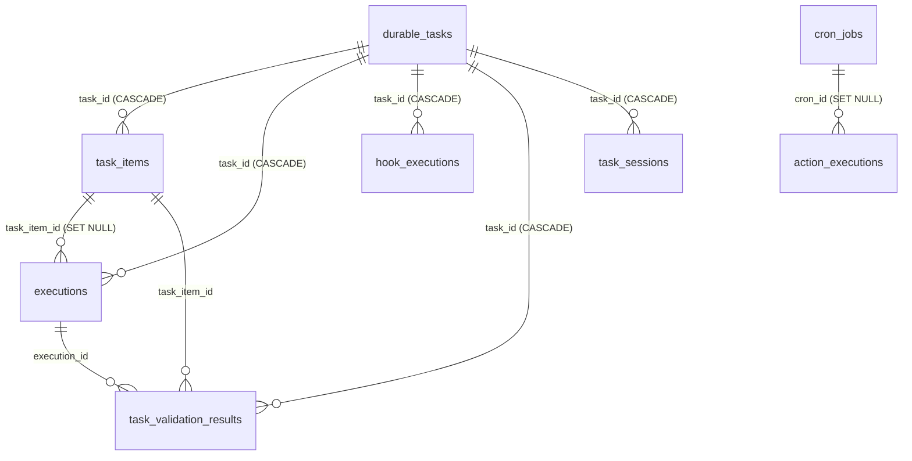

# Task Store v1: схема — инвентарь прода и целевое состояние

Статус: **предложение, готово к review** · пункт A2 эпика [#87](https://github.com/trained-assist/trained-agent-architecture/issues/87) · инвентарь прода снят **read-only** 01.10.2026 15:20–15:33 UTC.

Документ отвечает на вторую из трёх предпосылок до первой строки кода control plane: пилот P-DB ([COMPARISON](pilots/p-db/COMPARISON.md)), **схема Task Store** (этот документ), [контракт разговорной сессии](CONVERSATIONAL-SESSION-CONTRACT.md) (A3). Порядок работ — [IMPLEMENTATION-AND-INTEGRATION-PLAN, «Актуальный порядок старта», п. 2](IMPLEMENTATION-AND-INTEGRATION-PLAN.md#актуальный-порядок-старта) и [ARCHITECTURE §11](ARCHITECTURE.md#11-порядок-работ); требования к содержимому — [ARCHITECTURE §4.1](ARCHITECTURE.md#41-одна-транзакционная-база-состояния-задач-task-store). Пункт M0 «схема Task Store v1» эпика миграции — [#11](https://github.com/trained-assist/trained-agent-architecture/issues/11).

**Что здесь лежит:** (1) инвентарь реальной прод-базы `durable-tasks/state.db`, снятый только чтением; (2) целевая схема Task Store v1 — новые таблицы и аддитивные колонки поверх прод-схемы, с типами, индексами и комментарием «зачем» к каждому; (3) матрица покрытия требований A2 и границы скоупа.

Схема описывает **и текущее состояние (legacy), и целевое v1**, потому что v1 не проектируется с нуля: прод-таблицы — это ядро Task Store, новые сущности добавляются к ним ([ARCHITECTURE §4.1](ARCHITECTURE.md#41-одна-транзакционная-база-состояния-задач-task-store)).

---

## 1. Как снят инвентарь (метод и воспроизводимость)

Прод-база — **read-only источник фактов**. Запись, миграция и пересборка на проде запрещены; все запросы ниже открыты в режиме только чтения.

- Файл: `vova@136.65.7.197:/home/vova/agent-data/durable-tasks/state.db` (WAL: рядом `state.db-wal`, `state.db-shm`; есть резервные копии `state.db.bak-20260930-epic-escalation`, `state.db.bak-20261001-step40m`).
- На VM **нет `sqlite3` CLI**; читали через встроенный `python3` (SQLite 3.37.2) с открытием `file:…/state.db?mode=ro` — соединение физически не может писать. Никаких `ALTER`/`INSERT`/`VACUUM`/миграций на проде не выполнялось.
- Снимок: 01.10.2026, 15:20–15:33 UTC (18:20–18:33 МСК). База живая (writer держит WAL), поэтому счётчики — на момент чтения и растут.

Воспроизвести (только чтение):

```bash
ssh vova@136.65.7.197 'python3 - <<'"'"'PY'"'"'
import sqlite3
con = sqlite3.connect("file:/home/vova/agent-data/durable-tasks/state.db?mode=ro", uri=True)
cur = con.cursor()
for t, in cur.execute("SELECT name FROM sqlite_master WHERE type=\"table\" ORDER BY name"):
    print(t, cur.execute("SELECT COUNT(*) FROM \"%s\"" % t).fetchone()[0])
for r in cur.execute("SELECT type, name, sql FROM sqlite_master ORDER BY type, name"):
    print(r)
PY'
```

Полная выгрузка DDL (`sqlite_master`) и `PRAGMA table_info/index_list/foreign_key_list` по восьми таблицам лежит в разделах 3 и 6; расхождение с файлом на проде = ошибка этого документа, переснимите.

---

## 2. Факты масштаба

### 2.1 Счётчики (срез 01.10.2026 15:30 UTC)

| Таблица | Строк | Что это |
|---|---:|---|
| `durable_tasks` | **56** | Планы (в т.ч. 4 дочерних от `parent_task_id`) |
| `task_items` | **769** | Шаги планов |
| `executions` | **713** | Попытки исполнения шагов |
| `task_validation_results` | 483 | Результаты проверок acceptance |
| `action_executions` | 275 | Действия из расписания (274 cron + 1 user) |
| `hook_executions` | 77 | Срабатывания хуков |
| `cron_jobs` | 11 | Правила расписания (все `enabled=1`) |
| `task_sessions` | 4 | Привязки задач к сессиям движка |

### 2.2 Сверка с цифрами в ARCHITECTURE §6 («52 плана, 706 шагов, 625 запусков у 6 профилей»)

Цифры §6 воспроизводятся **точно**, если отсечь записи до 2026-09-30 16:00 UTC (счётчики сняты 30.09 около 20:00 МСК):

```sql
SELECT COUNT(*) FROM durable_tasks WHERE created_at < 1790784000000;                 -- 52
SELECT COUNT(*) FROM task_items WHERE created_at < 1790784000000;                    -- 706
SELECT COUNT(*) FROM executions WHERE started_at < 1790784000000;                    -- 625
SELECT COUNT(DISTINCT profile_id) FROM durable_tasks WHERE created_at < 1790784000000; -- 6
```

То есть **52/706 — это срез 30.09, а не «почти»**: расхождение с 56/769 — это рост базы за 01.10 (+4 плана, +63 шага, +88 запусков). Обе цифры верны, разница — дата.

### 2.3 Распределения, которые влияют на схему

```sql
-- durable_tasks.status (CHECK уже ограничивает набор)
active 22 · done 18 · cancelled 12 · paused 2 · draft 2

-- task_items.status
done 406 · pending 288 · skipped 54 · failed 11 · waiting 10

-- executions.status
success 383 · failed 241 · waiting 47 · interrupted 41 · running 1

-- executions.engine
opencode 574 · claude 81 · NULL 50 · codex 8

-- профили
trained-assist-product-owner 42 · playbooks-e2e 5 · iso-smoke 5 · flexi-consult 2 · vova 1 · hh-bg-test-77777 1
```

Прочие факты: `executions.tier` — free 710 / standard 2 / strong 1 (бесплатная ступень доминирует, платные движки автоматически не выбираются); `task_items.wait_json` заполнен у 79 шагов, `hooks_json` — у 66 шагов и 40 задач; `durable_tasks.request_id` и `execution_session_id` **пусты у всех строк** (колонки заведены под будущее, данные в них не пишутся — это ровно тот пробел, который закрывает v1: приём по `request_id` и связь с сессией); диапазон создания задач 23.09.2026 21:46 — 01.10.2026 06:45 UTC.

### 2.4 Параметры базы

`page_size=4096`, `journal_mode=wal`, `user_version=0` (**версионирования схемы нет**: миграции в коде опираются на наличие колонок, а не на номер версии — см. §6.4), `foreign_keys=0` на чтущем соединении (FK объявлены в DDL; фактическое принуждение включает соединение, которое пишет). Триггеров, представлений и `WITHOUT ROWID`-таблиц нет.

---

## 3. Текущая схема (legacy): прод `durable-tasks/state.db`

Восемь таблиц, десять именованных индексов, десять автоиндексов (PK/UNIQUE). DDL ниже — перенос из `sqlite_master` с сохранением порядка и типов колонок (переносы строк отформатированы для читаемости). Колонки, добавленные впоследствии через `ALTER TABLE ADD COLUMN`, видны в конце определения — это и есть действующая практика аддитивных миграций этого прода.

### 3.1 Связи



### 3.2 `durable_tasks` — планы; **`id` этой таблицы и есть userTaskId v1**

```sql
CREATE TABLE "durable_tasks" (
    id          TEXT PRIMARY KEY,              -- userTaskId (см. §5.1); PK
    profile_id  TEXT NOT NULL,                 -- владелец/область доступа (INV-01, ARCHITECTURE §8)
    project_id  TEXT,                          -- проект, унаследованный от сессии (#1843); NULL = не определён
    goal        TEXT NOT NULL,                 -- цель плана
    status      TEXT NOT NULL DEFAULT 'active'
                CHECK (status IN ('draft','active','paused','blocked','done','failed','cancelled')),
                                                      -- ЕДИНСТВЕННАЯ колонка состояния задачи; v1 добавляет 'awaiting_input' (§5.4)
    created_at  INTEGER NOT NULL,              -- epoch ms
    updated_at  INTEGER NOT NULL,              -- epoch ms
    revision    INTEGER NOT NULL DEFAULT 0,    -- bump на каждое изменение (оптимистическая блокировка)
    -- далее аддитивные колонки (ALTER TABLE ADD COLUMN):
    playbook_id TEXT,                          -- закреплённая методика; 48 из 56 планов
    playbook_version INTEGER,                  -- pinned версия методики
    user_value TEXT,                           -- вход плана (в пилоте сюда клали input Port)
    acceptance_criteria_json TEXT,             -- критерии приёмки
    contract_revision INTEGER NOT NULL DEFAULT 1,
    execution_policy_json TEXT,                -- политика исполнения
    execution_session_id TEXT,                 -- ПУСТО у всех строк: связь с сессией не ведётся
    request_id TEXT,                           -- ПУСТО у всех строк: приём по ключу идемпотентности не ведётся
    blocker_reason TEXT,                       -- причина blocked (текстом, без кода причины)
    hooks_json TEXT,                           -- хуки событий; 40 из 56 планов
    parent_task_id TEXT,                       -- дочерний план; 4 строки (fanout)
    parent_item_id TEXT,                       -- шаг-задача родителя, породивший дочерний план
    batch_item_key TEXT,                       -- ключ элемента веера; 4 строки
    origin_session_id TEXT,                    -- сессия-источник
    origin_chat_json TEXT                      -- чат-источник; 2 строки (JSON, не нормализован)
);
```

**Индексы:** только PK (`sqlite_autoindex_durable_tasks_1`). Ни одного индекса по `profile_id`, `status`, `parent_task_id`, `conversation`/чату — выборки идут сканированием (при 56 строках это неважно; v1 добавляет индексы под запросы Reporting, §5.9).

**Что важно:** `status` — колонка, а не вычисление из событий ([ARCHITECTURE §4.1](ARCHITECTURE.md#41-одна-транзакционная-база-состояния-задач-task-store)). Журнала переходов `status` **нет** — история собирается грубым объединением `executions` + `task_items` (пилот T8: «отдельной таблицы событий нет»).

### 3.3 `task_items` — шаги планов

```sql
CREATE TABLE task_items (
    id                  TEXT PRIMARY KEY,
    task_id             TEXT NOT NULL REFERENCES durable_tasks(id) ON DELETE CASCADE,
    position            INTEGER NOT NULL,      -- позиционный порядок; v1 заменяет графом зависимостей (ARCHITECTURE §6)
    title               TEXT NOT NULL,
    status              TEXT NOT NULL DEFAULT 'pending'
                        CHECK (status IN ('pending','running','waiting','done','failed','skipped')),
                                                      -- состояние ШАГА; 'waiting' = парковка (в т.ч. ожидание ввода)
    execution_tier      TEXT NOT NULL DEFAULT 'free'
                        CHECK (execution_tier IN ('free','standard','strong')),
    current_tier        TEXT NOT NULL DEFAULT 'free'
                        CHECK (current_tier IN ('free','standard','strong')),
    escalation_count    INTEGER NOT NULL DEFAULT 0,
    delay_after_sec     INTEGER NOT NULL DEFAULT 0,
    due_at              INTEGER,               -- плановый срок/дедлайн; 172 шага
    last_execution_id   TEXT,                   -- последняя попытка; 393 шага (указатель, не история)
    last_error          TEXT,                   -- текст ошибки без класса
    created_at          INTEGER NOT NULL,
    updated_at          INTEGER NOT NULL,
    -- аддитивные колонки:
    stage TEXT,
    instructions TEXT,                          -- промпт шага (LLM-шаг)
    execution_kind TEXT NOT NULL DEFAULT 'agent'
                         CHECK (execution_kind IN ('agent','programmatic')),
    executor_role TEXT CHECK (executor_role IN ('researcher','developer','reviewer','verifier')),
    minimum_model_level TEXT CHECK (minimum_model_level IN ('bachelor','master','doctor')),
    current_model_level TEXT CHECK (current_model_level IN ('bachelor','master','doctor')),
    context_budget TEXT CHECK (context_budget IN ('small','medium','large')),
    validation_json TEXT,
    attempt_count INTEGER NOT NULL DEFAULT 0,
    max_attempts INTEGER NOT NULL DEFAULT 3,   -- бюджет попыток шага
    execution_timeout_seconds INTEGER NOT NULL DEFAULT 600,
    wait_deadline_at INTEGER,                  -- ПУСТО у всех строк (дедлайн ждёт в wait_json, см. ниже)
    evidence_json TEXT,
    completed_at INTEGER,
    validation_mode TEXT CHECK (validation_mode IN ('programmatic','programmatic+llm','programmatic+llm-fastpass')),
    last_failure_class TEXT,
    last_recovery_action TEXT,
    hooks_json TEXT,
    wait_json TEXT,                             -- СОСТОЯНИЕ ОЖИДАНИЯ в JSON: 79 шагов; перезаписывается (parked→woken)
    exception_json TEXT,
    fanout_json TEXT,                            -- конфигурация веера дочерних планов
    already_done_json TEXT
);
```

**Индексы:** `idx_task_items_task (task_id, position)` — чтение плана по порядку; `idx_task_items_due (status, due_at)` — выборка созревших шагов.

**Ждущие шаги (10 шт.)** помечены `status='waiting'`, а их реальное состояние — в `wait_json`: `{"then":"complete","poll_every_sec":300,"timeout_sec":86400,"started_at":…,"deadline_at":…,"awaiting_user":true,"reason":"…","resolved":"timeout"}`. Отсюда два факта для v1: **ожидание пользователя неотличимо от ожидания внешнего условия** (только по флагу внутри JSON), и **переходы parked/woken перезаписываются** — история ожидания теряется.

### 3.4 `executions` — попытки

```sql
CREATE TABLE executions (
    id             TEXT PRIMARY KEY,
    task_id        TEXT NOT NULL REFERENCES durable_tasks(id) ON DELETE CASCADE,
    task_item_id   TEXT REFERENCES task_items(id) ON DELETE SET NULL,
    session_id     TEXT,                        -- сессия движка, в которой шла попытка
    engine         TEXT,                        -- opencode/claude/codex/NULL
    model          TEXT,
    tier           TEXT CHECK (tier IN ('free','standard','strong')),
    status         TEXT NOT NULL,               -- success/failed/waiting/interrupted/running; БЕЗ CHECK
    started_at     INTEGER NOT NULL,
    finished_at    INTEGER,
    error_class    TEXT,
    error_text     TEXT,
    -- аддитивные колонки:
    executor_role TEXT,
    model_level TEXT,
    context_budget TEXT,
    profile TEXT,
    provider TEXT,
    attempt_number INTEGER,                     -- заполнен у 91 из 713
    result_json TEXT                            -- СТРУКТУРИРОВАННЫЙ результат; пишется только patchExecution
);
```

**Индексы:** `idx_executions_task (task_id, started_at)` — история одной задачи.

**Ключевой пробел:** `result_json` есть, но **фактический результат шага в проде — не это поле, а текстовый маркер `DURABLE:` в ответе агента**, разбираемый из `evidence_json.reply` ([ARCHITECTURE §6, строка «Текстовый маркер»](ARCHITECTURE.md#6-что-берём-из-текущего-прода): 174 из 186 провалов OpenCode = «нет маркера»). Нет `generation`/`owner`/`lease` — **fencing отсутствует** (пилот T6: запись устаревшей попытки принята).

### 3.5 `hook_executions` — внешние вызовы (готовый прецедент идемпотентности)

```sql
CREATE TABLE hook_executions (
    id TEXT PRIMARY KEY,
    task_id TEXT NOT NULL REFERENCES durable_tasks(id) ON DELETE CASCADE,
    task_item_id TEXT,
    event TEXT NOT NULL,                        -- событие, на которое сработал хук
    hook_index INTEGER NOT NULL,
    hook_type TEXT NOT NULL,
    status TEXT NOT NULL CHECK (status IN ('fired','skipped','failed')),
    detail TEXT,
    boundary_key TEXT NOT NULL UNIQUE,          -- КЛЮЧ ИДЕМПОТЕНТНОСТИ внешнего вызова
    created_at INTEGER NOT NULL
);
```

`boundary_key UNIQUE` — это ровно то, что [COMPARISON, вывод 2](pilots/p-db/COMPARISON.md) называет готовым решением проблемы «окно повторного внешнего вызова»: **внешние вызовы идемпотентны по (userTaskId, шаг)** — здесь зашито в один ключ. v1 сохраняет этот механизм и расширяет его на сигналы (§5.3).

### 3.6 `cron_jobs` и `action_executions` — расписание с уже готовой дедупликацией

```sql
CREATE TABLE cron_jobs (
    id TEXT PRIMARY KEY,
    profile_id TEXT NOT NULL,
    project_id TEXT,
    name TEXT NOT NULL,
    schedule TEXT NOT NULL,
    timezone TEXT NOT NULL,
    action TEXT NOT NULL,
    arguments_json TEXT NOT NULL CHECK (json_valid(arguments_json) AND json_type(arguments_json)='object'),
    enabled INTEGER NOT NULL DEFAULT 1 CHECK (enabled IN (0,1)),
    last_run_at INTEGER,
    next_run_at INTEGER NOT NULL,
    last_status TEXT CHECK (last_status IN ('running','succeeded','failed','rejected','unknown')),
    last_error TEXT,
    created_at INTEGER NOT NULL,
    updated_at INTEGER NOT NULL
);
-- индексы: cron_jobs_scope(profile_id, project_id), cron_jobs_due(enabled, next_run_at)

CREATE TABLE action_executions (
    id TEXT PRIMARY KEY,
    profile_id TEXT NOT NULL,
    project_id TEXT,
    scope_key TEXT GENERATED ALWAYS AS (coalesce(project_id,'')) STORED,  -- генерируемая колонка: прецедент для v1 (§5.1)
    action TEXT NOT NULL,
    arguments_json TEXT NOT NULL CHECK (json_valid(arguments_json) AND json_type(arguments_json)='object'),
    trigger TEXT NOT NULL CHECK (trigger IN ('user','cron','durable_task','webhook','system')),
    origin TEXT CHECK (origin IS NULL OR origin IN ('web','mcp','telegram','api','cron-service','durable')),
    channel TEXT,
    idempotency_key TEXT NOT NULL,
    cron_id TEXT REFERENCES cron_jobs(id) ON DELETE SET NULL,
    scheduled_at INTEGER,
    status TEXT NOT NULL CHECK (status IN ('claimed','running','succeeded','failed','rejected','unknown')),
    lease_owner TEXT,                           -- АРЕНДА ВЫПОЛНИТЕЛЯ: уже есть здесь (в task_items её нет)
    lease_until INTEGER,
    attempt INTEGER NOT NULL DEFAULT 0 CHECK (attempt >= 0),
    started_at INTEGER, finished_at INTEGER,
    result_json TEXT, error_json TEXT,
    created_at INTEGER NOT NULL,
    UNIQUE (profile_id, scope_key, idempotency_key)
);
-- индексы: action_history_scope(profile_id, project_id, created_at),
--          cron_occurrence UNIQUE (cron_id, scheduled_at) WHERE cron_id IS NOT NULL AND scheduled_at IS NOT NULL
```

Два незаменимых прецедента отсюда: **полная идемпотентность запуска** через `UNIQUE(profile_id, scope_key, idempotency_key)` и **частично-уникальный индекс** (`cron_occurrence`) — именно такой приём нужен для дедупликации сигналов и для «одного открытого ожидания на задачу» (§5.3, §5.4).

### 3.7 `task_sessions` и `task_validation_results`

```sql
CREATE TABLE task_sessions (
    task_id TEXT NOT NULL REFERENCES durable_tasks(id) ON DELETE CASCADE,
    session_id TEXT NOT NULL,                   -- сессия движка (runtime state), НЕ владелец задачи (ARCHITECTURE §8)
    profile_id TEXT NOT NULL,
    attached_at INTEGER NOT NULL,
    active INTEGER NOT NULL DEFAULT 1,
    PRIMARY KEY (task_id, session_id)
);
-- idx_task_sessions_one_active UNIQUE (profile_id, session_id) WHERE active = 1
--   → одна активная задача на сессию; 4 строки. ЕДИНСТВЕННАЯ связь «задача ↔ сессия/диалог» в проде.

CREATE TABLE task_validation_results (
    id TEXT PRIMARY KEY,
    task_id TEXT NOT NULL REFERENCES durable_tasks(id) ON DELETE CASCADE,
    task_item_id TEXT REFERENCES task_items(id),
    execution_id TEXT REFERENCES executions(id),
    criterion_id TEXT NOT NULL,
    contract_revision INTEGER NOT NULL,
    validator TEXT NOT NULL,
    status TEXT NOT NULL CHECK (status IN ('pass','fail','inconclusive')),
    subject_json TEXT, evidence_json TEXT,
    created_at INTEGER NOT NULL
);
-- 483 строки; индекс только PK
```

`task_sessions` — единственная сегодняшняя привязка к «диалогу», и она **на уровне сессии движка, а не разговора**: колонки `conversation_id`/`audience_id`/`destination_id` в проде отсутствуют вовсе (см. §5.6).

---

## 4. Пробелы legacy относительно v1

Источники: [COMPARISON, выводы 1–5 и п. 4 рекомендации](pilots/p-db/COMPARISON.md), [prod-plans/RESULTS, «Разрывы относительно Port»](pilots/p-db/prod-plans/RESULTS.md), [ARCHITECTURE §4.1/§4.5](ARCHITECTURE.md#41-одна-транзакционная-база-состояния-задач-task-store). Пункты 1–4 — это и есть четыре доработки из B1 эпика #87; они закрываются схемой v1, а не отдельными сервисами.

| # | Пробел (факт прода/пилота) | Чем закрывается в v1 |
|---|---|---|
| 1 | **Нет userTaskId как сущности.** `durable_tasks.id` работает как userTaskId (пилот `ut-pilot-N` прошёл без правок), но это не задокументировано и не покрывает задач без плана | §5.1: `id` объявлен носителем userTaskId; `user_task_id` — имя FK во всех новых таблицах; `request_id`/`origin_*` начинают использоваться |
| 2 | **Нет delivery.** Доставка — прямой вызов Bot API из агента: сбой Telegram неотличим от сбоя работы | §5.5: таблица `deliveries` (outbox) + `delivery_state` на задаче |
| 3 | **Нет conversation.** Привязки чатов — JSON-файлы с TTL 4 ч, «последний писатель выигрывает»; в базе только 4 строки `task_sessions` | §5.6: `conversation_id`/`audience_id`/`destination_id` колонками задачи |
| 4 | **Нет `awaiting_input`.** Задача остаётся `active`, ожидание видно только по `task_items.status='waiting'` + флагу в JSON | §5.4: статус `awaiting_input` в CHECK + таблица `awaiting_inputs` |
| 5 | **Сигнал без буфера и без типа.** T4 FAIL (ранний сигнал потерян), T5 — «дубль перезаписывает первый, дедупа нет» | §5.3: таблица `task_signals` с дедуп по (userTaskId, шаг, ключ идемпотентности) |
| 6 | **Нет журнала событий.** История собирается из `executions`, переходы ожидания перезаписываются в `wait_json` | §5.2: `task_events` append-only, пишется в той же транзакции, что и смена статуса |
| 7 | **Нет fencing.** T6 FAIL: запись устаревшей попытки принята; спасает только файл-замок `execution-owner.sqlite` (один сервер на VM) | §5.7: `generation` у задачи и `claim_generation`/`lease_until`/`owner` у шага (INV-02) |
| 8 | **Результат шага — текстовый маркер `DURABLE:`**, 174 из 186 провалов OpenCode | §5.7: `task_items.result_json` — структурированный результат |
| 9 | **История ожидания теряется**, `wait_deadline_at` не используется вообще (0 из 769) | §5.4/§5.2: дедлайн — колонка `awaiting_inputs.deadline_at`; события parked/woken — в `task_events` |

Пробел 9 не из пилота, а из инвентаря: колонка `task_items.wait_deadline_at` заведена, но **не заполняется ни разу** — дедлайн живёт только внутри `wait_json` и исчезает при перезаписи.

---

## 5. Целевая схема Task Store v1

### 5.0 Правила

Из [ARCHITECTURE §4.1](ARCHITECTURE.md#41-одна-транзакционная-база-состояния-задач-task-store), ничего нового здесь не изобретается:

1. **Текущий статус — колонка, история — строки журнала.** Статус не вычисляется из событий; событие пишется в той же транзакции, что и смена статуса.
2. **Один источник истины на каждый факт.** Проекции (`delivery_state`, `awaiting_input_id`, `stage`) обновляются в той же транзакции, что и их таблица-источник; расхождение = баг.
3. **Дедупликация — через UNIQUE, а не через код.** Прецеденты уже в проде: `hook_executions.boundary_key`, `UNIQUE(profile_id, scope_key, idempotency_key)` в `action_executions`, частично-уникальный `cron_occurrence`.
4. **Аддитивность.** v1 = `CREATE TABLE` + `ALTER TABLE ADD COLUMN` + новые индексы. Пересборка таблицы — только для расширения CHECK `durable_tasks.status` (§5.4), той же практикой, что уже описана для этого прода: аддитивные ALTER при открытии плюс одна пересборка ради CHECK, выкатка вместе с релизом, без нисходящих миграций ([prod-plans/RESULTS](pilots/p-db/prod-plans/RESULTS.md)).
5. **Форматы как в legacy:** `INTEGER` epoch-ms для времени, `TEXT` для ID/JSON, `CHECK(json_valid(...))` для JSON-колонок, тяжёлые bytes — ссылками в Artifact Storage.
6. **Схема не навязывает SQL вызывающим**: модули ходят через repository-слой; смена SQLite → D1 → Postgres меняет адаптер (ARCHITECTURE §4.1). Факт для D1: интерфейс асинхронный, транзакции через `batch()` вместо `better-sqlite3` синхронного `db.transaction()`.

### 5.1 userTaskId

**`durable_tasks.id` — это userTaskId.** Подтверждено фактом: в пилоте `id='ut-pilot-N'` проходит весь Port без изменений ([prod-plans/RESULTS, «Перенос схемы»](pilots/p-db/prod-plans/RESULTS.md)). Второй корень (таблица `user_tasks`) v1 не заводит: корень один, а «задача без плана» — это `durable_tasks` со `stage` и без шагов.

Что меняется — **имя и покрытие**:

- во **всех новых таблицах** FK называется `user_task_id TEXT NOT NULL REFERENCES durable_tasks(id)` — читатель видит контракт ARCHITECTURE §8, а не «просто id»;
- в DDL `durable_tasks` сверху стоит комментарий `id = userTaskId`, чтобы контракт читался из схемы;
- `durable_tasks.request_id` и `origin_session_id/origin_chat_json`, которые сегодня пусты, становятся рабочими: приём по ключу идемпотентности (C01) и происхождение задачи;
- `task_sessions.session_id` остаётся **runtime-state сессии**, а не владельцем задачи (INV-01, ARCHITECTURE §8): смена сессии не меняет userTaskId.

Дедуп приёма на уровне входа покрывается существующим паттерном: `UNIQUE(profile_id, scope_key, idempotency_key)` — v1 переиспользует его для `action_executions` как есть и задаёт тот же принцип для `task_signals` (§5.3).

### 5.2 `task_events` — журнал событий (history)

Append-only журнал, который пишется **в одной транзакции со сменой статуса** (§5.0.1). Именно он закрывает правило «status = колонка состояния, history = события отдельными строками» и разрыв №6 из §4.

```sql
CREATE TABLE task_events (
    id            INTEGER PRIMARY KEY AUTOINCREMENT, -- порядок записи; порядок внутри задачи — по id
    event_id      TEXT,           -- eventId (C02, ARCHITECTURE §8) для дедупликации повторной записи события
    user_task_id  TEXT NOT NULL,  -- задача-владелец события
    task_item_id  TEXT,           -- шаг, если событие о нём
    execution_id  TEXT,           -- попытка, если событие о ней
    kind          TEXT NOT NULL,  -- тип события (закрытая лексика ниже; новый kind = значение, не миграция)
    status_before TEXT,           -- состояние до перехода (NULL = не переход)
    status_after  TEXT,           -- состояние после перехода (NULL = не переход)
    generation    INTEGER,        -- поколение записавшего: отвергнутое событие тоже видно (fenced)
    source        TEXT NOT NULL,  -- модуль-источник: input | router | executor | output | gateway | cron | watcher
    payload_json  TEXT NOT NULL DEFAULT '{}' CHECK (json_valid(payload_json)),
    created_at    INTEGER NOT NULL
);
CREATE UNIQUE INDEX idx_task_events_event_id ON task_events(event_id) WHERE event_id IS NOT NULL;
CREATE INDEX idx_task_events_task ON task_events(user_task_id, id);
CREATE INDEX idx_task_events_kind ON task_events(kind, created_at);
```

Лексика `kind` (закрытая для v1, расширяется значением, не изменением схемы): `task_accepted`, `task_status_changed`, `step_claimed`, `step_started`, `step_parked`, `step_woken`, `step_done`, `step_failed`, `run_started`, `run_finished`, `awaiting_opened`, `awaiting_answered`, `awaiting_expired`, `signal_received`, `signal_rejected`, `fenced`, `cancel_requested`, `task_cancelled`, `result_ready`, `delivery_queued`, `delivery_sent`, `delivery_failed`, `error`.

Почему три индекса: `(user_task_id, id)` — история одной задачи (запрос Reporting `getUserTaskHistory`, воспроизведение T8); `(kind, created_at)` — глобальные выборки «все ожидания / все ошибки за период» и TTL-очистка ([Observability](OBSERVABILITY-AND-ERROR-CONTRACT.md)); уникальный по `event_id` — повторная запись одного события идемпотентна.

`status_before/status_after` позволяют отвечать на «что менялось и когда» без чтения payload и пересобирать статус; авторитетный порядок внутри задачи назначает `durable_tasks.revision`, который обновляется в той же транзакции ([USER-TASK-IDS §10](USER-TASK-IDS-AND-REPORTING.md#10-как-reporting-остаётся-достоверным)).

### 5.3 `task_signals` — входящие сигналы с дедупликацией

Закрывает разрыв №5 (T4 FAIL «ранний сигнал потерян», T5 «дубль перезаписывает первый») и требование B1.2 эпика: **дедуп с идентичностью по userTaskId + шаг**.

```sql
CREATE TABLE task_signals (
    id              INTEGER PRIMARY KEY AUTOINCREMENT, -- порядок прихода
    user_task_id    TEXT NOT NULL,  -- адресат-задача
    step_key        TEXT NOT NULL DEFAULT '',  -- идентичность шага-приёмника: task_item_id либо имя шага;
                                               -- '' = сигнал ещё не привязан (ранний сигнал до парковки)
    idempotency_key TEXT NOT NULL,  -- ключ идемпотентности входящего сообщения (ARCHITECTURE §4.5):
                                    -- формат '<source>:<native id>' назначает Input
    event_type      TEXT NOT NULL,  -- user_reply | callback | ci | webhook | cancel | kick
    payload_json    TEXT NOT NULL DEFAULT '{}' CHECK (json_valid(payload_json)),
    generation      INTEGER,        -- для какого поколения задачи предназначен; NULL = любой
    source          TEXT NOT NULL,  -- канал-источник: telegram | web | api | cron | system
    created_at      INTEGER NOT NULL,
    consumed_at     INTEGER,        -- NULL = неизрасходован; шаг забирает первый подходящий
    consumed_by_execution TEXT,     -- какая попытка сигнал разобрала
    rejected_reason TEXT,           -- отклонён Port по статусу (задача не active / cancel / терминальный статус)
    UNIQUE (user_task_id, step_key, idempotency_key)
);
CREATE INDEX idx_task_signals_pending
    ON task_signals(user_task_id, step_key, event_type) WHERE consumed_at IS NULL;
```

Семантика, ровно как в задании:

- **Идентичность = userTaskId + шаг + ключ идемпотентности.** Повторная доставка того же сообщения (`source:native_id`) = конфликт по UNIQUE = no-op — возврат прежнего receipt по C01, а не вторая строка.
- **Ранний сигнал не теряется:** `step_key=''` до парковки; `waitFor` при парковке первым делом ищет неизрасходованный сигнал своего типа (`consumed_at IS NULL`), и только потом уходит в ожидание. `wakeItem` становится частным случаем `INSERT … signal` с пустым `event_type`.
- **Отклонение видно, а не молчит:** сигнал после `cancelled`/`done` сохраняется строкой с `rejected_reason`, а не отбрасывается ([prod-plans, разрыв 7](pilots/p-db/prod-plans/RESULTS.md) и [COMPARISON, рекомендация 4](pilots/p-db/COMPARISON.md): движок принимает сигналы после отмены, отвергать их должен Port по статусу в Task Store).

Триггер «задача ждёт именно этот сигнал» — индекс `WHERE consumed_at IS NULL`: он обслуживает горячий путь тика ожидания (`SELECT … WHERE user_task_id=? AND event_type=? AND consumed_at IS NULL`).

### 5.4 `awaiting_inputs` и статус `awaiting_input`

Закрывает разрыв №4 и требование B1.4. Две части: **таблица** (что именно ждём и кто вправе ответить) и **статус задачи** (видно в Reporting одним чтением, INV-15).

```sql
CREATE TABLE awaiting_inputs (
    awaiting_input_id TEXT PRIMARY KEY,   -- awaitingInputId (ARCHITECTURE §8): одноразовый адрес ответа
    user_task_id      TEXT NOT NULL,
    task_item_id      TEXT,               -- шаг, оставивший ожидание; NULL = задача целиком
    run_id            TEXT,               -- попытка, положившая checkpoint и завершившаяся ожиданием
    kind              TEXT NOT NULL CHECK (kind IN ('data','choice','approval')),
                                          -- data = свободный ответ, choice = выбор (в т.ч. выбор проекта, ARCHITECTURE §5.2),
                                          -- approval = подтверждение действия
    question          TEXT NOT NULL,      -- что спрашиваем (Web view / уведомление в чат)
    schema_json       TEXT,               -- ожидаемая форма ответа либо варианты choice
    respondent_scope  TEXT NOT NULL,      -- кто вправе ответить: профиль/аудитория/адрес (scope задаёт A3)
    checkpoint_ref    TEXT,               -- куда вернуть ответ (checkpoint / artifact ref)
    status            TEXT NOT NULL DEFAULT 'open'
                      CHECK (status IN ('open','answered','expired','cancelled')),
    created_at        INTEGER NOT NULL,
    deadline_at       INTEGER NOT NULL,   -- 24 ч по умолчанию, максимум 30 дней (ARCHITECTURE §4.4) — в КОЛОНКЕ, не в JSON
    answered_at       INTEGER,
    answer_signal_id  INTEGER REFERENCES task_signals(id),
    answer_json       TEXT,
    generation        INTEGER NOT NULL DEFAULT 1,  -- cancel/истечение поднимает поколение (INV-08)
    version           INTEGER NOT NULL DEFAULT 1
);
CREATE UNIQUE INDEX idx_awaiting_one_open ON awaiting_inputs(user_task_id) WHERE status = 'open';
CREATE INDEX idx_awaiting_due ON awaiting_inputs(status, deadline_at);
```

- **Одно открытое ожидание на задачу** — частично-уникальный индекс, по тому же приёму, что `idx_task_sessions_one_active` в legacy: снимок Reporting хранит одно `awaitingInputId` ([USER-TASK-IDS §3](USER-TASK-IDS-AND-REPORTING.md#3-что-хранится-после-освобождения-очередей)), поэтому второе открытое ожидание той же задачи — нарушение контракта, а не «ещё одна строка».
- **Ответ приходит сигналом:** `answer_signal_id` связывает `awaiting_inputs` ↔ `task_signals`; один и тот же ответ не может закрыть два ожидания, а повтор ответа отсекается UNIQUE из §5.3.
- **Дедлайн живёт в колонке** и опрашивается индексом `idx_awaiting_due` (`status='open'` уже в индексе через порядок колонок: `(status, deadline_at)` + частичность не нужна — планировщик фильтрует по `status` первым ключом).
- **Статус задачи:** в CHECK `durable_tasks.status` добавляется `'awaiting_input'`:

```sql
status TEXT NOT NULL DEFAULT 'active'
    CHECK (status IN ('draft','active','paused','blocked','awaiting_input','done','failed','cancelled'))
```

Это единственная **пересборка таблицы** во всём v1 (§5.0.4) и её выполняет новый релиз в песочнице — не пункт A2 (§9). Отдельный `stage` на задаче добавляется колонкой и держит более тонкую грань из [USER-TASK-IDS §4](USER-TASK-IDS-AND-REPORTING.md#4-статус-раскладываем-по-независимым-полям):

```sql
stage TEXT CHECK (stage IN ('collecting','preparing','queued','handing_off','running',
                            'evaluating','waiting_input','waiting_followup','finished'))
```

`status='awaiting_input'` + `stage='waiting_input'` — задача ждёт человека; `status='active'` + `task_items.status='waiting'` — шаг ждёт внешнего условия. Смешение этих двух ожиданий в одном JSON — причина разрыва №4/№9.

### 5.5 `deliveries` — outbox доставки

Закрывает разрыв №2 и правило «доставка имеет свой статус, отдельный от исполнения» ([ARCHITECTURE §3](ARCHITECTURE.md#3-одна-задача-вход-исполнение-результат), C02). Статус `executions`/`durable_tasks` больше не отвечает на вопрос «дошло ли сообщение».

```sql
CREATE TABLE deliveries (
    id                 TEXT PRIMARY KEY,   -- deliveryId
    user_task_id       TEXT NOT NULL,
    event_id           INTEGER,            -- task_events.id, породившее доставку
    logical_message_id TEXT NOT NULL,      -- одно логическое сообщение; повтор отчёта сохраняет его (§6 USER-TASK)
    conversation_id    TEXT,               -- снимок диалога-адресата на момент постановки
    audience_id        TEXT,               -- аудитория, записанная при приёме (INV-19)
    destination_id     TEXT,               -- адрес, записанный при приёме (INV-19)
    channel            TEXT NOT NULL,      -- telegram | web | api
    message_json       TEXT NOT NULL CHECK (json_valid(message_json)),  -- текст + ссылки на артефакты, без байтов
    status             TEXT NOT NULL DEFAULT 'pending'
                       CHECK (status IN ('pending','accepted','delivered','failed','unknown')),
    attempt            INTEGER NOT NULL DEFAULT 0,
    next_attempt_at    INTEGER,            -- когда пробовать снова (bounded retry)
    last_error         TEXT,
    provider_message_id TEXT,              -- nativeMessageId: при наличии гасит дубль у провайдера
    created_at         INTEGER NOT NULL,
    updated_at         INTEGER NOT NULL,
    UNIQUE (user_task_id, logical_message_id)
);
CREATE INDEX idx_deliveries_outbox ON deliveries(status, next_attempt_at);
CREATE INDEX idx_deliveries_task ON deliveries(user_task_id, created_at);
```

- `UNIQUE(user_task_id, logical_message_id)` — повторная постановка того же отчёта не создаёт вторую доставку; `logical_message_id` сохраняется при ретрае (§6 USER-TASK).
- `idx_deliveries_outbox` — горячий запрос воркера доставки: «что отправить сейчас».
- Проекция на задачу — колонка `delivery_state` (§5.8), включая значение `not_required`, которого как строки доставки не бывает: не каждая задача требует доставки.
- **Исполнение ≠ результат ≠ доставка:** `executions.status`, `durable_tasks.status` и `deliveries.status` — три независимых факта; сбой доставки не перезапускает Run (приёмка C02/USER-TASK-IDS).

### 5.6 Conversation, audience, destination

Требование «conversation» закрывается **колонками задачи, а не новой таблицей** — это решение по правилу минимальных требований:

```sql
ALTER TABLE durable_tasks ADD COLUMN conversation_id TEXT;  -- диалог, породивший задачу (ARCHITECTURE §5.1)
ALTER TABLE durable_tasks ADD COLUMN audience_id     TEXT;  -- бот-аудитория, записанная при приёме (INV-19, ARCHITECTURE §5.4)
ALTER TABLE durable_tasks ADD COLUMN destination_id  TEXT;  -- адрес доставки по умолчанию, записанный при приёме
```

- Обе проекции Reporting ([ARCHITECTURE §5.1](ARCHITECTURE.md#51-реплика-задача-и-контекст)) — «по userTaskId» и «по диалогу» — обслуживает `SELECT … WHERE conversation_id = ?` c индексом `idx_tasks_conversation`.
- `audience_id`/`destination_id` обязаны быть записаны **при приёме**, а не браться «у текущего бота» при отправке — это INV-19, поэтому они принадлежат задаче, а не доставке; в `deliveries` лежит снимок для конкретной отправки.
- **Отдельная таблица `conversations` в v1 не заводится**: метаданные диалога и привязки чатов сейчас — JSON-файлы с TTL 4 ч ([ARCHITECTURE §6, строка «Хранилище сессий и привязок чатов»](ARCHITECTURE.md#6-что-берём-из-текущего-прода)), их переезд описывает контракт разговорной сессии (A3). Если A3 потребует таблицу — она добавляется аддитивно, колонка `conversation_id` уже сегодня даёт связность. См. §10.

### 5.7 Fencing и структурированный результат

Правило ARCHITECTURE §4.1 «владелец попытки записан в базе: owner, lease, generation» (INV-02) и разрыв №7/№8:

```sql
ALTER TABLE durable_tasks ADD COLUMN generation INTEGER NOT NULL DEFAULT 1;
    -- control generation: cancel, ручное возобновление и истечение ожидания поднимают его;
    -- результат со старым generation отвергается (T6)

ALTER TABLE task_items ADD COLUMN claim_generation INTEGER NOT NULL DEFAULT 0;
ALTER TABLE task_items ADD COLUMN lease_until INTEGER;   -- epoch ms; heartbeat продлевает (вместо grace 45 мин)
ALTER TABLE task_items ADD COLUMN owner TEXT;            -- кто держит шаг сейчас
ALTER TABLE task_items ADD COLUMN result_json TEXT;      -- СТРУКТУРИРОВАННЫЙ результат шага вместо маркера DURABLE:

ALTER TABLE executions ADD COLUMN generation INTEGER NOT NULL DEFAULT 0;
    -- каким claim_generation попытка забрала шаг: по ней settle отличает свежую запись от устаревшей
```

Протокол (описание поведения, не новый сервис): claim делает `claim_generation+1` и возвращает токен; каждая запись результата идёт `WHERE id = ? AND claim_generation = ?` и при `changes = 0` даёт отказ `fenced` — событие `fenced` попадает в `task_events`, состояние не меняется. Внешний вызов шага использует `idempotency_key = task_items.id` ([prod-plans, разрыв 2](pilots/p-db/prod-plans/RESULTS.md)), а для хуков уже готов `hook_executions.boundary_key`. `lease_until` заменяет прод-льготу 45 минут: истечение аренды = новый claim, а не самостоятельный перезапуск агента (перезапуск — отдельное решение, ARCHITECTURE §4.6).

Структурированный результат: ответ шага больше не парсится из текста (`DURABLE: done` в `evidence_json.reply`); шаг пишет `task_items.result_json`, попытка — `executions.result_json`. Это снимает 174 из 186 провалов OpenCode ([ARCHITECTURE §6](ARCHITECTURE.md#6-что-берём-из-текущего-прода)).

### 5.8 Проекция состояния на задачу: все новые колонки одним блоком

Свод того, что §5.4–§5.7 добавляют к `durable_tasks` (повтор в одном месте, чтобы не собирать по разделам):

```sql
ALTER TABLE durable_tasks ADD COLUMN stage             TEXT     CHECK (stage IN ('collecting','preparing','queued','handing_off','running','evaluating','waiting_input','waiting_followup','finished'));
ALTER TABLE durable_tasks ADD COLUMN conversation_id   TEXT;
ALTER TABLE durable_tasks ADD COLUMN audience_id       TEXT;
ALTER TABLE durable_tasks ADD COLUMN destination_id    TEXT;
ALTER TABLE durable_tasks ADD COLUMN awaiting_input_id TEXT;    -- указатель на открытый awaiting_inputs (источник истины — там)
ALTER TABLE durable_tasks ADD COLUMN delivery_state    TEXT NOT NULL DEFAULT 'not_required'
        CHECK (delivery_state IN ('not_required','pending','accepted','delivered','failed','unknown'));
ALTER TABLE durable_tasks ADD COLUMN generation        INTEGER NOT NULL DEFAULT 1;
```

`awaiting_input_id` и `delivery_state` — проекции (§5.0.2): они существуют, чтобы snapshot Reporting читался одним SQL, как требует приёмка T8 (ARCHITECTURE §4.5); истина — в `awaiting_inputs` и `deliveries`.

### 5.9 Новые индексы legacy-таблиц

```sql
CREATE INDEX idx_tasks_status ON durable_tasks(status, updated_at);      -- sweep активных задач и фильтры состояния
CREATE INDEX idx_tasks_conversation ON durable_tasks(conversation_id)
    WHERE conversation_id IS NOT NULL;                                   -- проекция «по диалогу»
CREATE INDEX idx_tasks_profile ON durable_tasks(profile_id, created_at); -- scoped Reporting и очистка по профилю
```

Всё остальное уже есть (§3): `idx_task_items_task`, `idx_task_items_due`, `idx_executions_task`, `idx_task_sessions_one_active`, `cron_jobs_due`, `cron_jobs_scope`, `action_history_scope`. Индексы под fanout (`parent_item_id`) и под item-уровневую историю не заводим: 4 дочерние строки и `idx_executions_task` покрывают фактические запросы — добавляются по мере появления запроса, а не заранее.

---

## 6. DDL v1 целиком

Ниже — сводный вид целевой базы: восемь legacy-таблиц (определения из §3, с изменениями v1), четыре новые таблицы и индексы. Всё, что помечено `-- v1:`, добавляется аддитивно.

```sql
-- ============================================================
-- Task Store v1 (сводно). SQLite / D1 диалект.
-- Источники: прод durable-tasks/state.db (инвентарь §3),
--            ARCHITECTURE §4.1, pilots/p-db (§4).
-- ============================================================

-- ---------- 1. ЗАДАЧА (корень; id = userTaskId) ----------
CREATE TABLE durable_tasks (
    id                        TEXT PRIMARY KEY,          -- userTaskId (§5.1)
    profile_id                TEXT NOT NULL,             -- владелец / scope
    project_id                TEXT,
    goal                      TEXT NOT NULL,
    status                    TEXT NOT NULL DEFAULT 'active'
        CHECK (status IN ('draft','active','paused','blocked',
                          'awaiting_input',             -- v1: ждём ответа человека (§5.4)
                          'done','failed','cancelled')),
    stage                     TEXT CHECK (stage IN ('collecting','preparing','queued','handing_off',
                                                    'running','evaluating','waiting_input',
                                                    'waiting_followup','finished')),   -- v1
    conversation_id           TEXT,                      -- v1: диалог (§5.6)
    audience_id               TEXT,                      -- v1: аудитория при приёме (INV-19)
    destination_id            TEXT,                      -- v1: адрес при приёме (INV-19)
    awaiting_input_id         TEXT,                      -- v1: указатель на открытое ожидание
    delivery_state            TEXT NOT NULL DEFAULT 'not_required'
        CHECK (delivery_state IN ('not_required','pending','accepted','delivered','failed','unknown')), -- v1
    generation                INTEGER NOT NULL DEFAULT 1,     -- v1: control generation (INV-02/08)
    created_at                INTEGER NOT NULL,
    updated_at                INTEGER NOT NULL,
    revision                  INTEGER NOT NULL DEFAULT 0,
    playbook_id               TEXT, playbook_version    INTEGER,
    user_value                TEXT,                      -- вход плана
    acceptance_criteria_json  TEXT,
    contract_revision         INTEGER NOT NULL DEFAULT 1,
    execution_policy_json     TEXT,
    execution_session_id      TEXT, request_id          TEXT,
    blocker_reason            TEXT, hooks_json           TEXT,
    parent_task_id            TEXT, parent_item_id       TEXT,
    batch_item_key            TEXT,
    origin_session_id         TEXT, origin_chat_json     TEXT
);
CREATE INDEX idx_tasks_status       ON durable_tasks(status, updated_at);
CREATE INDEX idx_tasks_conversation ON durable_tasks(conversation_id) WHERE conversation_id IS NOT NULL;
CREATE INDEX idx_tasks_profile      ON durable_tasks(profile_id, created_at);

-- ---------- 2. ШАГ ----------
CREATE TABLE task_items (
    id                       TEXT PRIMARY KEY,
    task_id                  TEXT NOT NULL REFERENCES durable_tasks(id) ON DELETE CASCADE,
    position                 INTEGER NOT NULL,          -- v1: заменяется графом зависимостей (§6 ARCHITECTURE)
    title                    TEXT NOT NULL,
    status                   TEXT NOT NULL DEFAULT 'pending'
        CHECK (status IN ('pending','running','waiting','done','failed','skipped')),
    claim_generation         INTEGER NOT NULL DEFAULT 0,    -- v1: fencing шага (§5.7)
    lease_until              INTEGER,                       -- v1: аренда, продлевается heartbeat'ом
    owner                    TEXT,                          -- v1: кто держит шаг
    result_json              TEXT,                          -- v1: структурированный результат
    execution_tier           TEXT NOT NULL DEFAULT 'free'
        CHECK (execution_tier IN ('free','standard','strong')),
    current_tier             TEXT NOT NULL DEFAULT 'free'
        CHECK (current_tier IN ('free','standard','strong')),
    escalation_count         INTEGER NOT NULL DEFAULT 0,
    delay_after_sec          INTEGER NOT NULL DEFAULT 0,
    due_at                   INTEGER,
    last_execution_id        TEXT, last_error             TEXT,
    created_at               INTEGER NOT NULL, updated_at INTEGER NOT NULL,
    stage                    TEXT, instructions           TEXT,
    execution_kind           TEXT NOT NULL DEFAULT 'agent'
        CHECK (execution_kind IN ('agent','programmatic')),
    executor_role            TEXT CHECK (executor_role IN ('researcher','developer','reviewer','verifier')),
    minimum_model_level      TEXT CHECK (minimum_model_level IN ('bachelor','master','doctor')),
    current_model_level      TEXT CHECK (current_model_level IN ('bachelor','master','doctor')),
    context_budget           TEXT CHECK (context_budget IN ('small','medium','large')),
    validation_json          TEXT,
    attempt_count            INTEGER NOT NULL DEFAULT 0,
    max_attempts             INTEGER NOT NULL DEFAULT 3,
    execution_timeout_seconds INTEGER NOT NULL DEFAULT 600,
    wait_deadline_at         INTEGER,                      -- в v1 остаётся NULL: дедлайн в awaiting_inputs
    evidence_json            TEXT, completed_at           INTEGER,
    validation_mode          TEXT
        CHECK (validation_mode IN ('programmatic','programmatic+llm','programmatic+llm-fastpass')),
    last_failure_class       TEXT, last_recovery_action   TEXT,
    hooks_json               TEXT, wait_json              TEXT,
    exception_json           TEXT, fanout_json            TEXT, already_done_json TEXT
);
CREATE INDEX idx_task_items_task ON task_items(task_id, position);
CREATE INDEX idx_task_items_due  ON task_items(status, due_at);

-- ---------- 3. ПОПЫТКА ----------
CREATE TABLE executions (
    id             TEXT PRIMARY KEY,
    task_id        TEXT NOT NULL REFERENCES durable_tasks(id) ON DELETE CASCADE,
    task_item_id   TEXT REFERENCES task_items(id) ON DELETE SET NULL,
    session_id     TEXT, engine TEXT, model TEXT,
    tier           TEXT CHECK (tier IN ('free','standard','strong')),
    status         TEXT NOT NULL,                       -- success/failed/waiting/interrupted/running
    generation     INTEGER NOT NULL DEFAULT 0,          -- v1: claim_generation этой попытки (§5.7)
    started_at     INTEGER NOT NULL, finished_at       INTEGER,
    error_class    TEXT, error_text                     TEXT,
    executor_role  TEXT, model_level  TEXT, context_budget TEXT,
    profile        TEXT, provider     TEXT,
    attempt_number INTEGER, result_json                 TEXT
);
CREATE INDEX idx_executions_task ON executions(task_id, started_at);

-- ---------- 4. ЖУРНАЛ СОБЫТИЙ (v1, §5.2) ----------
CREATE TABLE task_events (
    id            INTEGER PRIMARY KEY AUTOINCREMENT,
    event_id      TEXT,
    user_task_id  TEXT NOT NULL REFERENCES durable_tasks(id) ON DELETE CASCADE,
    task_item_id  TEXT, execution_id TEXT,
    kind          TEXT NOT NULL,
    status_before TEXT, status_after TEXT,
    generation    INTEGER,
    source        TEXT NOT NULL,
    payload_json  TEXT NOT NULL DEFAULT '{}' CHECK (json_valid(payload_json)),
    created_at    INTEGER NOT NULL
);
CREATE UNIQUE INDEX idx_task_events_event_id ON task_events(event_id) WHERE event_id IS NOT NULL;
CREATE INDEX idx_task_events_task ON task_events(user_task_id, id);
CREATE INDEX idx_task_events_kind ON task_events(kind, created_at);

-- ---------- 5. ВХОДЯЩИЕ СИГНАЛЫ (v1, §5.3) ----------
CREATE TABLE task_signals (
    id              INTEGER PRIMARY KEY AUTOINCREMENT,
    user_task_id    TEXT NOT NULL REFERENCES durable_tasks(id) ON DELETE CASCADE,
    step_key        TEXT NOT NULL DEFAULT '',
    idempotency_key TEXT NOT NULL,
    event_type      TEXT NOT NULL,
    payload_json    TEXT NOT NULL DEFAULT '{}' CHECK (json_valid(payload_json)),
    generation      INTEGER,
    source          TEXT NOT NULL,
    created_at      INTEGER NOT NULL,
    consumed_at     INTEGER, consumed_by_execution TEXT,
    rejected_reason TEXT,
    UNIQUE (user_task_id, step_key, idempotency_key)
);
CREATE INDEX idx_task_signals_pending
    ON task_signals(user_task_id, step_key, event_type) WHERE consumed_at IS NULL;

-- ---------- 6. ОЖИДАНИЕ ВВОДА (v1, §5.4) ----------
CREATE TABLE awaiting_inputs (
    awaiting_input_id TEXT PRIMARY KEY,
    user_task_id      TEXT NOT NULL REFERENCES durable_tasks(id) ON DELETE CASCADE,
    task_item_id      TEXT, run_id TEXT,
    kind              TEXT NOT NULL CHECK (kind IN ('data','choice','approval')),
    question          TEXT NOT NULL,
    schema_json       TEXT, respondent_scope TEXT NOT NULL,
    checkpoint_ref    TEXT,
    status            TEXT NOT NULL DEFAULT 'open'
        CHECK (status IN ('open','answered','expired','cancelled')),
    created_at        INTEGER NOT NULL, deadline_at INTEGER NOT NULL,
    answered_at       INTEGER, answer_signal_id INTEGER REFERENCES task_signals(id),
    answer_json       TEXT,
    generation        INTEGER NOT NULL DEFAULT 1, version INTEGER NOT NULL DEFAULT 1
);
CREATE UNIQUE INDEX idx_awaiting_one_open ON awaiting_inputs(user_task_id) WHERE status = 'open';
CREATE INDEX idx_awaiting_due ON awaiting_inputs(status, deadline_at);

-- ---------- 7. ДОСТАВКА (v1, §5.5) ----------
CREATE TABLE deliveries (
    id                  TEXT PRIMARY KEY,
    user_task_id        TEXT NOT NULL REFERENCES durable_tasks(id) ON DELETE CASCADE,
    event_id            INTEGER,                          -- task_events.id
    logical_message_id  TEXT NOT NULL,
    conversation_id     TEXT, audience_id TEXT, destination_id TEXT,
    channel             TEXT NOT NULL,
    message_json        TEXT NOT NULL CHECK (json_valid(message_json)),
    status              TEXT NOT NULL DEFAULT 'pending'
        CHECK (status IN ('pending','accepted','delivered','failed','unknown')),
    attempt             INTEGER NOT NULL DEFAULT 0,
    next_attempt_at     INTEGER, last_error TEXT,
    provider_message_id TEXT,
    created_at          INTEGER NOT NULL, updated_at INTEGER NOT NULL,
    UNIQUE (user_task_id, logical_message_id)
);
CREATE INDEX idx_deliveries_outbox ON deliveries(status, next_attempt_at);
CREATE INDEX idx_deliveries_task   ON deliveries(user_task_id, created_at);

-- ---------- 8. БЕЗ ИЗМЕНЕНИЙ (legacy как есть, §3.5–3.7) ----------
-- hook_executions      (boundary_key UNIQUE = идемпотентность внешних вызовов)
-- cron_jobs            (+ cron_jobs_due, cron_jobs_scope)
-- action_executions    (+ UNIQUE(profile_id, scope_key, idempotency_key), cron_occurrence)
-- task_sessions        (+ idx_task_sessions_one_active)
-- task_validation_results
```

**Проверка DDL:** формы `ALTER TABLE ADD COLUMN` с `NOT NULL DEFAULT` и `CHECK`, частично-уникальные индексы и схема пересборки `durable_tasks.status` прогнаны на SQLite 3.53 (диалект совпадает с D1); прод-инвентарь снят на SQLite 3.37.2 — ограничения `ADD COLUMN` (без PK/UNIQUE, default для NOT NULL) соблюдены.

### 6.1 Приёмочный запрос: статус и история одним SQL

Приёмка ARCHITECTURE §4.5 — «статус и история читаются из Task Store». Эквивалент T8 на v1 (пара колонок + журнал, без склейки из `executions`):

```sql
SELECT t.id AS userTaskId, t.status, t.stage, t.delivery_state, t.generation,
       (SELECT json_group_array(json_object('pos', i.position, 'step', i.title, 'status', i.status))
          FROM task_items i WHERE i.task_id = t.id ORDER BY i.position) AS steps,
       (SELECT json_group_array(json_object('kind', e.kind, 'step', e.task_item_id,
                                             'before', e.status_before, 'after', e.status_after, 'at', e.created_at))
          FROM task_events e WHERE e.user_task_id = t.id ORDER BY e.id) AS history,
       (SELECT json_group_object(d.status, d.attempt)
          FROM (SELECT status, attempt, created_at AS at FROM deliveries WHERE user_task_id = t.id) d
          ORDER BY d.at) AS delivery
FROM durable_tasks t
WHERE t.id = ?;
```

---

## 7. Матрица покрытия требований A2

| Требование (A2, эпик #87) | Где в схеме | Факт-основание |
|---|---|---|
| **userTaskId** | `durable_tasks.id` = userTaskId; `user_task_id` — имя FK во всех новых таблицах (§5.1) | Пилот `ut-pilot-N` прошёл без правок; §8 ARCHITECTURE |
| **delivery** | `deliveries` + `durable_tasks.delivery_state` (§5.5) | Прямой вызов Bot API из агента → сбой канала неотличим от сбоя работы (ARCHITECTURE §6, «Заменяем») |
| **conversation** | `durable_tasks.conversation_id` + индекс; `deliveries.conversation_id` (§5.6) | Обе проекции Reporting (ARCHITECTURE §5.1); привязки чатов сегодня — JSON-файлы |
| **awaiting input** | `awaiting_inputs` + `durable_tasks.status='awaiting_input'` + `stage='waiting_input'` (§5.4) | Разрыв №4; INV-15; одна запись `awaitingInputId` в snapshot |
| **Сигналы с дедуп по userTaskId+шаг** | `task_signals`, `UNIQUE(user_task_id, step_key, idempotency_key)` + частичный индекс неизрасходованных (§5.3) | T4 FAIL / T5 «дубль перезаписывает первый»; прецеденты `boundary_key`, `cron_occurrence` |
| **Журнал: status = колонка, history = события** | `durable_tasks.status`/`stage` + `task_events` (append-only, одной транзакцией) (§5.2) | Разрыв №6; правило §4.1; приёмка T8 |
| **(B1.1) generation у попытки** | `durable_tasks.generation`, `task_items.claim_generation/lease_until/owner`, `executions.generation` (§5.7) | T6 FAIL; INV-02; правило §4.1 «владелец попытки записан в базе» |
| **(B1.3) структурированный результат шага** | `task_items.result_json`, `executions.result_json` (§5.7) | 174/186 провалов OpenCode = «нет маркера `DURABLE:`» |
| **(предусловие M1/P12)** | Документ смержен в этот репозиторий; §8 ниже связывает таблицы с операциями Workflow Port | [План, п.2 порядка старта и P12](IMPLEMENTATION-AND-INTEGRATION-PLAN.md#карточки) |

---

## 8. Workflow Port ↔ таблицы Task Store

Адаптер Port (текущий механизм планов либо Cloudflare Workflows) не хранит состояние сам — он пишет в эти таблицы ([ARCHITECTURE §4.2](ARCHITECTURE.md#42-движок-надёжного-исполнения-готовый-за-своим-интерфейсом)):

| Операция Port | Запись в Task Store | Таблицы |
|---|---|---|
| `start(userTaskId, definition, input)` | INSERT задачи (идемпотентно: повтор = `created:false`), событие `task_accepted` | `durable_tasks`, `task_events` |
| `step(name, fn, retry)` | claim (`claim_generation+1`, `lease_until`), попытка, структурированный результат, события `step_claimed/step_done/step_failed` | `task_items`, `executions`, `task_events` |
| `sleep(until)` | `task_items.due_at` / `awaiting_inputs.deadline_at` | `task_items`, `awaiting_inputs` |
| `waitFor(eventType, timeout)` | открытие ожидания (`awaiting_input_id`, `deadline_at`), парковка шага, события `awaiting_opened/step_parked` | `awaiting_inputs`, `task_items`, `task_events` |
| `signal(instance, eventType, payload)` | INSERT сигнала (дубль → UNIQUE conflict → no-op), пробуждение: потребление `consumed_at/consumed_by_execution`, событие `step_woken` | `task_signals`, `task_items`, `task_events` |
| `cancel(instance)` | `status='cancelled'` + `generation+1`, закрытие ожиданий, события `cancel_requested/task_cancelled`; дальнейшие wake → `rejected_reason` | `durable_tasks`, `awaiting_inputs`, `task_signals`, `task_events` |
| `status(instance)` | чтение колонок + журнала (§6.1) | `durable_tasks`, `task_items`, `task_events` |
| *доставка результата* | outbox с bounded retry, `delivery_state` в той же транзакции | `deliveries`, `durable_tasks` |

Правило INV-20: если движок заменить, задачи, статусы и результаты остаются здесь — движок держит только ход оркестрации.

---

## 9. Миграция: что и когда делается

1. **В рамках A2 — ничего не мигрируется.** Пункт A2 = документ; прод-база открыта только на чтение (§1). Любая запись в `state.db` на проде запрещена.
2. **Для разработки** — копия через `sqlite3 .backup` или `VACUUM INTO` (не `cp`: WAL не переносится, [prod-plans](pilots/p-db/prod-plans/RESULTS.md) §«Цена эксплуатации»); все запросы к копии обычные.
3. **Порядок применения на живой базе** — только новым релизом в песочнице ([SANDBOX](SANDBOX.md)), выкатка вместе с релизом, откат по релизной ссылке:
   - аддитивные `ALTER TABLE ADD COLUMN` при открытии базы (`durable-task-migrations.js` — существующая практика);
   - `CREATE TABLE` четырёх новых таблиц + `CREATE INDEX`;
   - **одна** пересборка `durable_tasks` ради расширения CHECK со `awaiting_input`: `CREATE TABLE … (полный список колонок, включая аддитивные) → INSERT INTO … SELECT (все колонки) → DROP → RENAME` в одной транзакции (`PRAGMA foreign_keys=off` на время) — иначе аддитивные колонки теряются (проверено на SQLite);
   - старый код новые колонки просто игнорирует, нисходящих миграций нет.
4. **D1:** тот же диалект; отличие — асинхронный `batch()` вместо синхронной транзакции `better-sqlite3` ([prod-plans §«Перенос схемы»](pilots/p-db/prod-plans/RESULTS.md)).

---

## 10. Вне скоупа и открытые решения

**Вне скоупа этого документа** (живут в своих спецификациях):

- Контракт разговорной сессии, resume-семантика и переезд JSON-хранилища сессий/привязок чатов — **A3**, ARCHITECTURE §5, §6;
- Транспорт и рендер доставки (адаптеры каналов, порядок, replay) — C02, [contracts](contracts/README.md);
- Retention/TTL журналов и артефактов — [Observability](OBSERVABILITY-AND-ERROR-CONTRACT.md);
- Граф зависимостей шагов вместо позиционного порядка — §6 ARCHITECTURE «Заменяем», не блокирует v1;
- Workspace/manifest/checkpoint refs и финализация — ARCHITECTURE §4.6 (там же — какие поля добавит P07–P09);
- GTD (`gtdId`/`gtdState`) — opt-in по [границам](PLAYBOOKS-VS-GETTING-THINGS-DONE-BOUNDARIES.md), в v1 не заводится.

**Открытые решения:**

1. **`conversations` как таблица** — решение «колонка в v1» (§5.6) пересматривается, если контракт A3 потребует состояние диалога (TTL, последний писатель, lane). Добавляется аддитивно, без ломки колонок.
2. **Момент и владелец пересборки `durable_tasks.status`** на проде — назначается вместе с первой карточкой, которая пишет в новый статус (P12 или прод-фикс B1.4).
3. **`respondent_scope`**: формат значений задаёт контракт A3; в v1 — TEXT без CHECK, чтобы не зафиксировать чужое решение.
4. **D1 или Postgres** — зависит от решения по P-DB (A1 эпика #87); схема от этого не меняется, меняется только адаптер (§5.0.6).

---

## 11. Связанные документы

| Документ | Связь |
|---|---|
| [ARCHITECTURE §4.1](ARCHITECTURE.md#41-одна-транзакционная-база-состояния-задач-task-store) | Правила, из которых следует §5.0; §11 «порядок работ» = 2 из 3 предпосылок до кода |
| [IMPLEMENTATION-AND-INTEGRATION-PLAN](IMPLEMENTATION-AND-INTEGRATION-PLAN.md#актуальный-порядок-старта) | «Актуальный порядок старта», п. 2: определить схему Task Store до control plane; P12 зависит от «схема Task Store» |
| [pilots/p-db/COMPARISON.md](pilots/p-db/COMPARISON.md) | Выбор пары база+движок; выводы 1–5 и четыре доработки = §4 этого документа |
| [pilots/p-db/prod-plans/RESULTS.md](pilots/p-db/prod-plans/RESULTS.md) | Прогон прод-механизма на реальном коде: разрывы 1–9, состав добавляемых колонок и таблиц |
| [USER-TASK-IDS-AND-REPORTING.md](USER-TASK-IDS-AND-REPORTING.md) | Словарь `stage`/`deliveryState`, snapshot, правило «version назначает журнал» |
| [contracts C01/C02](contracts/README.md) | Приём по `requestId` → receipt; envelope событий и факты «исполнено ≠ сохранено ≠ доставлено» |
| [Плейбуки и GTD](PLAYBOOKS-VS-GETTING-THINGS-DONE-BOUNDARIES.md) | `awaitingInputId`, поля ожидания, planId ≠ userTaskId |
| [Контракт разговорной сессии](CONVERSATIONAL-SESSION-CONTRACT.md) (A3) | Границы Session/Task/Run, resume и то, что из сессий переезжает в Task Store; `conversations`/`respondent_scope` из §5.6 ждут его решения |
| Эпик [#87](https://github.com/trained-assist/trained-agent-architecture/issues/87) A2 | Это задание; галочка A2 ставится после мержа этого файла в main |
| Эпик [#11](https://github.com/trained-assist/trained-agent-architecture/issues/11) M0 | «Схема Task Store v1» — пункт M0; порядок этапов теперь только в плане этого репо |


---

## 6. Наблюдаемый принятый вход и согласованность (arch#132, Приоритеты 2–4)

Дополнение к схеме v1 — то, что понадобилось, чтобы «принято, но дальше тишина»
стало невозможным молча. Все изменения аддитивные (§5.0).

### 6.1 `pending_inputs` — вход ДО создания задачи

```sql
CREATE TABLE pending_inputs (
    batch_id         TEXT PRIMARY KEY,   -- id пакета накопителя (стабильный)
    version          INTEGER NOT NULL,   -- версия контракта принятия
    profile_id       TEXT NOT NULL,
    channel          TEXT,               -- telegram | web | api | cron
    conversation_id  TEXT,
    audience_id      TEXT,               -- адрес доставки (INV-19)
    destination_id   TEXT,
    first_message_at INTEGER NOT NULL,   -- время ПЕРВОГО сообщения пакета
    message_count    INTEGER NOT NULL DEFAULT 0,
    prep_state       TEXT NOT NULL DEFAULT 'collecting'
                     CHECK (prep_state IN ('collecting','preparing','ready','failed','admitted')),
    deadline_at      INTEGER,            -- верхняя граница ожидания (NULL = не задана)
    user_task_id     TEXT,               -- связь с задачей после admitTask
    created_at       INTEGER NOT NULL,
    updated_at       INTEGER NOT NULL,
    CHECK (user_task_id IS NULL OR prep_state = 'admitted')
);
CREATE INDEX idx_pending_inputs_due ON pending_inputs(first_message_at) WHERE user_task_id IS NULL;
```

**Почему не `durable_tasks`:** заводить пользовательскую задачу на каждое сообщение только
ради watchdog нельзя — это раздувает хранилище задачами без результата и без попыток.
Ни одна существующая таблица не подходит: `durable_tasks` — задача с lifecycle,
`awaiting_inputs` — ожидание ответа внутри задачи, `conversations` — диалог,
`admission_principals` — права.

**`first_message_at` никогда не перебивается новыми сообщениями.** Иначе активный чат
постоянно подставлял бы свежие сообщения, и возраст самого старого непродвинувшегося
ввода стал бы невидимым. Новые сообщения двигают только `message_count`/`updated_at`.

### 6.2 `stuck_input_alerts` — один операторский алерт на инцидент

```sql
CREATE TABLE stuck_input_alerts (
    incident_id   TEXT PRIMARY KEY,   -- 'task:<id>' | 'batch:<id>'
    alerted_at    INTEGER NOT NULL,   -- первое обнаружение
    last_seen_at  INTEGER,            -- последнее обнаружение
    count         INTEGER NOT NULL DEFAULT 1
);
```

Планировщик шлёт алерт на ПЕРВОЕ обнаружение; дальше инцидент только копит `count`.
Иначе зависший вход шлёт тревогу на каждом проходе, и тревога перестаёт быть сигналом.

### 6.3 `start_deadline_at` и миграционная политика

`durable_tasks.start_deadline_at` (миграция 0008) — верхняя граница ожидания старта для
стадий `collecting`/`preparing`/`queued`/`handing_off`. Заполняется при приёме
(`DEFAULT_START_DEADLINE_MS`), сбрасывается в NULL при старте Run.

**Политика для строк, созданных до 0008** (миграция 0010): дедлайн назначается от
`updated_at`, а не от `now()` — возраст отражает реальное ожидание, а не искусственную
задержку бэкфилла. Задачи, ждавшие дольше стандартной границы, сразу попадают в следующий
проход детектора — это намеренно: тихий вход опаснее ложного срабатывания. Задачи вне
pre-start не трогаются; дедлайн им неприменим.

### 6.4 Атомарная граница старта

`startRun` записывает попытку, событие `run_started` и сбрасывает `start_deadline_at`
**одной транзакцией** (`db.batch`). До этого были три отдельных `.run()`: падение между
ними оставляло задачу с попыткой, но с не сброшенным дедлайном — и watchdog видел
«принято, но не начато» у задачи, которая уже идёт (ложное зависание навсегда).

### 6.5 Дедуп доставки не ухудшает подтверждённое состояние

`queueDelivery` идемпотентен по `(user_task_id, logical_message_id)`. Повтор не создаёт
вторую доставку, но проекция `delivery_state` на задаче обновлялась всегда и возвращала
задачу в `pending` даже после того, как та же доставка уже была `accepted`/`delivered`.
Теперь подтверждённые состояния не трогаются: повтор может только начать доставку заново,
но не отменять факт, что её уже приняли. Повтор после сбоя по-прежнему взводит `pending`.
