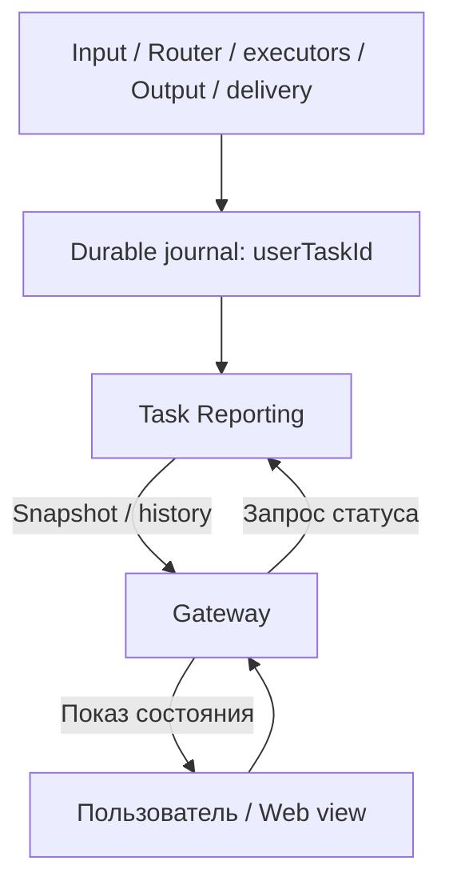

# User Task: идентификаторы и Reporting

Статус: **draft / продолжение Linearization Step · 30.09.2026**. Прорабатываем **одну пользовательскую задачу**. Playbooks, групповые задачи и batch API здесь не проектируем.

**Следующий отдельный слой:** [Playbooks / GTD boundaries](PLAYBOOKS-VS-GETTING-THINGS-DONE-BOUNDARIES.md) добавляет planId/stepId, schedule occurrence и inputRequestId; прежняя модель одной User Task сохраняется. Каждая Task имеет основной web view; чат — notification subscription. Awaiting-user отображается как state=blocked, stage=waiting_input, reason=awaiting_user, со ссылкой на активный Input Request; после ответа разрешённое продолжение возвращает active.

## 1. Главный ID — userTaskId

**User Task** — одна отслеживаемая работа для пользователя, независимо от того, каким executor она выполнялась и сколько раз эскалировала. **userTaskId** создаётся при durable приёме этой работы и сохраняется до результата, reporting, доставки и окончания retention.

Это публичный идентификатор работы, **не traceId**. Повтор, diagnosis, repair и переход deterministic → LLM → AI не меняют userTaskId. Запрос «что с моей задачей?» использует этот ID. Если в API поле называется taskId, оно должно быть согласованным alias той же сущности, а не вторым независимым ID.

Пример: один почасовой поиск кандидатов — одна User Task, даже если начался скриптом и завершился агентом. Следующий час — новая User Task. Расписание — отдельное постоянное определение; его здесь подробно не проектируем.

Пока пользователь собирает одну задачу из сообщений/файлов, допустим один userTaskId со стадией collecting. Повтор webhook не создаёт ещё один ID. Несколько сообщений относятся к уже открытому intake по явной binding policy, а не просто по совпадению profileId. Группировку нескольких самостоятельных задач пока не вводим.

## 2. Reporting — «справочная», Report to User — отправка

Разделяем две роли:

| Роль | Задача |
|---|---|
| **Task Reporting** | По userTaskId показать состояние, историю стадий, причины ожидания/ошибок, текущую эскалацию и доступный результат |
| **Report to User** | Подготовить и передать исходящее сообщение через gateway |
| **Gateway / View** | Получить статус, отрисовать его и доставить сообщения в своём канале |

Reporting можно разместить в Output-системе как отдельный module или выделить позже. Он читает **все стадии**, поэтому получает события и от Input/Router/executors, а не только финальные outputs.

Reporting не запускает работу, не повторяет её и не выбирает escalation. Это query/read model над operational journal. Запрос статуса проходит напрямую Gateway → Reporting; запускать агента или LLM для просмотра статуса не требуется.



Эта схема дополняет линейный execution flow чтением состояния. Она не добавляет новую петлю исполнения.

## 3. Что хранится после освобождения очередей

Активная Input/Output queue может удалить переданный item. **User Task record и история остаются**. Минимальная запись:

- userTaskId, owner/scope, source, createdAt;
- state, stage, currentExecutionType, currentPurpose;
- currentJobId/currentRunId, escalationDepth;
- currentReasonCode и пользовательское объяснение;
- result refs, отдельно deliveryState;
- version, updatedAt, lastProgressAt, lastHeartbeatAt, freshness;
- history links и причинная связь новых работ с предыдущими.

Output не обязан помнить весь running task в своей очереди. Он записывает решение в journal и передаёт follow-up; Reporting продолжает видеть ту же User Task.

## 4. Статус раскладываем по независимым полям

Не создаём отдельный enum для каждой комбинации вроде deterministic_fail_llm_fail_agent_running. История сохраняет failures, текущая запись описывает настоящее.

| Поле | Примеры / смысл |
|---|---|
| state | active, blocked, succeeded, failed, cancelled |
| stage | collecting, preparing, queued, handing_off, running, evaluating, waiting_followup, finished |
| currentExecutionType | deterministic, llm_recipe, ai_agent; null до выбора |
| currentPurpose | primary, diagnosis, repair, retry, escalation |
| escalationDepth | 0 — исходная работа; увеличивается при переходе к новому типу решения, а не при каждом retry |
| currentReasonCode | invalid_json, budget_exhausted, worker_unreachable и другие структурированные причины |
| deliveryState | not_required, pending, accepted, delivered, failed, unknown |
| freshness | fresh, stale, unknown; это достоверность наблюдения, не итог работы |

Степень эскалации и тип executor — разные оси. LLM diagnosis ошибки скрипта не означает, что исходную работу уже исполняет LLM. Поэтому purpose обязателен.

Пример истории одной задачи:

| Событие | Текущее пользовательское состояние |
|---|---|
| Принята | «Ожидает обработки» |
| Run скрипта запущен | «Обрабатывается автоматически» |
| Скрипт failed; diagnosis передан в Input | «Ошибка автоматической обработки. Ожидает разбора» |
| LLM diagnosis/repair запущен | «Ошибка разбирается моделью» |
| Repair failed; разрешена AI escalation | «Передана агенту для обработки» |
| Agent Run принят, но ещё не стартовал | «Ожидает запуска агента» |
| Agent Run действительно запущен | «Обрабатывается агентом» |
| Agent failed, продолжения исчерпаны | «Остановлена: выполнить задачу не удалось» |
| Получен и принят пригодный результат | «Выполнена»; delivery может ещё быть pending |

Failure отдельного Run не делает User Task failed, пока есть разрешённое продолжение. Budget exhausted обычно даёт blocked/action_required; terminal failed задаёт outcome policy, если продолжение закрыто. Успешная диагностика сама по себе не закрывает исходную User Task как succeeded.

## 5. Основные ID: владельцы, путь и видимость

«Публичный» означает доступен авторизованному пользователю в его API/UI, а не любому посетителю.

| ID / ref | Что обозначает и кто создаёт | Где передаётся | Видимость |
|---|---|---|---|
| **userTaskId** | Одна пользовательская работа; Intake/admission или trusted scheduled producer | Весь Input → Router → executor → Output → follow-up → Report → gateway; Reporting и logs | Основной пользовательский/API ID |
| **jobId** | Определённая работа/Job; resolved JobSpec owner | Router, executor, outputs, journal; новая работа при escalation имеет собственную Job | Внутренний; debug/API history при необходимости |
| **runId** | Одна попытка Job; dispatch owner резервирует до start | Executor/Runner, clean room bindings, usage, outcomes, journal | Внутренний; support/debug |
| **parentRunId** | Run, outcome которого породил diagnosis/repair/escalation | Follow-up Input, resolved JobSpec, history | Внутренний; причинная связь в support view |
| **operationId** | Идемпотентность одной операции; отправитель | Каждый конкретный handoff/API retry | Внутренний; сохраняется при повторе того же handoff |
| **eventId** | Одно наблюдение/переход; event producer | Durable outbox, journal ingestion, reporting projection | Внутренний; dedup события |
| **resultId** | Один сохранённый результат Run; executor/result producer | Executor outbox → Output → journal | Внутренний; связывает output/review |
| **logicalMessageId** | Одно логическое сообщение пользователю; Report/delivery producer | Report → Gateway → delivery receipt | Публичный message ref при необходимости |
| **artifactId** | Файл/оригинал/derivative/result; artifact store adapter | Input preparation, executor, Output, report | Scoped refs; содержимое по отдельной авторизации |
| **conversationRef / sessionId** | Канал общения/контекст, владельцы conversations/sessions | Intake, context, Reporting/delivery binding | Scoped API/UI refs |
| **destinationRef** | Разрешённый адрес ответа; gateway/admission | User Task, Output, Report | Внутренний; не произвольный URL модели |
| **profileId / tenantId** | Владелец и область доступа; identity system | Auth context и scoped records | Собственные identity refs; не credential |
| **nativeUpdateId / nativeMessageId** | Channel protocol IDs; внешний provider | Gateway dedup и receipt mapping | Канал/support; не заменяют userTaskId |
| **traceId / spanId** | Техническая трассировка конкретного прохода | Observability instrumentation | Внутренний; не главный ID пользовательской работы |

Queue item IDs и lease IDs локальны своим modules, не становятся пользовательскими идентификаторами. ownerGeneration/version/sequence — управляющие значения, а не новые сущности ID.

Job как определение может быть повторно использована в разных User Tasks, например одним hourly recipe. Run всегда относится ровно к одной User Task в текущей модели. Значит, userTaskId не выводим из jobId и не помещаем постоянный userTaskId в переиспользуемое Job definition.

## 6. Правила изменения ID

| Событие | userTaskId | jobId / runId |
|---|---|---|
| Повтор доставки принятого input | Тот же | Не создаёт новую работу |
| Потерян start ACK и повтор start | Тот же | Тот же runId и тот же operationId этого start |
| Retry выполнения той же Job | Тот же | jobId тот же; runId новый |
| Diagnosis / repair как новая работа | Тот же | Новые jobId/runId, parentRunId исходного outcome |
| Escalation deterministic → LLM → AI | Тот же | Новая Job и Run для нового способа работы |
| Повтор доставки результата | Тот же | runId/resultId/eventId сохранены |
| Повтор отправки отчёта | Тот же | logicalMessageId сохраняется; исходный Run не повторяем |
| Следующая самостоятельная задача / следующее почасовое срабатывание | Новый | Новые Runs; Job definition может остаться той же |

operationId имеет scope «caller + operation kind + logical operation». Нельзя использовать один userTaskId как универсальный idempotency key всех стадий: законный следующий шаг иначе будет принят за дубль.

## 7. Где обязательно передаётся userTaskId

| Граница | Минимальная корреляция |
|---|---|
| Durable acceptance → клиент | userTaskId, acceptedAt, statusRef |
| Input → Task Router | userTaskId, input refs/version, operationId |
| Router → executor | userTaskId, jobId, runId, operationId, ownerGeneration |
| Executor → Output | userTaskId, jobId, runId, resultId, eventId, outcome |
| Output → Input follow-up | userTaskId, parentRunId/resultId, новая работа, purpose, depth/limits, operationId |
| Output → Report | userTaskId, result/status refs, destinationRef, logicalMessageId |
| Report → Gateway | userTaskId, logicalMessageId, destinationRef, message/artifact refs |
| Gateway → delivery journal | userTaskId, logicalMessageId, native receipt/status |
| Каждая стадия → Reporting journal | userTaskId, eventId, source, causation, timestamp и проверяемая версия/ordering |
| Logs / LLM usage / trace correlation | userTaskId и доступные jobId/runId; secrets не пишутся |

У пользовательской работы missing userTaskId — ошибка контракта, а не генерация случайного нового ID в downstream. Технические maintenance operations без пользователя отдельно помечаются system scope и не выдают себя за User Task.

Первый ACK содержит userTaskId, чтобы после обновления страницы web мог запросить status. Gateway сохраняет mapping своего client request/native update к userTaskId: если ответ потерялся, повтор вернёт прежний ID.

## 8. Reporting API и пример snapshot

Логические операции, transport пока не выбран:

- getUserTask(userTaskId) → snapshot;
- getUserTaskHistory(userTaskId, cursor) → события и переходы;
- watchUserTask(userTaskId, afterVersion) → изменения; reconnect поддерживает replay либо refresh snapshot.

Все операции авторизованы по owner/scope. Непредсказуемый ID не является правом доступа.

Пример: скрипт упал, diagnosis уже работает, пользователь ещё не получил новый report:

```json
{
  "userTaskId": "ut_123",
  "state": "active",
  "stage": "running",
  "currentExecutionType": "llm_recipe",
  "currentPurpose": "diagnosis",
  "escalationDepth": 0,
  "currentJobId": "job_diagnosis",
  "currentRunId": "run_02",
  "currentReasonCode": "deterministic_failed",
  "statusText": "Ошибка автоматической обработки. Модель разбирает причину.",
  "deliveryState": "pending",
  "version": 8,
  "updatedAt": "2026-09-30T12:20:00Z",
  "freshness": "fresh"
}
```

escalationDepth=0 здесь намеренно: diagnosis ещё не является принятым переходом исходной работы на LLM. При фактической escalation policy повышает depth.

Пользовательская view показывает понятные statusText, ожидание/action и время обновления; внутренние job/run IDs и подробные ошибки доступны support view. Raw stack traces/секреты не уходят в обычный UI.

## 9. Если ответа нет или стадия зависла

Reporting не угадывает состояние по наличию ответа. Для Run хранится executor ownership, start/heartbeat/progress/deadline. Для подготовительного этапа — свой stage progress/deadline.

- Последний heartbeat устарел: показываем stale/«статус не подтверждён, проверяем», а не выдуманный running/failed.
- Deadline превышен: технический watchdog сверяет фактическое состояние и создаёт structured outcome.
- Outcome попадает в Output; тот решает report/follow-up по policy.
- Связь с Reporting недоступна: UI сохраняет последний snapshot с временем и признаком stale.
- Outcome есть, delivery pending/failed: пользователь всё равно видит состояние и сохранённый результат по userTaskId.

Timeout сам по себе не доказывает остановку процесса или отсутствие внешнего эффекта. Повтор запрещён, пока неизвестный outcome не обработан по соответствующей policy.

## 10. Как Reporting остаётся достоверным

Каждая стадия записывает durable факт до ACK и имеет replay/outbox для передачи journal. Reporting projection применяет события идемпотентно. Если queue и journal в одной transactional storage, фиксируем handoff decision и событие вместе; при разных storages явно допускаем lag, но не потерю.

eventId защищает от дубля, но не решает порядок. version User Task назначает authoritative journal, а не часы независимых workers. Causal refs/run ownership/generation защищают от позднего Run result: закрытый или superseded Run не возвращает задачу назад в running. События разных источников валидируются, задержавшиеся факты дополняют history.

Journal — небольшой shared operational module, не новый бизнес-controller. Он принимает разрешённые переходы и предоставляет durable facts; Output policy выбирает follow-up. Reporting может быть rebuildable read model над этими facts.

Отмена повышает control generation и запрещает новые follow-up/dispatch. Terminal task не открываем незаметно поздним событием; ручное возобновление требует отдельной явной команды и policy.

## 11. Репозитории и следующий шаг

В минимальном варианте **Task Reporting + User Task journal** — modules предлагаемого task-queue repo рядом с Input/Output; отдельный reporting repo пока не нужен. Gateway adapters — consumers query/event API. Agent Runner получает userTaskId в RunSpec и сохраняет его в events/result/usage correlation.

Это схема целевого контракта, не подтверждение наличия такой единой таблицы/API в текущем codebase. Старые taskId/requestId/sessionId mappings нужно проверить при миграции, не переименовывать автоматически.

- [ ] Один userTaskId переживает сборку input, retry, diagnosis и escalation до доставки.
- [ ] Refresh Web показывает состояние без нового execution и без LLM.
- [ ] Ошибка Run сохраняется в history, даже если Task продолжилась.
- [ ] Очереди пусты, но accepted Run без ответа виден и контролируется по deadline.
- [ ] Late/duplicate events не меняют текущую стадию неверно.
- [ ] Delivery failure не превращает вычислительный success в повтор Run.
- [ ] Пользователь не может читать чужую задачу по известному ID.
- [ ] Следующий hourly запуск получает новый userTaskId.

Сначала доводим этот lifecycle одной задачи. Playbook/group/batch layer будет следующей абстракцией и не участвует в этой модели.
