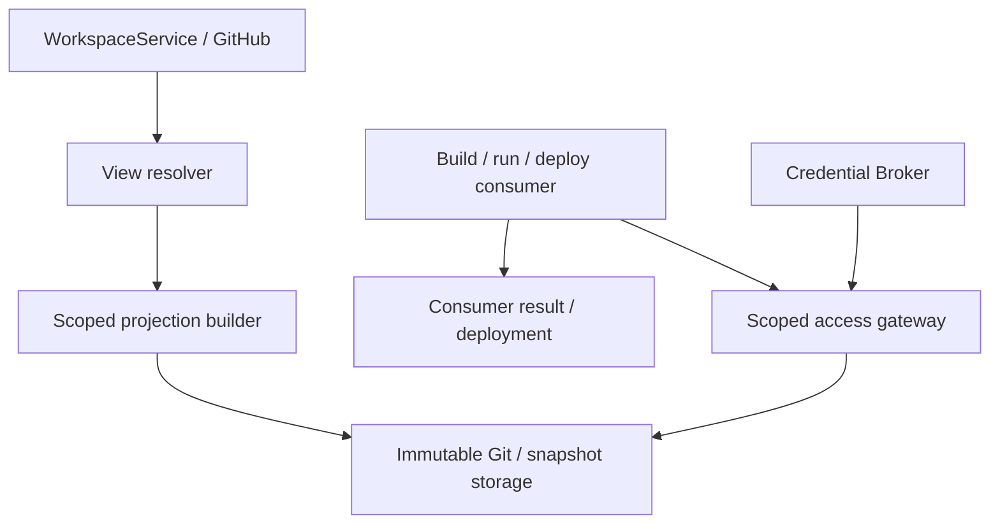

# Workspace Views: scoped доступ к папке для внешних исполнителей

Проектный контракт по запросу владельца, 06.10.2026. Описывает целевую границу; сервис и Git endpoint ещё не реализованы. WorkspaceService и его CAS/conflict flow остаются единственным владельцем canonical publication. Это общий доступ к исходникам для build/deploy, code runner, CI, renderer или другого consumer, а не только публикация сайта.

## 1. Модель

**Workspace View** — постоянное, разрешённое пользователем представление выбранной подпапки workspace. Внешний сервис получает собственный scoped grant к View; upstream GitHub credential не выдаётся. Git-ветки и commits — единственный источник версий; отдельные main/dev pointers и второй журнал публикации профиля не создаются. GitHub — текущий storage adapter, не часть публичного контракта.

Разделяем три операции:
- export: сделать разрешённые данные доступными consumer;
- execution: consumer читает зафиксированную версию и выполняет build/run;
- deployment/publication: consumer подтверждает результат и при необходимости переключает свой live URL.

Готовность export не означает успешный build, а успешный build не означает deployment. View URL стабилен, конкретная revision неизменяема. URL опубликованного сайта принадлежит deployment adapter, а не Git-сервису.

## 2. Сущности и ownership

| Сущность | Поля / смысл |
|---|---|
| SourceBinding | bindingId, tenantId, profileId, workspaceId, repositoryBindingRef, directory, policyVersion; создаёт trusted host после согласия пользователя |
| WorkspaceView | viewId, sourceBindingId, consumer policy и правило выбора веток; живёт дольше Run |
| ViewRevision | viewRevisionId, sourceCommit, sourceTree, projectionCommit, manifestDigest, exportPolicyVersion, artifact refs; неизменяема |
| Channel alias | main/dev — вычисляется из доступных Git refs; branch, sourceCommit, sourceRunId при наличии. Не самостоятельный authoritative state |
| ConsumerGrant | grantId, authenticated consumerId, tenant/profile/view binding, channels/revisions, scopes, audience, expiry, revocation |
| ExecutionReceipt | executionId, consumerId, viewRevisionId, selectionDigest, operationId, outcome, resultRefs; привязка результата к реально использованным исходникам |
| Publication | publicationId, URL и последний успешный deployment; существует только для consumers, публикующих результат |

SourceBinding и grants — host-owned. Агент может предложить папку, но не подменить user/tenant/repository или сам выдать себе доступ. Tenant/profile выводятся из аутентифицированной сессии. Сервис читает upstream только через существующий credential resolver, без ambient credentials.

Логически View Gateway — самостоятельная граница. Сначала модуль рядом с WorkspaceService/Runner API и отдельный HTTP port; новый repo не обязателен до отдельного release/операционного жизненного цикла. CP потребляет контракт, не дублирует хранение workspace. Доменная публикация/сборка принадлежит consumer adapter.

## 3. Ограничение видимости

Вход directory — относительный нормализованный путь внутри trusted workspace. Запрет абсолютных путей, traversal, выхода через symlink, включения .git и чтения соседних проектов. По умолчанию symlinks и submodules отклоняются; явная поддержка возможна только с доказанным сохранением границы. Зависимости за пределами папки не подтягиваются молча: declared дополнительный root требует отдельного разрешения.

Consumer видит содержимое разрешённой папки как корень представления. Он не видит upstream repository listing, branches/tags, Git objects, commit messages/author metadata или историю профиля. В export попадают только текущие разрешённые файлы; gitignore не считается разрешением публикации или достаточным фильтром credentials.

Тяжёлые файлы уже лежат в object storage. Экспорт включает только относящиеся к View manifest entries и scoped content refs. Object API проверяет grant на каждый ref, size и checksum; upstream bucket credentials и полный профильный artifact manifest не передаются. Materialization — явная option consumer, с byte/size limits.

Доверие consumer не разрешает ему видеть больше согласованного scope. Build scripts запускаются на изолированном представлении; полный профиль не монтируется как «удобная dependency».

## 4. Ветки — источник версий; main/dev — удобные имена

**Упрощённое правило:** main — canonical branch существующего workspace binding. Все разрешённые не-main ветки с этой папкой — доступные рабочие версии. dev — alias самой свежей такой версии. Если рабочих версий нет, dev совпадает с main; наружу возвращается одна уникальная версия с двумя labels. Если canonical пока отсутствует, отдаётся только доступная dev версия.

Сервис может перечислить все разрешённые версии и выбрать конкретную branch, а не только alias. Grant задаёт allowed refs policy: все разрешённые рабочие версии этой папки или ограниченный subset. Перечисление версий не раскрывает содержимое других папок или чужие workspace refs.

«Самая свежая» означает время последнего подтверждённого checkpoint/push из existing trusted workspace/run state, а не author/committer date внутри пользовательского commit и не номер в ответе GitHub API. При равном времени применяется стабильная сортировка по branch ID. Если trusted freshness недоступна, resolver возвращает freshness_unknown и версии для явного выбора; не выдумывает время. Reconcile после потерянного события использует existing receipts/state. Отдельный durable branch registry только ради alias не строится.

| Ситуация | Поведение |
|---|---|
| main и одна рабочая ветка | main + dev, dev указывает на рабочую ветку |
| Несколько рабочих веток | Все разрешённые версии перечислены; dev выбирается по правилу выше |
| Ветки имеют одинаковую папку | Branch identities сохранены; export dedup по digest, не две одинаковые сборки |
| Новая рабочая ветка/push | Следующий resolve может выбрать новый dev; выполняющийся build остаётся на прежнем SHA |
| Рабочая ветка удалена | Перечитать refs: dev становится следующей доступной рабочей версией либо main |
| Ветка смержена и удалена | main уже изменён существующим WorkspaceService; resolver просто видит новые refs |
| Ветка удалена без merge | main не меняется и ничего не мерджится; resolver не объявляет старую работу опубликованной |
| Папка отсутствует в branch | Эта branch не доступна для View; отсутствие main показывается явно |
| Merge конфликтует/исход unknown | Доступные run-версии остаются читаемыми; canonical не меняется до existing CAS/conflict/reconcile |
| Export/build упал | Git refs не меняются; последняя успешная consumer publication остаётся по её собственной политике |

Каждый resolve возвращает branch, sourceCommit, export digest и selectionDigest. SelectionDigest связывает View policy, branch и commit; это не отдельный sequence counter. Для execution consumer закрепляет SHA и immutable export descriptor. Старый build result сохраняется как история; consumer перед переключением live URL проверяет, что результат относится к выбранной версии/его deployment request. Не следует считать старый callback текущим только по имени dev.

Для агента, работающего в конкретном Run, команда публикации передаёт его branch/SHA явно. Автоматический newest-dev удобен для обзорного UI/consumer polling, но не должен публиковать чужую более свежую run-ветку вместо текущей агентской работы.

GitHub events ускоряют refresh, но не являются командой merge. Export revision — воспроизводимый derived snapshot/cache, не второе хранение исходников. Удаление branch не уничтожает уже развернутый сайт; это сохраняет deployment provider. Grant revocation блокирует новые чтения; ранее скачанные bytes невозможно отозвать задним числом.

## 5. API: control и data planes

Пути ниже — предлагаемый versioned контракт, не уже существующие методы. JSON Schema/OpenAPI обязательны при реализации.

| Endpoint | Назначение и важные поля |
|---|---|
| POST /v1/workspace-views | Создать View: workspaceBindingRef, directory, policyRef, idempotencyKey; tenant/profile берутся из identity |
| GET /v1/workspace-views/{viewId} | Разрешённая metadata и доступные channels; без upstream credential |
| PATCH /v1/workspace-views/{viewId} | Owner меняет allowed refs/selection policy; If-Match и operationId. Default newest-dev не требует этой операции |
| POST /v1/workspace-views/{viewId}/refresh | Refresh/reconcile refs и derived exports; может вернуть 202 + operationId |
| GET /v1/workspace-views/{viewId}/versions | Все разрешённые branch/revision records, main/dev labels, trusted freshness, digest и readiness |
| GET /v1/workspace-views/{viewId}/resolve?channel=dev | descriptor: viewRevisionId, sourceCommit, projectionCommit, manifestDigest, branch, selectionDigest, formats, scoped data URLs |
| POST /v1/workspace-views/{viewId}/grants | Owner/host выдаёт конкретному consumer ограниченный доступ; consumerId, channels, scopes, audience, expiresAt |
| POST /v1/consumer-access/token | Authenticated consumer обменивает существующий grant на короткоживущий credential; не создаёт новый grant |
| DELETE /v1/consumer-grants/{grantId} | Отозвать доступ |
| GET /v1/view-revisions/{revisionId}/manifest | Полный manifest только разрешённых файлов/ref: path, mode, size, SHA-256 |
| GET /v1/view-revisions/{revisionId}/archive | Детерминированный tar/zip той же revision; checksum и limits |
| GET /v1/view-revisions/{revisionId}/files/{path} | Чтение разрешённого файла; отсутствие и forbidden scope различаются без раскрытия чужих ресурсов |
| GET /v1/view-revisions/{revisionId}/objects/{objectId} | Разрешённые тяжёлые bytes, range/checksum; никакого произвольного upstream key |
| POST /v1/consumer-executions/{executionId}/results | Идемпотентный result/deployment receipt с pinned revision, selectionDigest и operationId |

Scopes разделяются: view:read, objects:read, results:write, view:configure. Default consumer — read-only; config/admin scopes не выдаются вместе с clone token. Grant renewal требует действующего consumer identity и не расширяет scope. Базовый формат — opaque bearer, hash lookup и revocation в durable store; JWT допустим при эквивалентной проверке binding/version/expiry. RFC 8693 — стандартный вариант exchange при наличии OAuth инфраструктуры, не обязательный новый IdP.

Git client может получать credential через credential helper/HTTP authentication. Токен не в URL, prompt, RunSpec или commit. Audience привязан к gateway и consumer binding; identity consumer отдельно проверяется при выдаче. Для bearer possession остаётся полномочием чтения до expiry/revocation; sender-constrained credentials — отдельное усиление, не обещание MVP.

IdempotencyKey связан с identity и payload digest. Повтор с другим payload — 409. Config/grant mutations требуют If-Match. Resolver не мутирует Git refs или отдельные channel pointers. Auth — 401, запрет scope — 403 или закрытый 404 по политике, source missing — typed state, pending export — 202, upstream failure — retriable/unknown без автоматического переключения канала.

## 6. Git transport без раскрытия профиля

Потребитель получает обычный read-only Git URL вида https://workspace.example/v1/git/{viewId}.git и разрешённые source branch refs, плюс refs/heads/dev как вычисляемый alias и refs/heads/main при наличии canonical версии. Коллизии имён резервных aliases нормализуются в descriptor, не скрывают ветки. На Git-запрос refs pinned revisions проверяются тем же grant. HEAD указывает на dev; consumer может явно выбрать main.

Это **проецированный Git repository**, не HTTP proxy полного upstream repo. В нём отдельная object database и синтетические commits, содержащие только разрешённые export snapshots, с нейтральными metadata. Upstream SHA хранится в descriptor отдельно: projection SHA другой. Source history/parents не копируются; default snapshot не наследует старые files/secrets. История экспортированных snapshots возможна только при явно согласованной retention/read policy.

Git HTTP использует стандартные info/refs и upload-pack; receive-pack запрещён. Проверяется весь достижимый object graph и выдача произвольных object IDs. Sparse checkout, partial clone и фильтрация списка refs полного repo не являются folder-level authorization.

Git-сервис не пишет обратно в профиль. Исполнитель возвращает output refs/candidate manifest, а разрешённые изменения публикует существующий WorkspaceService через CAS/conflict. Отдельный Git push/merge для View не создаётся.

HTTPS API и object storage могут быть serverless. Git projection/export выполняет ограниченный trusted job без исполнения пользовательского кода; полноценный smart HTTP upload-pack port требует Git-capable runtime и измерения ресурсов. Обычный Worker не предполагается умеющим запускать git binary. Для MVP допустимы archive и snapshot git bundle; git clone bundle поддерживается стандартным клиентом, но bundle URL нельзя выдавать за полноценный fetch remote.

Для постоянного Git URL реализуется настоящий Git HTTP adapter (smart либо проверенный dumb HTTP read transport), с auth на refs, packs и objects. Derived cache можно пересоздать из manifest/revisions; он не новый authoritative workspace и не второй GitHub repository на каждый Run.

Не каждый hosting provider принимает произвольный authenticated Git URL. В таком случае provider adapter получает snapshot через API и передаёт assets/build output штатным upload API. GitHub-only integration не обойдёт это ограничение автоматически. Единый View contract сохраняется независимо от выбранного транспорта.

## 7. Связь с текущим исполнением

1. Host разрешает View и consumer grant для выбранной папки. Repo binding берётся из уже существующего profile identity.
2. Run получает разрешённый viewId и tool availability; upstream credential остаётся у resolver.
3. Агент сохраняет checkpoint в run branch существующим механизмом, просит dev refresh и при необходимости build/deploy.
4. Consumer resolves dev, получает export revision и короткоживущий доступ, выполняет операцию.
5. Receipt подтверждает исходники и outcome; пользователь получает URL только при подтверждённом deployment.
6. Canonical publication через WorkspaceService обновляет main по правилам раздела 4; текущая жизнь агента для этого не нужна.

MCP/CLI — тонкие adapters create/select/refresh/build/deploy/status; data transport — HTTP/Git. Сервис не должен зависеть от MCP process в clean room. CP хранит user task/run/reporting, View service — binding/grant policy и derived export cache; branches остаются в существующем workspace repository, consumer — execution/deployment state; IDs связываются без нового GTD loop. Ordinary refresh не запускает LLM.

View lease не подменяет publication lock. Tenant/profile isolation, operationId, channelGeneration, viewRevisionId, sourceRunId и consumer executionId передаются явно. Logs не содержат credentials или файловый content; пользовательские ошибки содержат profile и userTaskId/runId при наличии. TTL follows [Observability](OBSERVABILITY-AND-ERROR-CONTRACT.md); история активных grants/revisions/receipts удерживается по явной retention policy, не удаляется вместе с Run.

## 8. Структура реализации и приёмка

Предлагаемая модульная структура:
- contracts/: schemas descriptors/grants/receipts и OpenAPI;
- bindings/: trusted profile/workspace source binding;
- resolver/: refs listing, newest-dev alias и event reconciliation без нового channel store;
- projection/: manifest, archive и Git snapshots;
- access/: consumer auth, grant exchange/revoke и scoped object reads;
- transports/: HTTP и Git adapters;
- consumers/: build/deploy/run adapters без копирования WorkspaceService;
- tests/fixtures/: synthetic multi-tenant workspace и fake Git/object/provider ports.

GitHubSourcePort, ObjectStoragePort, CredentialResolverPort, DerivedCachePort, ExportBuilderPort и ConsumerAdapter инъектируются. WorkspaceService publication events переиспользуются; CAS/conflict алгоритм не переносится и не копируется.

Обязательные sandbox сценарии: два профиля и соседняя secret folder; arbitrary Git object/history/ref probes; symlink/traversal/submodule; artifact ref чужого профиля; build зависимость за границей; только dev, только canonical, несколько версий и одинаковая проекция; newest-dev, ties, freshness_unknown и явный выбор run branch; потерянный webhook; merge/conflict/unknown; удаление ветки без merge и удаление папки; revoked/expired/wrong-audience grant; restart export/CAS replay; старый consumer callback; bounded large files; обычный git clone/fetch и archive дают одинаковый manifest.

Первый runnable slice — scoped archive и revision/grant semantics с synthetic workspace; Git adapter проходит отдельный compatibility gate обычным клиентом. Реальные consumers подключаются после contract checks, не через новые зависимости на выводимой GCP VM. Статусы и шаги реализации ведутся в issue, не в этом документе.

## Источники

Текущие profile binding/publication: [Workspace lifecycle](AGENT-RUNNER-DATA-PERSISTENCE-IMPLEMENTATION.md), [Runner #147](https://github.com/trained-assist/ai-agent-runner/pull/147), [workspace acceptance #95](https://github.com/trained-assist/ai-agent-runner/issues/95). [Repository map](REPOSITORIES.md) определяет existing owners.

Стандарты: https://git-scm.com/docs/gitprotocol-http ; https://www.rfc-editor.org/rfc/rfc8693.html . GitHub fine-grained permissions выбираются по repository/resources, не являются folder-level grants: https://docs.github.com/en/authentication/keeping-your-account-and-data-secure/managing-your-personal-access-tokens . Проекция, channels и View API выше — наш проектный контракт, не встроенная возможность GitHub или стандарт OAuth.
