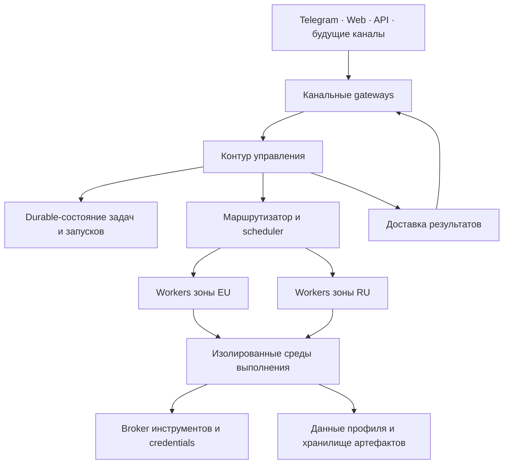

# Trained Assist — целевая архитектура бэкенда

Версия 0.2 · 30 сентября 2026 · статус: draft для согласования.

## 1. Назначение и границы проверки

Этот документ задаёт общую цель сервиса и устойчивые архитектурные блоки, к которым привязываются эпики. Он разделяет требования владельца, подтверждённую реализацию, предложения и открытые решения. Закрытый эпик сам по себе не доказывает достижение архитектурной цели: нужны проверяемые сценарии.

Проверены исходники и документы следующих репозиториев на конкретных ревизиях:

| Репозиторий | Ревизия |
|---|---|
| trained-assist-agent | `c83e6931d61ddb205779ee670e4c4c59b26580eb` |
| trained-assist-tg-bot | `b3b703fa3271a3b739bcf315ebf7d247a33c7dc7` |
| trained-assist-web | `be33bc0bce082693eaadc5b70e8ee78562d2dd8c` |
| software-engineering-playbooks | `bf9fd8845d9bea8938dc1b6e5f0f99a5e462243e` |
| trained-assist-llm-ladder | `9907dcb6b27307450bdfc826f67dd5490283d2c8` |

`trained-assist-engineering` переименован в `software-engineering-playbooks`. GitHub вернул для `Deploy-Playbooks/serverless-ai-agent-run` состояние пустого репозитория. Его прежний скачиваемый архив в эту проверку не вошёл. Проверка не включает доступ к VM, актуальные переменные окружения, фактический rollout и запуск тестов. «Есть в коде» не означает «включено в проде». «Не найдено» относится к просмотренным источникам.

## 2. Цель, заданная владельцем

Сервис принимает задания из Telegram, Web и внешнего API; позже добавляет Viber, Max и WhatsApp. Каждый запуск получает изолированную среду доступа и необходимые данные пользователя. Постоянная папка пользователя содержит текстовые данные и ссылки на артефакты. По завершении изменения сохраняются обратно; разовые API-задания доставляют результат в выбранное вызывающим сервисом место.

Исполнители работают на нескольких VM в двух классах зон: RU и EU. Число машин может меняться. Claude Code и Codex запускаются вне RU; OpenCode может запускаться в обеих зонах с учётом возможностей его конкретных провайдеров и инструментов. Надёжность, доведение задач до результата, выполнение методик, стоимость, журналы и credentials — самостоятельные части архитектуры.

Это целевой контракт. Пока не утверждены физический механизм clean room, схема общего состояния, правила совместной записи и требования к размещению данных.

## 3. Терминология

| Термин | Значение | Статус |
|---|---|---|
| Task / задача | Намерение и ожидаемый результат; живёт дольше процесса | Есть durable tasks |
| Session / сессия | Контекст взаимодействия и история; не процесс и не VM | Есть |
| Run / запуск | Одна попытка исполнения задачи или её шага | Используется; требуется унификация ID |
| Agent clean room / изолированная среда выполнения | Граница доступа процесса, файлов, сети и ресурсов | Предлагаемый целевой термин |
| Execution capacity lease / аренда ресурса исполнения | Арендуемая ёмкость хоста; сейчас отдельный Unix-пользователь `ta-agent-N` | Есть T0 |
| Ephemeral workspace / временная рабочая область | Локальные данные конкретного запуска | Целевой механизм |
| Profile workspace / рабочая область профиля | Постоянные данные профиля пользователя | Есть `USERS_ROOT` |
| Control plane / контур управления | Приём, durable-состояние, планирование, маршрутизация, права и бюджеты | Предлагаемая граница |
| Execution plane / контур исполнения | Региональные workers, clean rooms, движки и доступ к инструментам | Предлагаемая граница |
| Technical recovery / техническое восстановление | Реакция на технический сбой попытки | Есть policy и recovery |
| Outcome control / контроль достижения результата | Проверка, что задача действительно доведена до результата; GTD | Есть, границы требуют уточнения |
| Playbook / регламент выполнения | Версионированная методика со стадиями, шагами и проверками | Есть |
| Cookbook | Каталог рецептов/методик | Предлагается оставить названием каталога, не отдельного исполнителя |
| Reconciliation / сверка состояния | Сопоставление ожидаемого состояния с фактическим после сбоев | Частично есть |

Clean room не подразумевает обязательный контейнер. Unix users/ACL/firewall — один вариант реализации. Выбранный механизм должен обеспечивать заявленные свойства для каждого разрешённого движка и инструмента. Git worktree обеспечивает разделение разработки, но не является границей безопасности.

## 4. Целевая схема — предложение

Диаграмма показывает логические обязанности, а не требование создать отдельный микросервис на каждый блок. Для первых двух VM несколько блоков могут жить в одном сервисе. Единственный авторитетный владелец конкретной попытки и правила смены владельца обязательны даже при совместном размещении.

## 5. Карта блоков: цель → факты → пробелы

| ID | Блок | Подтверждено в исходниках | Что ещё требуется для цели |
|---|---|---|---|
| A01 | Каналы и приём | TG Worker, буферизация, durable RunOutbox, стабильный requestId; Web Worker делегирует core | Общий контракт API и будущих каналов; единая идентичность пользователя и адрес доставки |
| A02 | Durable orchestration | SQLite task store; GTD tick; recovery; process execution-owner lock | Межмашинное ownership, назначение worker, leases и защита от результатов прежнего владельца |
| A03 | Изоляция | Unix slot pool, ACL gates, env allowlist, run tokens, MCP bridge | Полное покрытие Codex, внешних cwd и привилегированных инструментов; лимиты ресурсов; фактический rollout |
| A04 | Постоянные данные и временная среда | `USERS_ROOT`, `SYSTEM_ROOT`, `TOKENS_ROOT` разделены; стабильные IDs вместо абсолютных путей | Materialize/commit/cleanup жизненный цикл; версии данных; конфликты параллельной записи |
| A05 | Артефакты и экспорт | R2 media refs с id/size/hash; чтение через доверенный gateway; локальный cache | Общий контракт выходных артефактов, хранение/retention, доставка API-результата, отказ при экспорте |
| A06 | Региональный placement | TG выбирает `AGENT_URL` либо `AGENT_RU_URL`; RU capabilities + aliases задачи | Единый router для всех каналов, матрица движков/провайдеров/инструментов, список N workers, data residency |
| A07 | Техническое восстановление | Классификация ошибок; bounded attempts; backoff; fallback; orphan recovery | Одна политика для всех точек повторов; безопасный retry внешних мутаций; recovery после потери worker |
| A08 | Outcome control / GTD | GTD контроллер исполняет durable шаги, проверяет результат, планирует продолжение | Формальное различие «процесс завершён», «результат подтверждён», «доставлено»; пределы долгого возобновления |
| A09 | Playbooks и quality gates | Compiler, executor resolver, hooks, validators; внешние engineering playbooks | Версия методики на задачу; hard/soft gates; распределение ответственности с GTD |
| A10 | Стоимость и routing моделей | Отдельный llm-ladder, health/key rotation; D1 trace calls; role/level mapping | Полный LLM Ledger и coverage всех путей; цены/стоимость попыток, streaming usage, budget enforcement |
| A11 | Журналы | Session store, native trace readers; OpenCode trace fallback JSONL | Единый journal contract для Claude/Codex/OpenCode, retention и экспорт до удаления clean room |
| A12 | Credentials | Отдельный store, AES-256-GCM при наличии ключа; registry потребителей; run-scoped bridge | Единый приоритет personal/shared/playground, scopes, выдача по ссылке, rotation concurrency, региональные правила |
| A13 | Эксплуатация | systemd, host storage roots, engine health; tick heartbeat; ops script изоляции | Fleet health/reconciliation, внешнее обнаружение остановленного supervisor, draining и воспроизводимое добавление VM |

## 6. Главные расхождения и риски

### 6.1 Изоляция T0 не равна целевому clean room

Документ T0 описывает опциональный rollout; `prepareEngineSpawn` в коде явно исключает Codex и cwd вне профиля из run-as. Там остаются env allowlist и bridge, но процесс работает с правами сервисного пользователя. В документации утверждение о fail-closed setup относится к ошибкам настройки и не отменяет этих исключений. Для архитектурных решений приоритет имеет реальный путь исполнения.

MCP servers работают как service user. Поэтому граница должна охватывать доступ инструментов к файлам/сети: изоляция CLI не ограничивает автоматически привилегированный MCP tool. Необходимо определить, что clean room может делать напрямую и что только через broker.

### 6.2 Постоянный профиль сейчас является рабочей директорией

Запуск получает доступ к постоянному профилю, `.agent-home` сохраняется между запусками. В профиль попадают native state, engineering worktrees/mirrors и другие runtime-файлы. Это отличается от цели «в постоянной папке только текст и ссылки».

Флаг `GCS_WORKSPACE_SYNC` присутствует в логике mode bits, но сам по себе не доказывает реализованный перенос данных между машинами. Общий протокол snapshot → run → commit → cleanup в просмотренных исходниках не найден.

### 6.3 Локальное single-owner не решает ownership между VM

`execution-owner-lock.js` удерживает SQLite-транзакцию, чтобы второй процесс не стал execution owner того же локального data root. Это полезная локальная гарантия. Для двух VM с независимыми SQLite она не исключает выполнение одной логической задачи обоими хостами.

Предлагается фиксировать task/run owner, lease expiration и fencing generation в авторитетном durable-состоянии. Новый владелец получает новое поколение; записи и результаты старого владельца отвергаются. Конкретный storage и механизм ещё не выбраны. Общий object bucket нельзя считать межмашинным transactional task store.

### 6.4 Повтор попытки не должен повторять неизвестную внешнюю мутацию

Если сервис упал после отправки письма, создания PR или платежа, отсутствие локального ACK не означает отсутствие внешнего эффекта. При поддержке провайдера нужен idempotency key; иначе перед повтором требуется сверка внешнего результата либо состояние `needs_review`. Нельзя обещать exactly-once для произвольного стороннего API.

### 6.5 Регион исполнения не равен региону каждой операции

Текущий TG router использует RU capabilities и aliases в тексте, а `forceRu` может напрямую выбрать RU. Он не реализует общий запрет Claude/Codex в RU. Web использует свой настроенный backend URL. Fallback между движками также должен заново проверять placement.

При комбинации «Claude вне RU + инструмент только с RU IP» возможен EU run с RU tool worker. Разрешён ли перенос входных данных между зонами — отдельное решение владельца. OpenCode как CLI не гарантирует доступность любой выбранной модели из RU.

### 6.6 Наблюдаемость ещё не подтверждает полный учёт денег

В llm-ladder есть D1 row per call, attempts и nullable token usage; streaming usage этим logger не сохраняется. Идентификаторы необязательны. `service-llm.js` в просмотренной версии не передаёт `x-ladder-*` headers. В D1 schema отсутствует поле денежной стоимости.

Владелец сообщил, что LLM Ledger уже существует. Его отдельная реализация и полнота доставки в него этой проверкой не установлены. Нельзя считать найденный ladder trace доказательством покрытия всех Claude/Codex/OpenCode, Gemini, service calls и повторов.

### 6.7 «Полный журнал» сейчас имеет ограничения

`session-trace-store.js` сохраняет поток OpenCode best-effort, ограничивает файл 4000 событиями и удаляет нетронутые файлы после 7 дней. Claude/Codex туда пока не пишут. Это рабочий fallback, но не гарантированный полный долговременный журнал.

### 6.8 Credentials имеют разные правила приоритета

Registry — CI/migration contract, а не runtime resolver. Он сам документирует различия приоритетов readers. Например, `github-token.js` для issue-fixer сначала берёт platform env, затем GH_TOKEN, затем personal file. Это не обязательно правильный порядок для пользовательского playground.

Без `CRED_ENCRYPTION_KEY` store пишет plaintext с предупреждением. T0 передаёт некоторые credentials непосредственно движку; Codex auth writeback описан как last-writer-wins. Требуются явная политика разрешения credentials и отдельное владение refresh/rotation; нельзя копировать все секреты в clean room.

## 7. Три уровня контроля — предлагаемое разделение

| Уровень | Вопрос | Право и ответственность | Чего избегать |
|---|---|---|---|
| Technical recovery | Исполнитель работоспособен? Попытка оборвалась технически? | Классифицировать сбой, ограниченно повторить, сменить разрешённый provider, восстановить ownership | Не объявлять бизнес-задачу выполненной; не возобновлять USER_STOP |
| Outcome control / GTD | Достигнут ожидаемый результат задачи? | Проверить acceptance/evidence, дождаться зависимости, создать продолжение или следующую попытку по политике | Не создавать конкурирующий run; не обнулять общий budget |
| Playbook governance | Соблюдён согласованный способ выполнения? | Задать стадии, зависимости, обязательные проверки и доказательства | Не становиться вторым scheduler; не считать текст агента доказательством gate |

Playbook определяет процесс. GTD интерпретирует прогресс и завершение. Технический recovery обслуживает попытки того же executor. Все уровни работают через одну модель durable task/run и один admission/ownership механизм. Для периодической работы отдельный schedule создаёт occurrences; retry относится к occurrence, а не к бесконечному переносу одной завершённой задачи.

Текущий `gtd-controller.js` совмещает значительную часть этих обязанностей. Логическое разделение не требует немедленно разносить его на три сервиса.

## 8. Жизненный цикл запуска — предложение

1. **Accept:** аутентифицировать источник; сохранить immutable request и idempotency key; ACK означает принятие, не результат.
2. **Plan/admit:** определить task, session, project, методику и budget; проверить conversation lane, session writer и доступную ёмкость.
3. **Place/claim:** выбрать worker по движку, провайдерам, инструментам и правилам данных; сохранить owner и lease generation.
4. **Materialize:** загрузить разрешённый snapshot/version данных; подготовить временную область и необходимые артефакты; выдать ограниченные credentials/ссылки.
5. **Execute:** запустить движок или programmatic step; обновлять heartbeat, собирать journal/cost events; выполнять tools через согласованную границу.
6. **Validate:** проверить результат и gates. Успешный exit процесса недостаточен для task completion.
7. **Commit/export:** записать изменения с проверкой базовой версии; сохранить артефакты и manifest. Для API-run выполнить выбранный delivery contract.
8. **Deliver:** отправить результат; сохранить статус и повторять доставку независимо от выполнения.
9. **Cleanup:** отозвать run credentials, остановить дочерние процессы, удалить временные данные после подтверждённого сохранения необходимых материалов.

Если commit/export не удался, результат остаётся recoverable: повторяется сохранение, а не вся работа агента. Если доставка не удалась, повторяется доставка. После краша sweeper сверяет leases, процессы, экспорт и cleanup; TTL не даёт права удалять единственную несохранённую копию.

Названия фаз не являются окончательной state machine: для execution, persistence и delivery желательно хранить независимые статусы, чтобы delivery failure не превращался в execution failure.

## 9. Инварианты для эпиков

- **INV-01:** профиль пользователя, сессия, задача, попытка, worker и clean room имеют разные идентификаторы.
- **INV-02:** один авторитетный владелец попытки; поздний результат прежнего владельца не меняет актуальное состояние.
- **INV-03:** Telegram conversation lane допускает одну интерактивную execution; другие сессии профиля могут работать параллельно. Web сериализует writers одной сессии, а не всего профиля.
- **INV-04:** параллельные runs одного проекта не получают глобальный profile lock; конфликты решаются по изменяемым ресурсам/версиям.
- **INV-05:** выбор движка и каждый fallback проходят placement policy; Claude/Codex не запускаются в RU.
- **INV-06:** отказ нужной границы изоляции не приводит к незаявленному запуску с более широкими правами.
- **INV-07:** внешняя мутация с неизвестным исходом не повторяется вслепую.
- **INV-08:** USER_STOP прекращает автоматическое возобновление остановленной работы на всех уровнях.
- **INV-09:** результат сохраняется до удаления clean room; доставка имеет отдельные retries.
- **INV-10:** каждый расход привязывается к task/run/step и источнику; неизвестная стоимость помечается unknown, а не zero.
- **INV-11:** общий budget учитывает технические retries, GTD continuation и проверки качества.
- **INV-12:** credentials выдаются по явным scopes и правилам приоритета; журнал не содержит значения секретов.
- **INV-13:** артефакт имеет стабильную ссылку/id, ownership и integrity metadata; временный URL не является его идентичностью.

## 10. Вопросы владельцу

### Сначала — решения, меняющие архитектуру

1. **Изоляция:** достаточно ли отдельного OS user + ограничения сети/файлов/ресурсов или нужна более сильная граница для произвольного пользовательского кода? Рекомендация: сначала записать требуемые свойства и покрытие всех движков; выбрать механизм после этого.
2. **Модель данных:** постоянная папка — единственный источник пользовательской памяти, а runtime/native resume/репозитории хранятся отдельно? Рекомендация: да; явно перечислить исключения, а durable task state вынести в operational store.
3. **Параллельные изменения:** как объединяются записи двух runs одного проекта? Рекомендация: versioned snapshot + commit changeset с conflict handling; избегать перезаписи всей папки.
4. **Межмашинное управление:** начинаем с одного логического control plane и региональных workers или сразу требуется failover самого control plane? Рекомендация: единый логический owner и durable store; отдельно определить допустимый простой управления.
5. **RU/EU:** это ограничение только места исполнения или также хранения и передачи данных? Разрешён ли EU run с RU tool worker? Рекомендация: независимые engine/tool/data policies; при противоречии явная ошибка placement.
6. **API-run:** куда разрешено доставлять результат — polling/artifact manifest, webhook, пользовательское object storage? Нужен ли минимум metadata после очистки для retry и учёта? Рекомендация: polling + durable result manifest как базовый контракт; webhook дополнительный.

### Затем — политика сервиса

7. **Готовность:** кто определяет acceptance criteria — пользователь, выбранный playbook или агент с подтверждением? Какие проверки hard, какие soft? Рекомендация: критерии фиксировать в task; непроверенное явно обозначать.
8. **GTD:** сколько времени и денег допускается потратить на самостоятельное доведение задачи? После какого порога нужна новая инструкция пользователя? Рекомендация: общий budget и отдельные лимиты attempts/time, без бесконечного автостарта.
9. **Playbooks:** сохраняем версию выбранного playbook на весь task? Что происходит при его обновлении? Рекомендация: pin version; миграция активной задачи только явным решением.
10. **Деньги:** бюджет применяется на run, task, день пользователя, platform key — какие уровни обязательны? Может ли платный fallback включаться автоматически? Рекомендация: не включать платный класс вне разрешённой task policy; учитывать usage subscriptions отдельно от точной invoice cost.
11. **Credentials:** personal заменяет playground для пользовательских действий? Какие platform credentials никогда не заменяются? Общие credentials доступны через broker или как raw secret? Рекомендация: правила по consumer, personal-first только там, где пользователь действительно выбирает аккаунт.
12. **Журналы и cleanup:** какие данные храним, на сколько и где; допустим ли bounded best-effort trace? Когда удаляем native state и локальную область при неудачном экспорте? Рекомендация: отдельные сроки для journal, artifacts и resume; не удалять непереданный результат.

## 11. Как привязывать эпики

В каждом эпике указывать: `architecture_blocks`, `invariants`, `current_gap`, `target_contract`, `acceptance_evidence`, `rollout`, `remaining_gaps`. Один эпик может затрагивать несколько Axx. Ссылки на issue добавляются после проверки их актуального содержания; исторические номера не подставляются по памяти.

Пример: clean room rollout → A03/A12/A13, INV-06/12; доказательство — запуск каждого поддерживаемого движка, отрицательный тест доступа к чужому профилю, проверка MCP boundary и очистки после краша. Multi-worker scheduling → A02/A06/A07, INV-02/05/07; доказательство — потеря worker, передача lease, отказ поздней записи старого поколения.

Приоритет уточнения: A02/A03/A04/A06 → A07/A08/A09 → A10/A11/A12/A13. Это порядок архитектурных решений, не запрет параллельно исправлять текущие эксплуатационные проблемы.

## Контракты и сквозные сценарии

[Контракты C01–C09](../contracts/README.md) выделяют основные границы ключевых сервисов. [Индекс пользовательских сценариев](../scenarios/README.md) содержит исходные копии из связанных репозиториев. [Execution runtime](../runtime/EXECUTION-RUNTIME.md) описывает предложение о выделении инфраструктуры запуска из core. Разделы имеют статус draft; копирование не изменяет runtime readers или API.

Архитектурные и сквозные продуктовые требования описываются в этом репозитории. Их расположение не назначает core владельцем реализации: каждый сервис отвечает за свою границу и контракт. В эпиках дополнительно указывать contract IDs Cxx и ссылки на общие сценарии.

## 12. Источники проверки

Все ссылки привязаны к проверенной ревизии, чтобы документ можно было перепроверить после изменений.

- [T0 isolation и ограничения](https://github.com/trained-assist/trained-assist-agent/blob/c83e6931d61ddb205779ee670e4c4c59b26580eb/docs/agent-process-isolation.md)
- [Реальные исключения run-as](https://github.com/trained-assist/trained-assist-agent/blob/c83e6931d61ddb205779ee670e4c4c59b26580eb/src/runner/engine-isolation.js)
- [Slot/env implementation](https://github.com/trained-assist/trained-assist-agent/blob/c83e6931d61ddb205779ee670e4c4c59b26580eb/src/agent-isolation.js)
- [Пути и виды состояния](https://github.com/trained-assist/trained-assist-agent/blob/c83e6931d61ddb205779ee670e4c4c59b26580eb/src/data-paths.js)
- [Локальный execution owner](https://github.com/trained-assist/trained-assist-agent/blob/c83e6931d61ddb205779ee670e4c4c59b26580eb/src/execution-owner-lock.js)
- [GTD controller](https://github.com/trained-assist/trained-assist-agent/blob/c83e6931d61ddb205779ee670e4c4c59b26580eb/src/gtd-controller.js)
- [Durable recovery](https://github.com/trained-assist/trained-assist-agent/blob/c83e6931d61ddb205779ee670e4c4c59b26580eb/src/durable-recovery.js)
- [Recovery policy](https://github.com/trained-assist/trained-assist-agent/blob/c83e6931d61ddb205779ee670e4c4c59b26580eb/src/recovery-policy.js)
- [Playbooks](https://github.com/trained-assist/trained-assist-agent/blob/c83e6931d61ddb205779ee670e4c4c59b26580eb/docs/playbooks.md)
- [Playbook executor mapping](https://github.com/trained-assist/trained-assist-agent/blob/c83e6931d61ddb205779ee670e4c4c59b26580eb/src/playbook-executor.js)
- [Concurrency contract](https://github.com/trained-assist/trained-assist-agent/blob/c83e6931d61ddb205779ee670e4c4c59b26580eb/docs/architecture/channel-execution-concurrency.md)
- [TG router/client](https://github.com/trained-assist/trained-assist-tg-bot/blob/b3b703fa3271a3b739bcf315ebf7d247a33c7dc7/src/lib/agent-client.js)
- [TG durable outbox](https://github.com/trained-assist/trained-assist-tg-bot/blob/b3b703fa3271a3b739bcf315ebf7d247a33c7dc7/src/run-outbox.js)
- [Web gateway](https://github.com/trained-assist/trained-assist-web/blob/be33bc0bce082693eaadc5b70e8ee78562d2dd8c/worker.mjs)
- [R2 media lifecycle и rollout](https://github.com/trained-assist/trained-assist-agent/blob/c83e6931d61ddb205779ee670e4c4c59b26580eb/docs/MEDIA-R2.md)
- [Credentials store](https://github.com/trained-assist/trained-assist-agent/blob/c83e6931d61ddb205779ee670e4c4c59b26580eb/src/credential-store.js)
- [Credentials registry data](https://github.com/trained-assist/trained-assist-agent/blob/c83e6931d61ddb205779ee670e4c4c59b26580eb/config/credentials.json)
- [GitHub credential precedence](https://github.com/trained-assist/trained-assist-agent/blob/c83e6931d61ddb205779ee670e4c4c59b26580eb/src/github-token.js)
- [Session trace fallback](https://github.com/trained-assist/trained-assist-agent/blob/c83e6931d61ddb205779ee670e4c4c59b26580eb/src/session-trace-store.js)
- [Service LLM client](https://github.com/trained-assist/trained-assist-agent/blob/c83e6931d61ddb205779ee670e4c4c59b26580eb/src/service-llm.js)
- [Ladder trace logger](https://github.com/trained-assist/trained-assist-llm-ladder/blob/9907dcb6b27307450bdfc826f67dd5490283d2c8/src/trace.js)
- [Ladder trace schema](https://github.com/trained-assist/trained-assist-llm-ladder/blob/9907dcb6b27307450bdfc826f67dd5490283d2c8/schema/ladder_calls.sql)
- [Engineering workspace boundary](https://github.com/trained-assist/software-engineering-playbooks/blob/bf9fd8845d9bea8938dc1b6e5f0f99a5e462243e/docs/WORKSPACE-LIFECYCLE.md)

## 13. История решений

30.09.2026: создан draft 0.1 по формулировке владельца и code audit. Целевые требования отделены от текущей реализации. Вопросы раздела 10 ещё не согласованы. После ответов версия 0.2 фиксирует решения и конкретные acceptance criteria; новые изменения архитектуры добавляют decision record с причиной и затронутыми Axx/INV-xx.

30.09.2026: draft 0.2 — добавлены snapshots пользовательских сценариев, предложения контрактов C01–C09 и граница execution runtime. Код сервисов и текущие runtime readers не изменены; предложения ещё не согласованы.

30.09.2026: термин среды уточнён владельцем: Agent clean room. Agent run означает попытку исполнения, Agent Runner — инфраструктурный компонент; технический slot обозначает аренду ресурса, а не работающий процесс. Названия кода и исходные snapshots не изменены.

## Типы исполняемой работы

Решение владельца 30.09.2026: различать **deterministic-job**, **llm-recipe-job**, **ai-agent-job**. Общая сущность Job совместима со словарём OpenLineage; jobType — наше расширение. Agent Runner/Agent clean room обслуживают агентский тип. LLM recipe получает подготовленный input без tools и самостоятельного доступа к пользовательским данным; обычный код выполняет явно заданные операции. Матрица authority, validation и правил перехода: [TERMINOLOGY.md](../TERMINOLOGY.md#типы-job--решение-владельца-30092026). Это целевой контракт; классификация текущего кода ещё не проведена.
