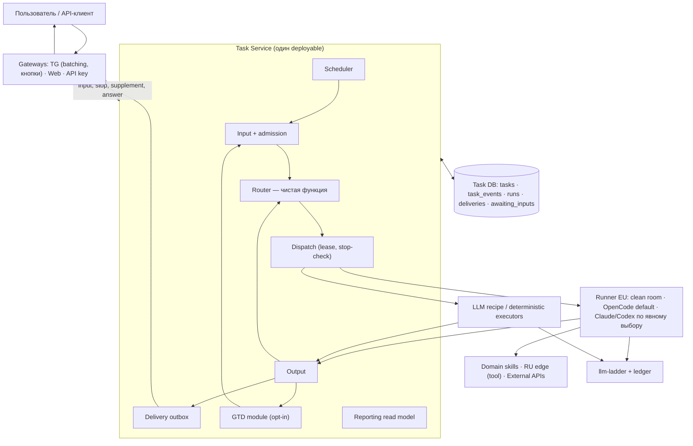

# Trained Assist — архитектура от пользовательских историй (версия Claude)

30.09.2026 · **альтернативный взгляд на [ARCHITECTURE v0.6](ARCHITECTURE.md), не принятая модель.** Здесь нет новых механизмов: всё, что ниже, есть и в v0.6. Отличие в направлении. v0.6 идёт от механизмов (25 видов ID, 13 контрактов, 17 инвариантов, ~6 новых repo). Эта версия идёт от историй пользователя: история → минимальное требование → минимальный механизм. То, для чего истории нет, уходит в раздел «отложить до появления истории».

Источники историй: [scenarios](scenarios/README.md) (Core 02 stop/supplement, TG CURRENT-STATE, recruiter, engineering), инциденты 28.09, текущие правила `trained-assist-agent` (instant restart, checklist-GTD, #1288).

---

## Часть 1. Ревью v0.6

### Что в v0.6 сильное — сохранить

- Задача ≠ чат. Стабильный `userTaskId`, чат только получает уведомления. Это прямо лечит класс багов «задача умерла вместе с сессией чата».
- Статус доставки отделён от статуса исполнения. Потеря связи с Telegram не перезапускает агента.
- GTD opt-in, а не обёртка вокруг всего. Автоматическая эскалация заканчивается на OpenCode.
- Неизвестный исход внешней мутации → reconciliation, а не слепой retry (INV-07).
- Новая реализация строится параллельно живому сервису, с cohort cutover и rollback.
- Code baseline отделён от целевой модели, а ссылки закреплены на ревизиях.

### Главные замечания

| # | Замечание | Почему важно | Предложение |
|---|---|---|---|
| R1 | **Главное решение не выделено как главное: где живёт durable task state.** В таблице repo стоит «отдельный repo ещё не выбран», в baseline — «storage не выбран» | На этом storage держатся outbox, lease/fencing (INV-02), durable inbox GTD (INV-14), Reporting и recovery после рестарта. Пока его нет, половина инвариантов — пожелания | Решить до P01. Самый простой вариант, закрывающий все истории, — **одна Postgres** с таблицами `tasks`, `task_events`, `runs` и outbox-строками в той же транзакции. Добавил в «Открытые решения» |
| R2 | **Stop/Дополнить в v0.6 есть только как INV-08 и строка в списке миграции** | Это главный класс инцидентов: Core 02 от 28.09 — задача «перерождается» после Стопа через retry, GTD и таймеры. Если поток не нарисован, его снова починят по одному пути | Сделать stop отдельным потоком в схеме 2. Флаг `stopped` лежит в task journal, и его проверяет **каждый** dispatcher (retry, GTD, schedule, resume) перед запуском. Приёмка — тест-план Core 02 |
| R3 | **Первый вертикальный срез невидим пользователю.** Порядок: Runner/VM → external API → artifacts → Web/TG → … | Пользовательская ценность и риски UX (stop, supplement, restart) проверяются только четвёртым шагом, после Serverless API, которого пока никто не просил | Первый срез: TG/Web sandbox → Task Service → OpenCode Run → результат в Web и чате + Стоп + рестарт посреди Run. Serverless API — это тот же Task API с ключом, он появится почти бесплатно |
| R4 | **Слишком много новых repo для команды** (task-router, integration-gate, error-watcher, ai-agent-runner, task queue/journal, GTD) | По собственному критерию v0.6 («независимый контракт и lifecycle») Router не проходит. У него нет state и своего lifecycle, его всегда вызывает Input/Output. Каждый repo — это CI, deploy, версии контрактов и место для рассинхрона | Два новых deployable: **Task Service** (Input, Router как функция, Output, Reporting, Scheduler, позже GTD-модуль) и **Runner**. Gate и Watcher — модули, пока не появится второй потребитель |
| R5 | **Инфляция ID**: 25 видов в одной таблице с одинаковым весом | Реализатор (по политике проекта это opencode/deepseek) воспримет все 25 как обязательные с первого дня | Разделить таблицу: «с первого среза» — `userTaskId`, `runId`, `profileId`, `operationId`, `awaitingInputId`, `eventId`. Остальные появляются вместе со своей фичей |
| R6 | **`tenantId`** в модели доступа без истории | Сейчас единица изоляции — profile. Tenant — это второй слой access control. Такое усложнение самое дорогое: каждая проверка расползается по всем путям | Убрать до появления истории про компанию с несколькими профилями |
| R7 | **«Executors: Russia»** на схеме 1 | Противоречит недавнему упрощению #1288: все Claude-сессии на GCP, RU — тонкий IP-edge. История, которой нужен именно агент в RU, не названа. Всё известное (nalog/ESIA, geo-blocked fetch, vacancy pages) — это инструменты | Executors только в EU. RU edge — это tool worker. INV-05 тогда выполняется по построению |
| R8 | **Awaiting user input описан только как checkpoint → новый Run** | Уже работает и нравится live inbox (`get_new_messages`, US-BUF-02): агент читает пароль или подтверждение прямо в ходе Run. Если его потерять, UX деградирует | Два режима: короткое ожидание — live inbox в живом Run; длинное — durable `awaitingInputId` без живого процесса |
| R9 | **Нет целевых latency** | «Быстрый ответ» — центральная UX-ценность, но в документе нет ни одного числа. Сейчас classifier ограничен таймаутом 4s | SLO: «задача принята» ≤ 2s, первый полезный ответ reply-or-route ≤ 6s p95, первое событие прогресса агента ≤ 15s |
| R10 | **Плотность и смешение языков** | Абзац вроде «Outbox, идемпотентный приём и lease/watchdog нужны против потери между процессами» не говорит, *как именно*. Реализатор выберет сам, и каждый repo выберет по-своему | У каждого блока A01–A13 одно предложение «как именно» или ссылка на схему в contracts |
| R11 | Мелкое: на схеме 1 стрелка `C --> S` (пользователь → Storage) | Выглядит как прямой доступ к БД. Текст ниже схемы это опровергает | Вести стрелку через Gateway/Reporting API |

### Правки, внесённые сразу (очевидные)

- ARCHITECTURE: один владелец continuation — «Output, применяющий решение Router policy», вместо двусмысленного «политика Output/Router».
- ARCHITECTURE: явно написано, что Claude/Codex запускаются только по явному выбору пользователя или профиля (как в Task Router), а не ступенью эскалации.
- ARCHITECTURE: в «Открытые решения» добавлены storage task journal/lease и fail-open/closed budget authority. Оба пункта уже отмечены как нерешённые в Code baseline и C08.
- contracts: `taskId` → `userTaskId` в envelopes C01–C06/C08, `callId` → `providerCallId` (по таблице ID), ссылка v0.4 → v0.6, та же формулировка владельца continuation в C11.
- USER-TASK-IDS: устаревшая ссылка «Общая v0.4».

---

## Часть 2. Пользовательские истории

Формат: *как …, я хочу …, чтобы …* → приёмка → что из архитектуры нужно. Истории отобраны по реальным сценариям и инцидентам, а не придуманы под механизмы.

### Разговор и задачи

**US-01 Быстрый ответ.** Как пользователь TG/Web, я задаю вопрос и получаю ответ за секунды, без запуска агента, если агент не нужен.
Приёмка: ≤ 6s p95; при `needs_executor` сразу приходит «задача принята, запускаю агента» (≤ 2s), затем агент. Нужно: Gateway → Task Service (Input → Router reply-or-route recipe → Output) → llm-ladder. ID: `userTaskId`.

**US-02 Несколько сообщений — одна задача.** Как пользователь, я пишу мысль несколькими сообщениями и голосовыми, и агент получает её целиком.
Приёмка: US-BUF-01..04 (TG). Нужно: батчинг остаётся **в Gateway** — это UX канала. Task Service получает один нормализованный input.

**US-03 Длинная задача видна.** Как пользователь, я запускаю долгую работу и вижу в Web статус, прогресс и результат, даже если закрыл вкладку. Чат получает уведомление о завершении.
Приёмка: reconnect воспроизводит результат; статус вычисляется из событий, а не из наличия процесса. Нужно: Runner, `task_events`, Reporting read model. ID: `userTaskId`, `runId`.

**US-04 Стоп значит стоп.** Как пользователь, я нажимаю «Стоп», и задача не возобновляется: ни retry, ни GTD, ни таймер, ни resume после рестарта.
Приёмка: все пути R1..Rn из Core 02; «stop requested» и «stopped» — разные статусы; Стоп не трогает соседние задачи профиля. Нужно: stop-флаг в task journal, который проверяет каждый dispatcher; Runner убивает всю группу процессов.

**US-05 Дополнить.** Как пользователь, я дописываю уточнение, пока агент работает, и вижу, куда оно попало: агент прочитал сейчас или оно ушло в следующий запуск.
Приёмка: Core 02 supplement; receipt сообщает выбранный вариант. Нужно: live inbox (есть) + C03 supplement.

**US-06 Параллельность.** Как рекрутер, я запускаю задачи в разных проектах одного профиля, и они не блокируют друг друга. В одном TG-чате одновременно идёт одна интерактивная задача.
Нужно: INV-03/INV-04 как есть.

### Надёжность

**US-07 Рестарт незаметен.** Как пользователь, я не замечаю деплой: задача продолжается или честно сообщает, что не может, и дублей сообщений нет.
Приёмка: kill -9 Task Service и Runner посреди Run → задача завершается один раз, доставка at-least-once с дедупом по `eventId`. Нужно: durable journal (R1), lease + generation для Runner.

**US-08 Внешнее действие не дублируется.** Как рекрутер, я не хочу, чтобы кандидат получил сообщение дважды из-за таймаута.
Приёмка: timeout после отправки → «исход неизвестен, проверяю» → reconciliation или needs_review. Нужно: `operationId` до вызова (INV-07).

**US-09 Бюджет исчерпан.** Как пользователь, я получаю понятную причину и варианты, а не тихое переключение на дорогую модель и не молчание.
Нужно: typed budget failure, одинаковый текст в каналах (C08).

**US-10 Сбой системы.** Как пользователь, я сразу получаю понятное сообщение об ошибке. Как оператор, я получаю сгруппированный инцидент, а не шторм из 200 сообщений.
Приёмка: доставка пользователю не ждёт диагностики. Нужно: structured error events с `profileId`/`userTaskId` (INV-17). Для начала группировка + alert; LLM-диагностика — позже.

### Ожидание, расписание, контроль

**US-11 Агенту нужен мой ответ.** Как пользователь, я получаю вопрос (пароль, 2FA, «какой вариант?»), отвечаю через час, и работа продолжается, не расходуя токены в ожидании.
Нужно: короткое ожидание — live inbox; длинное — `awaitingInputId` + checkpoint + новый Run (INV-15).

**US-12 Регулярный поиск.** Как рекрутер, я включаю холодный поиск раз в час. Каждый запуск — отдельная задача в Web; выключение останавливает будущие запуски; ошибка запуска приходит мне.
Нужно: `scheduleId`/`occurrenceId` с дедупом. GTD не нужен.

**US-13 Довести до результата.** Как владелец, я прошу «сделай PR и выкати», и система сама следит за CI → merge → deploy, будит агента только при реальной работе и переживает рестарт.
Нужно: `gtdId` opt-in (сегодня это `checklist.md` + `gtd-controller`). Это единственная история, которой нужен GTD.

### Профили, регион, внешние клиенты

**US-14 Общий профиль.** Как команда рекрутеров, мы из нескольких чатов работаем с одним профилем: общие токены и файлы, но ответ приходит в тот чат, где спросили.
Нужно: `profileId` + `destinationId` (уже так: Profile ≠ Chat).

**US-15 RU-сервис.** Как самозанятый, я выбиваю чек в nalog.ru. Агент работает в EU, а запрос уходит с RU IP.
Нужно: RU edge как tool worker (как сейчас после #1288). Executors в RU не нужны.

**US-16 Внешний клиент API.** Как разработчик-клиент, я по ключу отправляю задачу агенту, получаю receipt, опрашиваю статус и забираю результат.
Нужно: тот же Task API, аутентификация по ключу, без GTD/Web.

---

## Часть 3. Минимальные требования, выведенные из историй

| Требование | Истории | Минимальный механизм |
|---|---|---|
| Задача и её события durable до ACK | 03, 07, 11, 12, 13 | Одна БД: `tasks`, `task_events`, `runs`; outbox — строки в той же транзакции |
| Stop авторитетен | 04 | `tasks.stopped_at`; каждый dispatcher проверяет его в той же транзакции, где берёт задачу |
| Один исполнитель на Run | 07 | `runs.lease_until` + `generation`; поздний результат со старым generation отвергается |
| Доставка отдельно от исполнения | 03, 07 | `deliveries` с дедупом по `eventId`, at-least-once |
| Ожидание без процесса | 11 | `awaiting_inputs` + checkpoint ref |
| Внешние мутации идемпотентны | 08 | `operationId` пишется до вызова; `effect: none/applied/unknown` |
| Бюджет — typed отказ | 09 | проверка перед dispatch + ledger per `runId` |
| Регион | 15 | engines только EU; RU-инструменты — через edge |
| Ошибки адресуемы | 10 | ErrorEvent с `profileId`, `userTaskId`, `destinationId?` |
| Контроль результата opt-in | 13 | `gtd_controls` с `gtdId`, next check, bounded attempts |

## Часть 4. Минимальная целевая схема

Хранилища: Task DB (решение R1), Artifact store (R2 — уже есть), profile workspace (snapshot → run → export).

## Часть 5. Что из v0.6 отложить до появления истории

| Элемент v0.6 | Почему откладываем | Что вернёт его |
|---|---|---|
| `tenantId` | нет истории; второй слой access control | компания с несколькими профилями и общими правами |
| Executors: Russia | все RU-нужды — инструменты | задача, где сам агент должен работать в RU |
| Отдельный repo Task Router | без state и lifecycle | второй независимый потребитель Router |
| Отдельный GTD Manager | одна история (US-13) | несколько классов managed tasks с разной логикой |
| Integration Gate как repo | HH сейчас на polling, webhook не подтверждён | первый провайдер с webhook или второй домен с тем же transport |
| Error Watcher с LLM/OpenCode диагностикой | сначала нужна группировка и alert | стабильный поток инцидентов, где ручной разбор дорог |
| 4 execution modes поверх 3 Job types | 3 Job types достаточно для историй | corpus, показывающий пользу template-режима |
| OpenLineage facets | не нужен ни одной истории | внешний lineage-потребитель |
| `webhookSubscriptionId`, `suppressionId`, `spanId`, `externalOperationRef` | появятся вместе со своими фичами | соответствующая фича |

## Часть 6. Первый вертикальный срез

US-01 + US-03 + US-04 + US-07 в sandbox: sandbox TG-бот и Web → Task Service → Runner (OpenCode) → результат в Web и чате. В срез входят Стоп и `kill -9` обоих процессов посреди Run.
Приёмка: тест-план Core 02 (все пути «перерождения») + restart без дублей + логи/TTL по [Observability](OBSERVABILITY-AND-ERROR-CONTRACT.md).
Следующие срезы: US-11 (ожидание) → US-12 (расписание) → US-08 (HH mutation) → US-13 (GTD) → US-16 (API).

## Часть 7. Вопросы владельцу

1. Task DB: Postgres (managed) или SQLite на одном control-plane хосте для первого этапа? Второй вариант проще, но при втором хосте его придётся переносить.
2. Нужна ли multi-tenant модель в горизонте полугода? Если нет — убираем `tenantId`.
3. Есть ли история, где агенту (а не инструменту) нужен RU?
4. Согласны ли с SLO из R9 или нужны другие числа?
5. Устраивает ли свёртка до двух новых deployable (Task Service + Runner) вместо ~6 repo?
